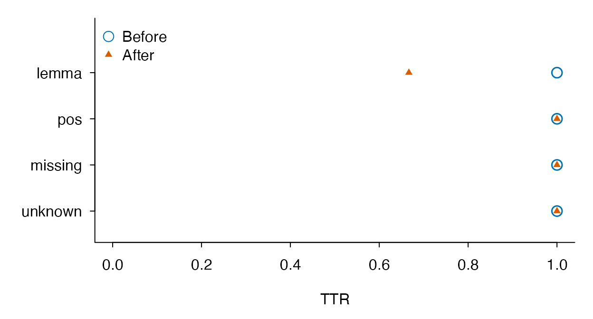

# Understanding unmatched words and lexical-unit choices

## Begin with the question

A teacher wants to describe how much vocabulary in student essays
matches New JACET 8000. Several frequent words fail to match. Before
interpreting this as advanced vocabulary, check which lexical units were
compared with the list. NJ8 contains representative headwords; surface
forms and dictionary lemmas can produce different coverage. These
authored sentences make that choice visible.

``` r
texts <- c(a = "Students have jobs.", b = "Students enjoy jobs.", blank = "")
prepared <- lexdiv_tokenize_batch(texts, tokenizer = "english", case = "lower")
surface <- nj8_profile_batch(prepared, unit = "surface")
audit <- nj8_diagnostics(surface)
audit$unmatched_terms
#>   lookup_term token_count document_count
#> 1    students           2              2
#> 2        jobs           2              2
audit$coverage[, c("document_id", "eligible_tokens", "off_list_tokens", "token_coverage")]
#>   document_id eligible_tokens off_list_tokens token_coverage
#> 1           a               3               2      0.3333333
#> 2           b               3               2      0.3333333
#> 3       blank               0               0             NA
```

`token_count` counts occurrences; `document_count` counts distinct
documents containing the term. Repeating a word in one essay raises only
the former. The empty document remains in coverage with an undefined
rate. Do not silently drop it when describing the sample, or replace its
undefined coverage with zero.

## Compare explicit annotations on the same input

Here we supply lemmas ourselves so that the example runs without an
optional dictionary or model. In real work use reviewed annotations, or
explicitly call `lexdiv_lemmatize(x, method = "textstem")` after
installing `textstem`. That dictionary backend does not provide
context-sensitive POS disambiguation.

``` r
lemmas <- list(a = c("student", "have", "job"),
               b = c("student", "enjoy", "job"), blank = character())
annotated <- Map(function(x, lemma) lexdiv_lemmatize(x, lemmas = lemma,
  backend_id = "authored-example", backend_version = "1"), prepared, lemmas)
lemma <- nj8_profile_batch(annotated, unit = "lemma")
comparison <- data.frame(document_id = surface$coverage$document_id,
  surface_coverage = surface$coverage$token_coverage,
  lemma_coverage = lemma$coverage$token_coverage)
comparison
#>   document_id surface_coverage lemma_coverage
#> 1           a        0.3333333              1
#> 2           b        0.3333333              1
#> 3       blank               NA             NA
audit_lemma <- nj8_diagnostics(lemma)
subset(audit_lemma$unit_mappings, unit_changed)
#>   surface_term    term lookup_term matched token_count document_count
#> 1     students student     student    TRUE           2              2
#> 2         jobs     job         job    TRUE           2              2
#>   unit_changed lookup_changed numeric_introduced whitespace_introduced
#> 1         TRUE          FALSE              FALSE                 FALSE
#> 2         TRUE          FALSE              FALSE                 FALSE
```

The change is an answer about matching different units to the same
resource. It is not evidence that a writer learned more words or that
lemmatization is universally preferable. Choose a lexical unit for the
research question and keep it consistent across documents. For a
supplied character vector, NJ8 cannot reconstruct surface forms that the
caller already replaced upstream.

## Compare the same documents under explicit conditions

Lemmatization and word inclusion can change lexical findings
([Caltabellotta et al.,
2026](https://doi.org/10.1016/j.asw.2026.101039)). Separate the choice
of lexical unit from the choice of MATTR window. This example crosses
two units with two windows using the same annotated documents. These
very small windows illustrate the workflow; they are not recommended
settings for learner essays or a replication of the cited study.

``` r
conditions <- expand.grid(unit = c("surface", "lemma"),
  window_length = c(2L, 4L), stringsAsFactors = FALSE)
conditions$condition_id <- paste0(conditions$unit, "_w", conditions$window_length)

condition_runs <- lapply(seq_len(nrow(conditions)), function(i) {
  lexdiv_metrics_text_batch(annotated, unit = conditions$unit[i],
    word_inclusion = "all", metrics = "mattr",
    window_length = conditions$window_length[i])
})
names(condition_runs) <- conditions$condition_id

condition_results <- do.call(rbind, lapply(seq_along(condition_runs), function(i) {
  rows <- condition_runs[[i]]$results
  stopifnot(identical(rows$document_id, names(annotated)))
  data.frame(condition_id = conditions$condition_id[i],
    unit = conditions$unit[i], window_length = conditions$window_length[i],
    rows[, c("document_id", "N", "V", "value", "status", "missing_reason")])
}))
row.names(condition_results) <- NULL
condition_results
#>    condition_id    unit window_length document_id N V value  status
#> 1    surface_w2 surface             2           a 3 3     1      ok
#> 2    surface_w2 surface             2           b 3 3     1      ok
#> 3    surface_w2 surface             2       blank 0 0    NA missing
#> 4      lemma_w2   lemma             2           a 3 3     1      ok
#> 5      lemma_w2   lemma             2           b 3 3     1      ok
#> 6      lemma_w2   lemma             2       blank 0 0    NA missing
#> 7    surface_w4 surface             4           a 3 3    NA missing
#> 8    surface_w4 surface             4           b 3 3    NA missing
#> 9    surface_w4 surface             4       blank 0 0    NA missing
#> 10     lemma_w4   lemma             4           a 3 3    NA missing
#> 11     lemma_w4   lemma             4           b 3 3    NA missing
#> 12     lemma_w4   lemma             4       blank 0 0    NA missing
#>                       missing_reason
#> 1                               <NA>
#> 2                               <NA>
#> 3                        empty_input
#> 4                               <NA>
#> 5                               <NA>
#> 6                        empty_input
#> 7  too_short_for_requested_parameter
#> 8  too_short_for_requested_parameter
#> 9                        empty_input
#> 10 too_short_for_requested_parameter
#> 11 too_short_for_requested_parameter
#> 12                       empty_input
```

All three documents remain in each condition. The four-token window is
too large for these sentences; the output retains the missing result and
its reason. The empty document also remains. For computable rows, these
toy sentences have no within-sentence repetition in either unit, so
MATTR is unchanged even though NJ8 coverage changes. Coverage and
diversity answer different questions.

Keep `condition_runs` as well as this display table: the full objects
retain method identities, requested/effective parameters, token audits
and preprocessing. For a paired comparison, match document IDs within a
fixed specification and report the number of usable pairs; do not
silently omit failed conditions.

An all-word/content-word comparison additionally needs aligned UPOS
annotations and their backend identity on every document. Once these
exist, repeat the same explicit workflow with
`word_inclusion = "content"`. The retained token count then changes, and
a window spans selected words rather than the original token positions.
A surface/lemma contrast is also different from a default/custom
lemmatizer contrast: the latter requires two separately recorded
annotation sets on the same original texts. Do not treat them as
interchangeable replications.

## Audit alternative annotation schemes

The custom scheme in Caltabellotta et al. (2026, Section 4.3 and
Table 1) distinguished verbal mood and tense. It was not a
dictionary-correction exercise. Here we supply a small authored example
with explicit POS-sensitive labels and a refined verbal scheme. The
package counts supplied strings as given; `unit = "lemma"` does not
automatically append POS, mood or tense.

``` r
scheme_tokens <- lexdiv_tokenize(
  "Students see students and saw teachers.", case = "lower")
scheme_pos <- c("NOUN", "VERB", "NOUN", "CCONJ", "VERB", "NOUN")
base_labels <- c("student_NOUN", "see_VERB", "student_NOUN",
  "and_CCONJ", "see_VERB", "teacher_NOUN")
refined_labels <- base_labels
refined_labels[c(2, 5)] <- c("see_VERB_Ind_Pres", "see_VERB_Ind_Past")
make_scheme <- function(labels, version) {
  lexdiv_lemmatize(scheme_tokens, lemmas = labels, upos = scheme_pos,
    backend_id = "authored-counting-scheme", backend_version = version,
    upos_backend_id = "authored-upos", upos_backend_version = "1")
}
base_scheme <- make_scheme(base_labels, "base-v1")
refined_scheme <- make_scheme(refined_labels, "tense-v1")
annotation_audit <- lexdiv_compare_annotations(base_scheme, refined_scheme)
annotation_audit$documents
#>   document_id tokens before_has_lemma after_has_lemma lemma_changed_tokens
#> 1  document_1      6             TRUE            TRUE                    2
#>   before_has_upos after_has_upos upos_changed_tokens before_has_flemma
#> 1            TRUE           TRUE                   0             FALSE
#>   after_has_flemma flemma_changed_tokens changed_tokens
#> 1            FALSE                     0              2
annotation_audit$changes[, c("token_index", "surface", "before_lemma", "after_lemma")]
#>   token_index surface before_lemma       after_lemma
#> 1           2     see     see_VERB see_VERB_Ind_Pres
#> 2           5     saw     see_VERB see_VERB_Ind_Past

schemes <- list(base = base_scheme, refined = refined_scheme)
scheme_conditions <- expand.grid(scheme = names(schemes),
  inclusion = c("all", "content"), stringsAsFactors = FALSE)
scheme_runs <- lapply(seq_len(nrow(scheme_conditions)), function(i) {
  lexdiv_metrics_text_batch(list(essay = schemes[[scheme_conditions$scheme[i]]]),
    unit = "lemma", word_inclusion = scheme_conditions$inclusion[i],
    metrics = "mattr", window_length = 3)
})
names(scheme_runs) <- with(scheme_conditions, paste(scheme, inclusion, sep = "_"))
lapply(scheme_runs, function(x) x$results[, c("document_id", "N", "V", "value")])
#> $base_all
#> <lexdiv_batch_results: 1 document; 1 metric record; schema unknown>
#>   document_id     value N V
#> 1       essay 0.9166667 6 4
#> 
#> $refined_all
#> <lexdiv_batch_results: 1 document; 1 metric record; schema unknown>
#>   document_id     value N V
#> 1       essay 0.9166667 6 5
#> 
#> $base_content
#> <lexdiv_batch_results: 1 document; 1 metric record; schema unknown>
#>   document_id     value N V
#> 1       essay 0.7777778 5 3
#> 
#> $refined_content
#> <lexdiv_batch_results: 1 document; 1 metric record; schema unknown>
#>   document_id     value N V
#> 1       essay 0.8888889 5 4
```

Two lemma labels changed; no UPOS labels changed. The conjunction
remains in the all-word condition and is excluded in the content-word
condition. The window length is measured in the selected tokens. These
authored annotations and the three-token window illustrate the workflow,
not a replication or a recommended setting. The published study used
spaCy, a 50-token window, and the same processing for learner texts and
its reference corpora.

Do not submit these POS/morphology keys directly to NJ8 or an ordinary
lemma frequency table: their lexical units differ. Keep separate
prepared objects for headword lookup and scheme-sensitive diversity,
with explicit identities. For frequency comparisons, the reference
counts need a corresponding scheme. An improved match rate alone cannot
establish that correspondence.

[`lexdiv_compare_annotations()`](https://ryuya-dot-com.github.io/ldfreq/reference/lexdiv_compare_annotations.md)
also accepts named batches. It matches IDs even if their order differs,
retains empty documents, and rejects differences in original text or
tokenization. Missing-to-value and value-to-missing transitions are
changes; two missing values are unchanged. Backend-only differences
remain visible in `$provenance` even when `$changes` is empty. Save both
prepared inputs and the audit:
`saveRDS(list(before = base_scheme, after = refined_scheme, audit = annotation_audit, conditions = scheme_conditions, runs = scheme_runs), path)`.
Backend labels alone are not proof of dictionary content identity. The
dictionary example below records the content fingerprint and saves the
table.

## Connect annotation changes to document results

A changed label does not necessarily change a document score.
Conversely, a single POS change can remove a token from a content-word
analysis and make a fixed-window score unavailable. The feature-level
and document-level evaluation in [Kyle and Eguchi
(2024)](https://doi.org/10.1016/j.rmal.2024.100120) motivates checking
both levels. Their dependency-based adjective-noun analysis is not
replicated here: this example compares supplied lemmas and UPOS,
TTR/MATTR and NJ8 coverage. It does not estimate annotation accuracy or
vocabulary ability.

Two installed scripts provide an offline, editable workflow. The demo
uses six authored documents, including missing annotations, an invented
off-list form, all-excluded content words, and an empty text. It
performs no inference, downloads or automatic file writes. Source it
into its own environment:

``` r
sensitivity <- new.env()
invisible(capture.output(sys.source(system.file("examples",
  "annotation-sensitivity-demo.R", package = "ldfreq", mustWork = TRUE),
  envir = sensitivity)))
effects <- sensitivity$result
effects$changes[, c("document_id", "token_index", "keyword",
  "before_lemma", "after_lemma", "before_upos", "after_upos")]
#>   document_id token_index keyword before_lemma after_lemma before_upos
#> 1       lemma           1    cats         cats         cat        NOUN
#> 2       lemma           2     saw          saw         see        VERB
#> 3         pos           2     can          can         can        VERB
#> 4     missing           2     fly         <NA>         fly        VERB
#>   after_upos
#> 1       NOUN
#> 2       VERB
#> 3        AUX
#> 4       <NA>
```

`pre`, `keyword` and `post` retain up to 24 Unicode characters of source
context on either side. These are character windows, not quanteda token
windows. The helper checks the original text against both stored text
hashes and every token span. This initial workflow requires **identical
original and processed text**; use explicit
`normalization = "none", case = "preserve"` and check the tokenizer’s
other transformations. It rejects changed text, normalization-induced
changes and lowercased offsets instead of presenting processed positions
as original positions. Different token boundaries are also outside its
scope.

For `cats saw cat.`, replacing `cats/saw/cat` with `cat/see/cat` leaves
three selected tokens but changes the type count from three to two. TTR
and the illustrative three-token MATTR change from 1 to 2/3.
Surface-based scores and exact surface-phrase matches remain unchanged.
A label’s change alone is not evidence that the new label is correct.

``` r
subset(effects$differences, document_id %in% c("lemma", "pos") &
  condition_id == "lemma_content", select = c(document_id, metric_id,
    N_before, N_after, value_before, value_after, delta, difference_status))
#>    document_id metric_id N_before N_after value_before value_after      delta
#> 25       lemma       ttr        3       3            1   0.6666667 -0.3333333
#> 26       lemma     mattr        3       3            1   0.6666667 -0.3333333
#> 27         pos       ttr        3       2            1   1.0000000  0.0000000
#> 28         pos     mattr        3       2            1          NA         NA
#>    difference_status
#> 25            paired
#> 26            paired
#> 27            paired
#> 28    not_computable
```

For `we can run and jump.`, changing `can` from VERB to AUX reduces the
selected content sequence from three tokens to two. TTR stays 1, but
MATTR with window 3 becomes unavailable. The report retains both
statuses and missing reasons; the difference is `NA`, not zero. `delta`
is after minus before, and `absolute_delta` describes its magnitude. A
three-token window is chosen for hand verification, not recommended for
a substantive corpus study.

### Show each condition on the original scale

This small example shows both TTR values for each document on their
original 0–1 scale. Condition is distinguished by color and symbol. The
larger open circle and smaller triangle remain visible when values
coincide. Four documents are too few to motivate a smooth distribution
estimate.

``` r
document_changes <- subset(effects$differences,
  condition_id == "lemma_content" & metric_id == "ttr")
document_changes[, c("document_id", "difference_status", "missing_reason_before",
  "missing_reason_after")]
#>    document_id difference_status missing_reason_before missing_reason_after
#> 25       lemma            paired                  <NA>                 <NA>
#> 27         pos            paired                  <NA>                 <NA>
#> 29     missing            paired                  <NA>                 <NA>
#> 31     unknown            paired                  <NA>                 <NA>
#> 33    excluded    not_computable           empty_input          empty_input
#> 35       empty    not_computable           empty_input          empty_input
paired <- subset(document_changes, difference_status == "paired")
stopifnot(nrow(document_changes) == 6L, nrow(paired) == 4L)

draw_values <- function(paired, monochrome = FALSE) {
  old <- par(mar = c(4.2, 5.2, 1, 1), family = "sans", las = 1,
    bty = "l", mgp = c(2.6, .7, 0), tcl = -.25)
  on.exit(par(old))
  y <- rev(seq_len(nrow(paired)))
  colors <- if (monochrome) c("black", "black") else c("#0072B2", "#D55E00")
  plot(paired$value_before, y, type = "n", yaxt = "n", ylab = "",
    xlab = "TTR", xlim = c(0, 1), ylim = c(.5, nrow(paired) + 1))
  axis(2, at = y, labels = paired$document_id)
  points(paired$value_before, y, col = colors[1], pch = 21, bg = "white", cex = 1.5, lwd = 1.5)
  points(paired$value_after, y, col = colors[2], pch = 17, cex = .8)
  legend("topleft", c("Before", "After"), col = colors, pch = c(21, 17),
    pt.bg = "white", pt.cex = c(1.5, .8), bty = "n")
  invisible(paired)
}
draw_values(paired)
```



Four of six documents have paired TTR values; `excluded` and `empty`
remain in the displayed status table and are not plotted as zero. The
`lemma` document’s TTR decreases by one third; the other three paired
documents have zero change. This is a sensitivity illustration, not
evidence that the new annotations are more accurate or that a population
effect has been estimated. The four rows can be drawn in monochrome with
`draw_values(paired, monochrome = TRUE)`. For actual research, preserve
the participant/task structure and annotation conditions in the full
table before calculating any uncertainty interval.

For a study with enough observations to inspect a smooth continuous
distribution, the following optional ggplot2 recipe overlays the two
densities. Supply a common positive bandwidth in TTR units and use the
same document subset for both curves. Inspect bandwidth sensitivity; the
curves describe marginal distributions and do not display which document
changed or provide confidence intervals. The [boundary
correction](https://ggplot2.tidyverse.org/reference/geom_density.html)
reflects tails at 0 and 1, rather than simply cropping an unbounded
density.

``` r
draw_ttr_densities <- function(paired, bw, monochrome = FALSE) {
  if (!requireNamespace("ggplot2", quietly = TRUE)) stop("Install optional ggplot2.")
  x <- paired$value_before; y <- paired$value_after
  stopifnot(is.numeric(x), is.numeric(y), length(x) == length(y), length(x) >= 2L,
    all(is.finite(c(x, y))), all(c(x, y) >= 0 & c(x, y) <= 1),
    length(unique(x)) > 1L, length(unique(y)) > 1L,
    is.numeric(bw), length(bw) == 1L, is.finite(bw), bw > 0,
    is.logical(monochrome), length(monochrome) == 1L, !is.na(monochrome))
  d <- data.frame(value = c(x, y), condition = factor(
    rep(c("Before", "After"), each = length(x)), levels = c("Before", "After")))
  colors <- if (monochrome) c("black", "black") else c("#0072B2", "#D55E00")
  ggplot2::ggplot(d, ggplot2::aes(x = value, color = condition, linetype = condition)) +
    ggplot2::geom_density(bw = bw, bounds = c(0, 1), linewidth = .7, key_glyph = "path") +
    ggplot2::geom_rug(sides = "b", alpha = .35, show.legend = FALSE) +
    ggplot2::scale_color_manual(values = colors) +
    ggplot2::scale_linetype_manual(values = c("solid", "dashed")) +
    ggplot2::scale_x_continuous(limits = c(0, 1), breaks = seq(0, 1, .2)) +
    ggplot2::labs(x = "TTR", y = "Density", color = NULL, linetype = NULL) +
    ggplot2::theme_classic(base_size = 11, base_family = "sans") +
    ggplot2::theme(legend.position = "top")
}
```

Use `draw_ttr_densities(study_pairs, bw = chosen_bandwidth)` on your
reviewed study table; add `monochrome = TRUE` for black solid/dashed
lines. A density’s area is normalized separately for each condition, so
report the sample sizes and missingness alongside the figure. A constant
series is rejected: for it, use the raw observations or an empirical
distribution. Do not treat the numerical minimum of two observations as
a recommendation for density estimation. Preserve the full roster and
pairing metadata even when displaying marginal densities.

### Keep selection coverage separate from reference coverage

``` r
subset(effects$coverage, document_id %in% c("missing", "unknown", "empty") &
  condition_id == "lemma_content", select = c(document_id, version,
    source_tokens, selected_tokens, reference_eligible_tokens,
    selection_coverage, nj8_coverage_of_eligible, matched_fraction_of_source))
#>    document_id version source_tokens selected_tokens reference_eligible_tokens
#> 27     missing  before             2               1                         1
#> 28     unknown  before             1               1                         1
#> 30       empty  before             0               0                         0
#> 33     missing   after             2               1                         1
#> 34     unknown   after             1               1                         1
#> 36       empty   after             0               0                         0
#>    selection_coverage nj8_coverage_of_eligible matched_fraction_of_source
#> 27                0.5                        1                        0.5
#> 28                1.0                        0                        0.0
#> 30                 NA                       NA                         NA
#> 33                0.5                        1                        0.5
#> 34                1.0                        0                        0.0
#> 36                 NA                       NA                         NA
```

The missing-annotation document has one selected word out of two, and
that word matches NJ8. Thus selection coverage is 1/2, conditional NJ8
coverage is 1, and the matched fraction of all source word tokens is
1/2. These are different denominators. `source_tokens` means tokenizer
output, not all characters or punctuation. NJ8 can apply additional
lookup exclusions; its eligible count is reported separately. Full
resource provenance and diagnostics remain in `runs`.

`effects$tokens` retains every source word position for each condition
and version, including excluded tokens, selected forms, UPOS,
missing-label flags, the selection reason and NJ8 lookup. A reference
query’s position indexes the selected vector; the helper maps it back to
the source token before joining. Never join that query position directly
to an unfiltered source table.

The invented word `glorp` has a defined zero match rate. An empty
selection has undefined conditional coverage. In `birds fly.`, the
second token changes from missing lemma to missing UPOS in the content
condition; both exclude it, but the reason changes. Even unchanged
scores can therefore warrant inspection.

### Reuse and replay with your own annotations

Copy the two example scripts to a study folder for editing. In the demo,
replace the texts and position-aligned lemma/UPOS lists with your
recorded annotations; both columns are required, with unavailable labels
represented by `NA`. Alternatively, source only
`annotation-sensitivity.R` and call
`annotation_sensitivity(before, after, texts, window_length = ...)` with
named batches of `lexdiv_tokenization` objects and a named text vector.
IDs must agree; order need not.
[`lexdiv_import_annotations()`](https://ryuya-dot-com.github.io/ldfreq/reference/lexdiv_import_annotations.md)
output is a different format and cannot be supplied to this helper.
Flemma-based scores and changed segmentation require a separate
extension.

The fixed conditions are surface/all, lemma/all and lemma/content, with
TTR and MATTR and the bundled NJ8 table. Inspect `settings` before
adapting these choices. No general-purpose public function is added.
Keep participant/task metadata separately and join by unique document
ID. `before` and `after` are versions, not independent raters or
gold/prediction labels.

``` r
# Save explicitly to a new local file, respecting access rules for original text.
saveRDS(list(result = effects, session = sessionInfo()), "annotation-sensitivity.rds")

# A fresh R session: load the helper, then replay from saved inputs.
source(system.file("examples", "annotation-sensitivity.R", package = "ldfreq"))
saved <- readRDS("annotation-sensitivity.rds")$result
replayed <- do.call(annotation_sensitivity,
  c(saved$inputs, list(window_length = saved$settings$window_length)))
stopifnot(identical(replayed, saved))
```

Preserve the actual example scripts, R/package environment and input
resources with the RDS file. A different package or resource version is
a new analysis, not an exact replay. CSV exports of `changes`,
`coverage` or `differences` are useful for inspection but do not retain
the complete inputs and provenance. Independent reference annotations,
including non-candidates, are needed before claiming precision, recall
or improved validity. Group inference additionally requires a sampling
design that respects writers, speakers and repeated tasks.

## Choose and save the actual lemma dictionary

A backend version alone does not identify its dictionary. With optional
`textstem` installed, pass a two-column character data frame and give it
an explicit identity and version. Lookup terms must be unique and
lowercase under the current R locale. Unmatched tokens retain their
surface forms. This tiny authored dictionary illustrates lookup; it is
not a general English dictionary.

``` r
if (requireNamespace("textstem", quietly = TRUE)) {
  dictionary <- data.frame(term = c("cats", "ran", "third"),
    lemma = c("cat", "run", "3"))
  input <- lexdiv_tokenize("Cats ran. The third group ate one third.",
    tokenizer = "english", case = "lower")
  baseline <- lexdiv_lemmatize(input, method = "textstem",
    dictionary = dictionary, dictionary_id = "authored-demo",
    dictionary_version = "1")
  baseline$tokens[, c("token_index", "surface", "lemma")]
  baseline$provenance$annotation$dictionary
}
#> $source
#> [1] "supplied"
#> 
#> $id
#> [1] "authored-demo"
#> 
#> $version
#> [1] "1"
#> 
#> $sha256
#> [1] "75ea2e5ea4a6cb4e1848b58bdda457dd56bfc669c4d157a8ddb889d30b7817ac"
#> 
#> $hash_method
#> [1] "sha256-utf8-byte-length-pairs-v1"
#> 
#> $entries
#> [1] 3
#> 
#> $query_casefold
#> [1] "base-tolower"
#> 
#> $query_locale
#> [1] "C.UTF-8"
#> 
#> $unknown_form_policy
#> [1] "surface"
```

The record includes a content fingerprint, entry count and lookup
locale. Reordering rows leaves the fingerprint unchanged; changing a
mapping changes it even if the version label stays the same. With
`dictionary = NULL`, the package uses
[`lexicon::hash_lemmas`](https://rdrr.io/pkg/lexicon/man/hash_lemmas.html)
and records the installed lexicon version and the actual table’s
fingerprint. This records context-free lookup, not POS disambiguation or
evidence that the labels are linguistically correct.

The example has two occurrences of `third`. Suppose an analysis
specifies word-form labels for ordinal expressions, while leaving the
fractional expression for separate review. Editing the dictionary would
affect both. Instead, record the reviewed token position and supply an
aligned lemma vector. This is an illustration of an explicit counting
scheme, not a recommendation to retain numeric fraction labels in every
study.

``` r
if (requireNamespace("textstem", quietly = TRUE)) {
  revisions <- data.frame(token_index = 4L, before_lemma = "3",
    after_lemma = "third", reason = "ordinal word-form counting scheme")
  stopifnot(baseline$tokens$surface[revisions$token_index] == "third",
    baseline$tokens$lemma[revisions$token_index] == revisions$before_lemma)
  reviewed_lemmas <- baseline$tokens$lemma
  reviewed_lemmas[revisions$token_index] <- revisions$after_lemma
  reviewed <- lexdiv_lemmatize(input, lemmas = reviewed_lemmas,
    backend_id = "authored-context-review", backend_version = "1")
  changes <- lexdiv_compare_annotations(baseline, reviewed)
  changes$changes[, c("token_index", "surface", "before_lemma", "after_lemma")]
  saved <- tempfile(fileext = ".rds")
  saveRDS(list(dictionary = dictionary, before = baseline, after = reviewed,
    revisions = revisions, audit = changes), saved)
  restored <- readRDS(saved)
  replay <- lexdiv_lemmatize(input, method = "textstem",
    dictionary = restored$dictionary, dictionary_id = "authored-demo",
    dictionary_version = "1")
  stopifnot(identical(replay, restored$before))
  unlink(saved)
}
```

Use a persistent path for real analyses. The prepared object retains
dictionary metadata, not the dictionary table; saving only its hash
cannot reproduce lookup. Retain the actual dictionary, backend versions,
locale, both annotation sets and revision reasons. For a POS-tagged
analysis also pass the aligned UPOS vector and its backend identity when
reannotating. Missing tags are not inferred. Older saved annotations
remain readable; missing dictionary records cannot establish strict
lemma comparability in
[`lexdiv_content_overlap()`](https://ryuya-dot-com.github.io/ldfreq/reference/lexdiv_overlap.md).

## Inspect surprising transformations

``` r
example <- lexdiv_tokenize("second compound missing", case = "lower")
example <- lexdiv_lemmatize(example, lemmas = c("2", "two words", NA),
  backend_id = "authored-transformations", backend_version = "1")
example_profile <- nj8_profile(example, unit = "lemma")
diagnostic <- nj8_diagnostics(example_profile)
diagnostic$unit_mappings
#>   surface_term      term lookup_term matched token_count document_count
#> 1       second         2           2   FALSE           1              1
#> 2     compound two words   two words   FALSE           1              1
#>   unit_changed lookup_changed numeric_introduced whitespace_introduced
#> 1         TRUE          FALSE               TRUE                 FALSE
#> 2         TRUE          FALSE              FALSE                  TRUE
diagnostic$exclusion_reasons
#>   document_id        reason tokens
#> 1  document_1 missing_lemma      1
```

The numeric and whitespace flags describe changes; they do not establish
an error. The phrase `two words` remains one supplied lexical unit.
Missing lemmas are excluded, not counted as unmatched. `lookup_changed`
can reflect query normalization or a flemma headword-conflict decision.
Keep the original `profile$lookup` for occurrence positions and the
prepared objects for annotation details. No automatic spelling
correction, compound splitting or numeric-label removal is performed by
the diagnostics.

## Handle learner errors without losing the observed text

Choose the primary text version from the research question, and always
retain the original. When studying observed production, spelling and
grammatical patterns may be part of the outcome. When studying lexical
choices apart from orthographic control, an explicitly reviewed spelling
version may be useful. A grammatically rewritten version answers a
different question: inserted words, substituted vocabulary and changed
constructions can alter the features being measured. Do not treat its
higher coverage or different diversity score as an improvement in the
learner’s ability.

Three problems require different actions:

| Observation | What to inspect | Analysis decision |
|----|----|----|
| `freind` and `friend` in one essay | Original context and a defensible intended form | A reviewed spelling edit may merge types; retain both versions |
| `She has beautiful garden.` or `I went too school.` | Grammar and intended meaning, even when every word is in a dictionary | Declare whether article insertion or real-word substitution belongs in the analysis policy |
| An unexpected lemma/POS or an off-list word | Parser output, token boundaries, reference coverage and source text | Correct an annotation separately; off-list status alone does not establish a learner error |

Names, specialist vocabulary, acceptable spelling varieties and
code-switching must not automatically become errors. An unclear form
should remain unresolved rather than be assigned a plausible meaning.
OCR/transcription mistakes are a separate data-production issue: verify
against the source where possible and record that provenance instead of
attributing them to the writer. Rejected and unresolved proposals remain
in the ledger; no proposals does not mean error-free.

For valid English spelling variants, proper nouns, numeral expressions
and symbols, see the [counting-policy
comparison](https://ryuya-dot-com.github.io/ldfreq/articles/english-tokenization.html#declare-spelling-name-numeral-and-symbol-policies).
It separates unchanged source forms, optional counting equivalence,
reference lookup aliases and token selection; these choices need not
rewrite the text.

[Nagata, Sato, and Takamura (2018)](https://aclanthology.org/C18-1202/)
compared original and manually spelling-corrected Japanese EFL essays
and found different sensitivities for TTR and Yule’s K. Their
preprocessing excluded unidentifiable corrections and word
concatenation/split corrections. This is evidence to check each measure
and correction policy, not a guarantee that a particular measure is
unaffected by errors in another corpus. A spelling variant can increase
the number of types, but not every repair reduces diversity: deletions,
insertions and changes to word boundaries can change both numerator and
denominator.

For syntax, [Berzak et al. (2016)](https://aclanthology.org/P16-1070/)
describe parallel annotation of original and corrected learner
sentences. Their literal-reading principle emphasizes observed
constructions, with explicit exceptions for misspellings and malformed
words. State the annotation scheme rather than assuming either that all
intended forms should replace the source or that annotating the source
requires no interpretation.

### Run a reviewed-text sensitivity analysis

The installed, explicitly sourced example below applies a supplied edit
ledger. It does not detect or propose corrections, and is not an
exported package API. The six documents and review decisions are
authored demonstrations, not learner data or independently validated
gold corrections. No corpus or model download is needed.

``` r
review_example <- new.env(parent = environment())
sys.source(system.file("examples", "reviewed-text-demo.R", package = "ldfreq",
  mustWork = TRUE), envir = review_example)
text_review <- review_example$result
```

``` r
subset(text_review$metrics, metric_id == "ttr" &
  document_id %in% c("spelling", "grammar", "boundary"),
  select = c(document_id, version, N, V, value, status))
#>    document_id           version N V value status
#> 1     spelling          original 5 4   0.8     ok
#> 3      grammar          original 4 4   1.0     ok
#> 5     boundary          original 3 3   1.0     ok
#> 13    spelling spelling_reviewed 5 3   0.6     ok
#> 15     grammar spelling_reviewed 4 4   1.0     ok
#> 17    boundary spelling_reviewed 3 3   1.0     ok
#> 25    spelling   expanded_review 5 3   0.6     ok
#> 27     grammar   expanded_review 5 5   1.0     ok
#> 29    boundary   expanded_review 4 4   1.0     ok
text_review$versions$expanded_review$edits[, c("document_id", "pre", "original",
  "replacement", "post", "category", "decision", "applied")]
#>   document_id               pre original replacement              post
#> 1    spelling                A    freind      friend     met a friend.
#> 2     grammar          She has                    a  beautiful garden.
#> 3    boundary           I like      alot       a lot                 .
#> 4   real_word           I went       too          to           school.
#> 5   uncertain          I saw a     glorp       globe         in Kyoto.
#> 6   uncertain I saw a glorp in     Kyoto       Tokyo                 .
#>         category   decision applied
#> 1       spelling   approved    TRUE
#> 2        grammar   approved    TRUE
#> 3  word_boundary   approved    TRUE
#> 4      real_word   approved    TRUE
#> 5 lexical_choice unresolved   FALSE
#> 6    proper_name   rejected   FALSE
```

`original` applies no edits; `spelling_reviewed` applies only approved
spelling edits; `expanded_review` also applies approved grammar,
word-boundary and real-word edits. Every version starts from the same
original document table. For `A freind met a friend.`, lowercased
surface TTR changes from 4/5 to 3/5; inserting the article in
`She has beautiful garden.` changes N from 4 to 5 while TTR stays 1.
Splitting `alot` changes N from 3 to 4, making the illustrative
four-token MATTR window computable. An unchanged score therefore does
not show that the source or counted vocabulary stayed unchanged. Four
tokens is a tiny demonstration window, not a study recommendation.

To use your own data, source `reviewed-text.R` and call
`apply_reviewed_edits(documents, edits, categories, policy)`. Supply:

- A `documents` data frame with unique `document_id` and nonmissing
  UTF-8 `text`. Writer, task, occasion and other metadata columns are
  preserved. Empty strings are retained; unknown/missing source texts
  must be resolved explicitly, not converted to empty essays.
- An `edits` data frame with unique `edit_id`, `document_id`, `start`,
  `end`, `original`, `replacement`, `category`, `decision`, `reviewer`
  and `reason`. `decision` is `approved`, `rejected` or `unresolved`;
  completed decisions require a reviewer. Extra columns can record
  proposal tool/model versions and adjudication records. Categories are
  study-defined; choose them before examining the resulting scores.
- Explicit selected `categories` and a `policy` description. Only
  approved edits in those categories are applied. Use `character(0)` for
  the unchanged version. This example requires an explicit study policy;
  it does not impose a universal taxonomy of learner errors.

Coordinates are **1-based inclusive Unicode code points in the original,
unnormalized document**, not byte offsets, token numbers or
normalized-text positions. An insertion before position `start` uses
`end = start - 1` and `original = ""`; deletion uses `replacement = ""`.
Each original substring must match exactly. Overlapping applied edits
and edits sharing a start position stop for review; unresolved
alternatives can remain in the ledger. Each applied edit gets positions
in the revised document, including an empty interval for deletion. These
edit spans are not a complete token alignment between versions.

The return value keeps both document tables, all proposals with original
KWIC, applied/rejected/unresolved counts, policy and source/revised
SHA-256 hashes. These counts describe submitted proposals, not the
prevalence of all learner errors. The example reuses
[`lexdiv_tokenize_batch()`](https://ryuya-dot-com.github.io/ldfreq/reference/lexdiv_text_batch.md),
[`lexdiv_metrics_text_batch()`](https://ryuya-dot-com.github.io/ldfreq/reference/lexdiv_text_batch.md)
and
[`nj8_profile_batch()`](https://ryuya-dot-com.github.io/ldfreq/reference/nj8_profile.md)
on **every complete version**, retaining N, V, non-computable requests
and reference coverage in `text_review$metrics`, `$coverage` and
`$runs`. Join document results by `document_id` and version, preserving
writer/task identifiers from the source table. Do not average only the
conditions with successful lookup or silently drop short/empty texts.

Re-tokenize rewritten strings. For lemma/POS/dependency analyses, also
rerun the annotation pipeline under the same recorded settings for each
version. Token indices and processed-text offsets are local to each
version; edits here are anchored before normalization.
[`lexdiv_compare_annotations()`](https://ryuya-dot-com.github.io/ldfreq/reference/lexdiv_compare_annotations.md)
and
[`lexdiv_align_annotations()`](https://ryuya-dot-com.github.io/ldfreq/reference/lexdiv_align_annotations.md)
require the same original source and intentionally reject rewritten
text. Do not disguise text correction as a lemma change or reuse
original dependency heads after a word insertion.

``` r
review_path <- tempfile(fileext = ".rds")
saveRDS(list(result = text_review, session = sessionInfo()), review_path)
saved_review <- readRDS(review_path)$result
stopifnot(identical(do.call(review_example$apply_reviewed_edits,
  saved_review$versions$expanded_review$inputs),
  saved_review$versions$expanded_review))
unlink(review_path)
```

Use a persistent local path for a study, saving complete sources and
ledgers under their access conditions. For human review, define the
policy and retain individual decisions and adjudication where
applicable. Compare all conditions with fixed counting units, parameters
and reference versions; separate a spelling-only analysis from grammar
or lexical rewriting. If displaying results, show each version’s
original values or overlaid distributions, not a difference-axis plot;
retain paired tables for inspection and respect repeated observations
within writers in inference.

External spell checkers, GEC systems or language models may supply
**proposals** for review; this example neither invokes them nor sends
text to a service. Record their identity/settings if used and retain the
human decision separately. [ERRANT (Bryant, Felice, and Briscoe,
2017)](https://aclanthology.org/P17-1074/) extracts and categorizes
edits from original/corrected sentence pairs; those categories do not
independently establish that the proposed correction was the writer’s
intended meaning. A broad rewrite may change lexical choice and syntax
beyond the declared policy. Independent evaluation on real paired
documents remains a research task; this example verifies accounting and
replay only.

## Keep window sensitivity separate from vocabulary coverage

The existing plan API compares common windows on ordered tokens. These
repeated tokens are an illustration of parameter effects, not learner
observations.

``` r
documents <- list(clustered = rep(c("river", "stone", "cloud"), each = 20),
                  interleaved = rep(c("river", "stone", "cloud"), 20))
method <- lexdiv_methods()$method_id[lexdiv_methods()$metric_id == "mattr"]
plan <- lexdiv_plan(presets = character(), grids = lexdiv_grid(
  method, "window_length", c(10, 20), request_id_prefix = "window"))
results <- lexdiv_profile_batch(documents, plan)
results[, c("document_id", "request_id", "value", "status")]
#> <lexdiv_profile_batch_results: 2 documents; 4 specification results; schema unknown>
#>   document_id request_id      value status
#> 1   clustered   window_1 0.13529412     ok
#> 2   clustered   window_2 0.09634146     ok
#> 3 interleaved   window_1 0.30000000     ok
#> 4 interleaved   window_2 0.15000000     ok
```

Use the same requested windows for every text; retain missing results
when a text is too short. Do not choose a different window for each
writer to improve its score or average unlike conditions together.
Lexical diversity and NJ8 coverage answer different questions, so
neither provides a combined proficiency score. Generalizing to
proficiency or writing quality needs an appropriate external criterion
and a design that respects writers, tasks and raters.

## Distinguish window size from position effects

Text length and the reduction parameter are separate sensitivity
questions ([Bestgen, 2024](https://doi.org/10.1111/lang.12630)). MATTR
also weights positions unequally through its overlapping windows
([Bestgen, 2025](https://doi.org/10.1016/j.rmal.2024.100168)). This
authored counterexample holds the number and frequency of tokens fixed
and moves one unique token from an endpoint to the middle.

``` r
positions <- list(endpoint = c("x", rep("a", 6)),
  middle = c(rep("a", 3), "x", rep("a", 3)))
position_scores <- lexdiv_metrics_batch(positions,
  metrics = c("ttr", "mattr", "hdd"), window_length = 3, sample_size = 3)
position_scores[, c("document_id", "metric_id", "N", "V", "value")]
#> <lexdiv_batch_results: 2 documents; 6 metric records; schema unknown>
#>   document_id metric_id     value N V
#> 1    endpoint       ttr 0.2857143 7 2
#> 2    endpoint     mattr 0.4000000 7 2
#> 3    endpoint       hdd 0.4761905 7 2
#> 4      middle       ttr 0.2857143 7 2
#> 5      middle     mattr 0.5333333 7 2
#> 6      middle       hdd 0.4761905 7 2

position_plan <- lexdiv_plan(presets = character(), specs = lexdiv_spec(
  method, list(window_length = 3), request_id = "mattr_3"))
position_profile <- lexdiv_mattr_profile(positions$endpoint, position_plan)
position_profile$exposure[, c("position", "exposure_count")]
#>   position exposure_count
#> 1        1              1
#> 2        2              2
#> 3        3              3
#> 4        4              3
#> 5        5              3
#> 6        6              2
#> 7        7              1
```

There are five complete windows. At the endpoint, `x` appears in one
window; in the middle it appears in three. MATTR is therefore 0.4 and
8/15 (about 0.533), respectively. TTR and HD-D are identical across the
two orders because their calculations here depend on the same frequency
distribution. This checks a mathematical property, not which index best
captures learners’ proficiency. Exposure counts describe window
membership, not each token’s causal contribution. Keep the canonical
MATTR calculation; dividing its score by exposure counts would define a
different, unvalidated index.

The local windows overlap and are not independent observations. A future
length/position study should retain the parent document ID, distinguish
contiguous excerpts from randomly sampled tokens, and use uncertainty
estimates that respect repeated observations within writers. A single
MATTR window comparison does not establish text-length invariance.

## Save a reproducible analysis

Save the complete profiles and prepared objects, not just a top-word
list:
`saveRDS(list(prepared = annotated, profile = lemma, audit = audit_lemma), path)`.
Use `write.csv(audit_lemma$unmatched_terms, path, row.names = FALSE)`
for inspection in a spreadsheet. These objects can contain text-derived
data; choose a destination appropriate to the corpus. Record the package
version, selected unit, annotation backend, normalization, exclusions
and NJ8 citation alongside any reported coverage.

For the condition comparison, also save
`saveRDS(list(prepared = annotated, conditions = conditions, runs = condition_runs, results = condition_results), path)`.
Save the complete objects before exporting display tables to CSV; a CSV
alone does not preserve their annotation records.
