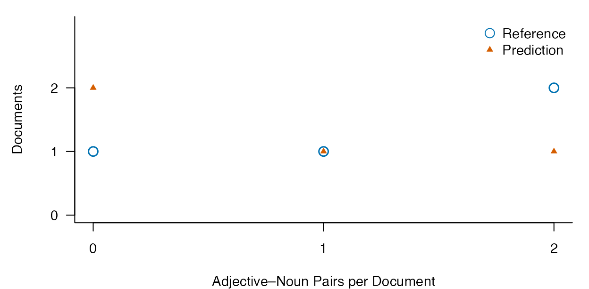

# Trace adjective–noun dependencies from source context to document counts

## Which noun does an adjective modify?

In *Big red balloons float*, both *big* and *red* modify *balloons*.
Adjacent bigrams cannot represent the first relation as a two-word
sequence.
[`lexdiv_amod_pairs()`](https://ryuya-dot-com.github.io/ldfreq/reference/lexdiv_amod_pairs.md)
instead reads supplied basic Universal Dependencies (UD) and connects
each selected pair to its two source positions, context and document
counts. It does not run a parser or decide whether a phrase is
idiomatic.

The initial feature is deliberately specific: a dependent tagged `ADJ`,
a head tagged `NOUN`, and an `amod` relation (including subtypes).
`PROPN` and `PRON` heads are excluded. [UD’s amod
relation](https://universaldependencies.org/u/dep/amod.html) is broader
than this selected feature. The function also does not reproduce the
Penn-tag selection in Kyle and Eguchi (2024) exactly.

The research question is whether annotation differences change the pairs
and counts used in an analysis. A correct total does not establish that
the same occurrences were found. A structurally valid tree can still
have the wrong head.

## Supply complete sentences and basic trees

Use
[`lexdiv_import_annotations()`](https://ryuya-dot-com.github.io/ldfreq/reference/lexdiv_import_annotations.md)
to import the complete, unnormalized output of an existing parser or
human annotation process. Keep punctuation and original sentence text.
The input contract is:

| Table | Required information |
|----|----|
| `segments` | `document_id`, `segment_id`, `text`; one sentence per segment, including empty inputs |
| token table | Same IDs; `token_index` starting at 1 in each sentence; exact `surface`; `upos`, `head`, `deprel` |
| optional lexical units | `lemma`, if lemma type counts are requested |
| provenance | Language, analyzer and version, dictionary and version, token unit and normalization; add model identity and any explicit projection choices |

`head` is numeric and refers to `token_index` in the **same sentence**;
root has head 0. `deprel` and `upos` use UD labels. Convert missing
annotation fields to typed `NA`, not the literal underscore used by
CoNLL-U. Do not convert legitimate surface strings such as `NA` into
missing values. When adapting a parser table, map its columns explicitly
and preserve the relation between IDs and heads.

This is not a general CoNLL-U reader. Multiword-token range records,
empty nodes, and syntactic words without individually matching original
surfaces are outside the current input contract. Enhanced edges in
`deps`/`DEPS` are rejected; explicitly select the basic tree and record
the projection when that is the research target. See the [CoNLL-U
specification](https://universaldependencies.org/format.html). The
importer never reconstructs original text from normalized token strings.

Known head errors, self-links, cycles, inconsistent root labels and
multiple roots raise errors. A valid complete tree has one root. These
checks cannot verify that a declared segment is linguistically one
sentence or that its syntactic analysis is correct.

## Run an offline English/Japanese example

The installed example supplies authored annotations. It requires no
model, corpus download or additional package. The Japanese sentence
includes *赤い鳥* to exercise original Japanese source positions and the
same declared feature; this does not establish comparable feature
coverage across languages.

``` r
env <- new.env(parent = baseenv())
sys.source(system.file("examples", "amod-pairs.R", package = "ldfreq",
  mustWork = TRUE), env)
example <- env$amod_pairs_example
reference <- lexdiv_amod_pairs(example$inputs$reference, unit = "lemma")
reference$occurrences[c("document_id", "dependent_term", "head_term",
  "token_distance", "pre", "keyword", "post")]
#>   document_id dependent_term head_term token_distance              pre
#> 1     english            big   balloon              2                 
#> 2     english            red   balloon              1             Big 
#> 3  wrong_head          small      bird              1                 
#> 4  wrong_head          large      fish              1 Small birds see 
#> 5    japanese           赤い        鳥              1                 
#> 6 unavailable          quiet      bird              1                 
#> 7     partial            red      bird              1                 
#> 8     partial           blue      bird              1                 
#>            keyword             post
#> 1 Big red balloons           float.
#> 2     red balloons           float.
#> 3      Small birds  see large fish.
#> 4       large fish                .
#> 5           赤い鳥         を見る。
#> 6      Quiet birds            rest.
#> 7        Red birds             fly.
#> 8       Blue birds             fly.
```

`keyword` spans both endpoints and all intervening text. The separate
`dependent_start`/`dependent_end` and `head_start`/`head_end` columns
identify the selected words. Positions are one-based, inclusive Unicode
codepoints within the original sentence. Keep document and segment IDs
with these columns when returning to KWIC or comparing occurrences. A
row number is not an occurrence identity.

## Report counts beside coverage

``` r
predicted <- example$predicted
predicted$documents[c("document_id", "tokens", "analyzed_tokens", "token_coverage",
  "observed_pairs", "pairs", "pairs_with_unit", "types", "status")]
#>   document_id tokens analyzed_tokens token_coverage observed_pairs pairs
#> 1     english      5               5            1.0              1     1
#> 2  wrong_head      6               6            1.0              2     2
#> 3    japanese      5               5            1.0              0     0
#> 4        zero      3               3            1.0              0     0
#> 5 unavailable      4               0            0.0              0    NA
#> 6     partial      8               4            0.5              1    NA
#> 7       empty      0               0             NA              0     0
#>   pairs_with_unit types                status
#> 1               1     1              complete
#> 2               2     2              complete
#> 3               0     0              complete
#> 4               0     0              complete
#> 5               0    NA incomplete_annotation
#> 6               1    NA incomplete_annotation
#> 7               0     0                 empty
predicted$segments[c("document_id", "segment_id", "missing_heads",
  "missing_relations", "missing_upos", "status")]
#>   document_id segment_id missing_heads missing_relations missing_upos
#> 1     english         s1             0                 0            0
#> 2  wrong_head         s1             0                 0            0
#> 3    japanese         s1             0                 0            0
#> 4        zero         s1             0                 0            0
#> 5 unavailable         s1             4                 4            0
#> 6     partial         s1             0                 0            0
#> 7     partial         s2             4                 4            0
#> 8       empty         s1             0                 0            0
#>                  status
#> 1              complete
#> 2              complete
#> 3              complete
#> 4              complete
#> 5 incomplete_annotation
#> 6              complete
#> 7 incomplete_annotation
#> 8                 empty
```

Any missing head, relation or UPOS excludes that whole sentence. This
conservative rule prevents an unknown label from being silently
classified as a negative. The `partial` document retains one observed
pair from a complete sentence, but its total pair count is unknown
because its other sentence is incomplete. `zero` has a complete analysis
with no selected relation; `unavailable` has no analyzed sentence. Their
totals are respectively 0 and `NA`. Empty inputs have zero counts, an
`empty` status and undefined token coverage.

Token coverage uses all supplied syntactic tokens, **including
punctuation**, as its denominator. `counts` and `observed_types`
summarize the observed subset, not an estimate for excluded sentences.
Surface matching is case-sensitive; selecting `unit = "lemma"` uses
exactly the supplied lemmas. If a detected pair is missing either lemma,
it remains in the occurrence table but contributes no known type key.
`pairs_with_unit` reports this second source of incompleteness, and a
complete type total is `NA`.

## Compare occurrences as well as totals

``` r
example$differences
#>   document_id reference_pairs predicted_pairs delta_pairs reference_types
#> 1     english               2               1          -1               2
#> 2  wrong_head               2               2           0               2
#> 3    japanese               1               0          -1               1
#> 4        zero               0               0           0               0
#> 5 unavailable               1              NA          NA               1
#> 6     partial               2              NA          NA               2
#> 7       empty               0               0           0               0
#>   predicted_types reference_coverage predicted_coverage evaluated tp fp fn
#> 1               1                  1                1.0      TRUE  1  0  1
#> 2               2                  1                1.0      TRUE  1  1  1
#> 3               0                  1                1.0      TRUE  0  0  1
#> 4               0                  1                1.0      TRUE  0  0  0
#> 5              NA                  1                0.0     FALSE NA NA NA
#> 6              NA                  1                0.5     FALSE NA NA NA
#> 7               0                 NA                 NA      TRUE  0  0  0
subset(example$comparison, document_id == "wrong_head")
#>   document_id segment_id dependent_start dependent_end head_start head_end
#> 2  wrong_head         s1              17            21         23       26
#> 5  wrong_head         s1               1             5          7       11
#> 9  wrong_head         s1               1             5         23       26
#>   reference_present predicted_present evaluated outcome
#> 2              TRUE              TRUE      TRUE      tp
#> 5              TRUE             FALSE      TRUE      fn
#> 9             FALSE              TRUE      TRUE      fp
```

The `wrong_head` document has two pairs under both annotations, yet one
intended pair was lost and another introduced. The example joins **both
endpoints** by source IDs and positions, yielding one true positive, one
false positive and one false negative relative to the authored
reference. Comparing word strings alone would also lose the identity of
repeated occurrences.

Incomplete documents remain in the differences table but are not scored
as complete-reference comparisons. Their unavailable predictions are not
reported as perfect zero-error results. The example is a transparent
comparison recipe, not a new general dependency-evaluation API. It
assumes common original text and segmentation; use
[`lexdiv_align_annotations()`](https://ryuya-dot-com.github.io/ldfreq/reference/lexdiv_align_annotations.md)
to examine segmentation changes before defining a cross-segmentation
dependency evaluation.

``` r
draw_pair_distributions <- function(example, monochrome = FALSE) {
  d <- example$differences
  keep <- d$evaluated & example$reference$documents$tokens > 0
  d <- d[keep, ]
  counts <- seq.int(0, max(d$reference_pairs, d$predicted_pairs))
  reference_n <- tabulate(match(d$reference_pairs, counts), nbins = length(counts))
  prediction_n <- tabulate(match(d$predicted_pairs, counts), nbins = length(counts))
  colors <- if (monochrome) c("black", "black") else c("#0072B2", "#D55E00")
  old <- par(family = "sans", bty = "l", las = 1, mar = c(4, 4.5, 1, 1))
  on.exit(par(old))
  ymax <- max(reference_n, prediction_n)
  plot(counts, reference_n, type = "n", xaxt = "n", yaxt = "n",
    ylim = c(0, ymax + 1), xlab = "Adjective–Noun Pairs per Document", ylab = "Documents")
  axis(1, at = counts)
  axis(2, at = seq.int(0, ymax))
  points(counts, reference_n, pch = 21, bg = "white", col = colors[1], cex = 1.5, lwd = 1.5)
  points(counts, prediction_n, pch = 17, col = colors[2], cex = .8)
  legend("topright", c("Reference", "Prediction"), col = colors, pch = c(21, 17),
    pt.bg = "white", pt.cex = c(1.5, .8), bty = "n")
  invisible(d)
}
draw_pair_distributions(example)
```



This overlays the observed count distributions for four nonempty
documents; it does not estimate population effects or parser accuracy.
An open circle and a smaller triangle remain visible when frequencies
coincide. These few discrete counts do not justify a smooth density
curve. Identical count distributions can still conceal different source
occurrences, so retain the endpoint comparison. Use `monochrome = TRUE`
for black symbols. Place figure numbers, titles and notes outside the
image; see [the report
guide](https://ryuya-dot-com.github.io/ldfreq/articles/from-text-to-report.md)
for final-size export.

## Save inputs and reproduce the result

``` r
path <- tempfile(fileext = ".rds")
saveRDS(example$inputs, path)
saved <- readRDS(path)
replayed <- lexdiv_amod_pairs(saved$predicted, unit = saved$unit)
stopifnot(identical(replayed, example$predicted))
unlink(path)
```

For an empirical study, preserve annotation guidelines, sampling and
reviewer decisions separately. Candidate KWIC review alone cannot
discover all missed positive cases; independent complete-sentence
annotation is needed to assess recall. Authored fixtures verify
implementation behavior, not the accuracy of an English or Japanese
parser, and a common API does not establish measurement equivalence
between languages.

No reference corpus is bundled for this feature. MI requires
dependency-specific joint counts, compatible marginals and opportunity
totals; unigram frequencies or adjacent-bigram frequencies do not supply
those quantities automatically. The present output ends at source-linked
occurrences, counts and coverage.

## Connect a real parser in R

The optional [UDPipe R
package](https://bnosac.github.io/udpipe/docs/doc2.html) can supply
tokenization, tags, lemmas and dependency parses without Python. This
recipe uses its complete `udpipe_annotate()` output and the original
sentence roster. The `sentence` column and reconstructed offsets in a
parser table are not a substitute for your original source text.

Install `udpipe` separately and select a local model appropriate to your
study. For example, the English EWT UD 2.5 model is available through
`udpipe::udpipe_download_model("english-ewt", model_dir = "models")`.
This is an explicit download, outside package installation and routine
analysis. The [model
distributor](https://github.com/jwijffels/udpipe.models.ud.2.5) states
CC BY-NC-SA 4.0 for these models; model terms are separate from the
package’s code license. Check the selected model’s terms and training
data. No model is bundled here, and a general English model is not
validated for your register or learner population merely because this
example runs.

To execute the following optional chunks, set `LDFREQ_UDPIPE_MODEL` to
the local model file before rendering this guide, or run the code with
`model_file` set to that path. These chunks are not run in ordinary
package builds. The helper is an explicitly sourced recipe, not an
exported API.

``` r
source(system.file("examples", "udpipe-amod.R", package = "ldfreq", mustWork = TRUE), local = TRUE)
stopifnot(file.exists(model_file), file.info(model_file)$size > 0)
model_sha256 <- digest::digest(file = model_file, algo = "sha256")
model <- udpipe::udpipe_load_model(model_file)

# Four authored inputs, including the empty document. This is not corpus data.
selected_docs <- c("english", "wrong_head", "zero", "empty")
roster <- subset(example$inputs$reference$segments, document_id %in% selected_docs,
                 select = c(document_id, segment_id, text))
roster$parser_id <- paste0("segment_", seq_len(nrow(roster)))
# Each caller-supplied sentence occupies one line; never silently remove line breaks.
stopifnot(!any(grepl("[\r\n]", roster$text)))
raw_annotation <- udpipe::udpipe_annotate(model, x = roster$text,
  doc_id = roster$parser_id, tokenizer = "tokenizer=presegmented", tagger = "default", parser = "default")
metadata <- list(language = "en", analyzer = "udpipe",
  analyzer_version = as.character(packageVersion("udpipe")),
  dictionary = "embedded-in-model", dictionary_version = model_sha256,
  unit = "UDPipe-syntactic-word", normalization = "none",
  model = basename(model_file), model_sha256 = model_sha256,
  model_source = "https://github.com/jwijffels/udpipe.models.ud.2.5",
  model_license = "CC BY-NC-SA 4.0",
  tokenizer = "tokenizer=presegmented", tagger = "default", parser = "default")
parsed <- import_udpipe_sentences(raw_annotation, roster, metadata)
actual <- lexdiv_amod_pairs(parsed, unit = "lemma")
actual$occurrences[c("document_id", "dependent_term", "head_term", "pre", "keyword", "post")]
actual$documents[c("document_id", "tokens", "pairs", "types", "token_coverage", "status")]
```

Change the model metadata when using a different model. Save the
complete raw output, including `x`, `conllu` and `errors`. The recipe
verifies that `x` matches the ordered original roster and rejects parser
errors, unknown/reordered IDs, multiple sentences in one input segment,
multiword-token ranges, empty nodes and enhanced edges. It maps integer
token IDs without renumbering and imports all surfaces, including
punctuation, before selecting pairs. Annotation underscores become
missing fields through UDPipe’s reader; literal surface strings such as
`NA` or `_` are preserved. Empty inputs stay in the roster. Missing
annotation values remain missing and receive the existing sentence-level
coverage treatment; a parser-reported failure stops this recipe for
inspection.

For full documents, first supply and retain a sentence roster with its
mapping to the original document. This recipe does not automatically
split raw documents or invent document-global offsets. The [presegmented
tokenizer](https://ufal.mff.cuni.cz/udpipe/1/api-reference) respects the
supplied sentence line while still predicting token boundaries. Use it
only after deciding the sentence boundaries; passing a whole paragraph
on one line would force that paragraph into one parse. Newlines within a
segment require an explicit, recorded boundary decision, not silent
whitespace replacement. Saved outputs with multiple parser sentences per
segment are still rejected. Never silently discard unsupported rows to
make an import succeed. A saved annotated table alone cannot attest that
filtering or normalization did not occur upstream.

## Compare parser occurrences to the authored example

``` r
ref_occ <- subset(example$reference$occurrences, document_id %in% roster$document_id)
key <- c("document_id", "segment_id", "dependent_start", "dependent_end", "head_start", "head_end")
ref <- ref_occ[key]; ref$in_reference <- rep(TRUE, nrow(ref))
pred <- actual$occurrences[key]; pred$in_prediction <- rep(TRUE, nrow(pred))
occurrence_comparison <- merge(ref, pred, by = key, all = TRUE, sort = FALSE)
occurrence_comparison$in_reference[is.na(occurrence_comparison$in_reference)] <- FALSE
occurrence_comparison$in_prediction[is.na(occurrence_comparison$in_prediction)] <- FALSE
occurrence_comparison$outcome <- with(occurrence_comparison,
  ifelse(in_reference & in_prediction, "tp", ifelse(in_reference, "fn", "fp")))

document_comparison <- actual$documents
ref_rows <- match(document_comparison$document_id, example$reference$documents$document_id)
document_comparison$reference_pairs <- example$reference$documents$pairs[ref_rows]
document_comparison$delta_pairs <- document_comparison$pairs - document_comparison$reference_pairs
stopifnot(!anyNA(ref_rows), all(document_comparison$status %in% c("complete", "empty")))
document_comparison[c("document_id", "reference_pairs", "pairs", "delta_pairs", "status")]
occurrence_comparison
```

Endpoint comparison assumes the same original text and sentence
boundaries. This short illustration also requires complete annotations;
it stops before reporting comparisons if any document is incomplete. For
a research sample, report those failures rather than excluding them from
the study roster.

With UDPipe 0.8.16 and English EWT UD 2.5 model SHA-256
`784bd0fa85e3d831fd02a55290d0acfd05c953159dc38cc33d52e1b28add9957`, the
*Big red balloons float.* input illustrates the need for this
comparison: two pairs are returned, but *big* modifies the predicted
noun *float* instead of *balloons* in the authored reference. An
unchanged count conceals a false positive and a false negative relative
to that reference. These small, visible authored cases demonstrate a
workflow, not independent accuracy estimates.

``` r
# Overlay the original count distributions; color is the default.
parser_plot <- list(differences = transform(document_comparison, evaluated = TRUE,
                      predicted_pairs = pairs),
                    reference = actual)
draw_pair_distributions(parser_plot)
# draw_pair_distributions(parser_plot, monochrome = TRUE)
```

``` r
record <- list(raw_annotation = raw_annotation, segments = roster, provenance = metadata,
               imported = parsed, pairs = actual, comparison = occurrence_comparison,
               document_comparison = document_comparison, session = sessionInfo())
record_path <- tempfile(fileext = ".rds") # Use a study-specific path to retain it.
saveRDS(record, record_path)
saved <- readRDS(record_path)
reimported <- import_udpipe_sentences(saved$raw_annotation, saved$segments, saved$provenance)
stopifnot(identical(reimported, saved$imported),
          identical(lexdiv_amod_pairs(reimported, unit = "lemma"), saved$pairs))
unlink(record_path)
```

Replay needs the optional UDPipe package to read its saved output, but
does not load a model or rerun inference. Keep the reader version as
well as the original analyzer/model metadata; a reader-version change is
a provenance change, not proof that the linguistic results changed. Use
`lexdiv_amod_pairs(saved$imported)` with the original `unit` argument to
replay extraction without UDPipe at all.
