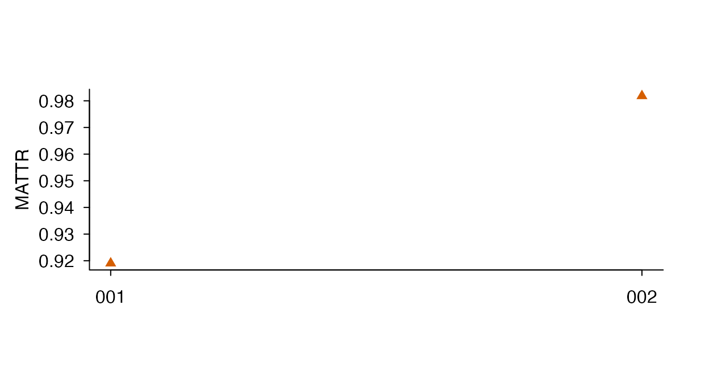

# English tokenization and document input

## Choose what counts as a word

An essay can include contractions, web addresses and dates. Counting
pieces of a URL as vocabulary changes both lexical diversity and
vocabulary-list coverage. Before comparing texts, choose the same
segmentation and inspect representative examples from your corpus.
ldfreq offers an English lexical tokenizer that runs in R with its
existing `stringi` dependency, without Python, model downloads, or an
external service.

Select it explicitly with `tokenizer = "english"`. The default
`"unicode"` retains the original segmentation for compatibility with
existing analyses.

Tokenization does not correct learner spelling or grammar. Preserve the
source and declare any correction policy separately. The [reviewed-text
example](https://ryuya-dot-com.github.io/ldfreq/articles/auditing-vocabulary-profiles.html#handle-learner-errors-without-losing-the-observed-text)
keeps approved, rejected and unresolved edits and compares complete
original and revised texts without treating off-list words as errors.

``` r
text <- "John’s well-known book costs 3.14. See https://example.org on 2026-10-04."
english <- lexdiv_tokenize(text, tokenizer = "english", case = "lower")
english$tokens
#>   token_index start end    surface is_number
#> 1           1     1   6     john's     FALSE
#> 2           2     8  17 well-known     FALSE
#> 3           3    19  22       book     FALSE
#> 4           4    24  28      costs     FALSE
#> 5           5    36  38        see     FALSE
#> 6           6    60  61         on     FALSE
english$provenance$excluded_spans
#>   start end             surface reason
#> 1    30  33                3.14 number
#> 2    40  58 https://example.org    url
#> 3    63  72          2026-10-04 number
```

`John's` and `well-known` each count as one surface word. The price,
URL, and date do not enter the lexical denominator. Apostrophe and
hyphen typography are canonicalized after the requested Unicode
normalization and case conversion: left/right curly apostrophes become
`'`, and Unicode hyphen/non-breaking hyphen become `-`. This does not
expand contractions or provide lemmas.

| Input | English lexical rule |
|----|----|
| `can't`, `won't`, `John's` | Keep whole; no grammatical interpretation |
| `well-known`, `COVID-19`, `2nd` | Keep as one word |
| `U.S.A.`, `e.g.` | Keep dotted initialisms with periods |
| `Dr.` | Retain `Dr`; discard the final punctuation |
| `3.14`, `-12`, `1,000`, `2e-3`, `75%` | One number-like span; exclude by default |
| `2026-10-04`, `3/4`, `10:30` | One number-like span; exclude by default |
| HTTP(S)/www URL, dotted-domain email address | Exclude recognized full span |
| Standalone punctuation, emoji, combining mark | Ignore |

With `keep_numbers = TRUE`, number-like expressions are retained and
flagged with `is_number = TRUE`. Numeric recognition is not date or
number validation; for example, an invalid calendar date can still be a
number-like expression. URL recognition can include trailing
punctuation. Bare domains without www or HTTP(S), malformed addresses,
abbreviations requiring a dictionary, and language-specific segmentation
are outside these rules. Check token rows when those cases are important
to your corpus.

Offsets count Unicode code points in the **processed text**, after
normalization, case conversion and typography changes. They are not byte
positions or offsets into the original text. The full source is not
retained, but tokens and `excluded_spans` contain observed text; this is
an analysis record, not redaction. The exclusion table lists recognized
URLs, emails and removed numbers, not every punctuation character.
SHA-256 fingerprints detect accidental edits when the object is reused.
They do not establish authenticity or reconstruct source text.

## Check the effect on your results

The two rules answer different operational questions. This small
sensitivity example illustrates the consequences; it does not establish
that either rule is universally superior.

``` r
comparison_text <- "Read read at https://example.org on 2026-10-04."
prepared <- lapply(c("unicode", "english"), function(rule) {
  lexdiv_tokenize(comparison_text, tokenizer = rule, case = "lower")
})
names(prepared) <- c("unicode", "english")
comparison <- lexdiv_metrics_text_batch(prepared, metrics = "ttr")
knitr::kable(comparison$results[, c("document_id", "N", "V", "value")])
```

| document_id |   N |   V | value |
|:------------|----:|----:|------:|
| unicode     |   8 |   7 | 0.875 |
| english     |   4 |   3 | 0.750 |

``` r
lapply(prepared, function(x) x$tokens$surface)
#> $unicode
#> [1] "read"       "read"       "at"         "https"      "example"   
#> [6] "org"        "on"         "2026-10-04"
#> 
#> $english
#> [1] "read" "read" "at"   "on"
```

Here, removing non-lexical spans changes the number of tokens and types,
and therefore TTR. A higher TTR under one rule is not evidence of better
writing or better tokenization. Report the tokenizer ID/version and
settings along with the metric definition and parameters. For NJ8, a
retained surface form such as `John's`, `can't` or `U.S.A.` can still be
off-list. Lemma analyses require an explicit annotation step, and the
coverage report must remain with the scores. Both R tokenizers differ
from the bundled TUBELEX Treebank segmentation; see the separate
[TUBELEX input
guide](https://ryuya-dot-com.github.io/ldfreq/articles/tubelex-input.md)
when source-aligned segmentation is required.

## Declare spelling, name, numeral and symbol policies

These are measurement choices, not automatically errors in the writer’s
text. Keep source forms, analysis keys and reference-lookup keys
separate. The raw tokenizer does not infer national variety, proper
names or the meaning of a number. Current behavior and possible
alternatives are:

| Item | Current English lexical tokenizer | Study-specific alternative |
|----|----|----|
| `colour` / `color` | Separate surface forms; no variety conversion | Reviewed equivalence for counting, lookup, or both, declared separately |
| `Rose` / `rose` | Retains both; `case = "lower"` merges their spellings | Annotate the original case; select proper-noun occurrences using supplied POS |
| `2026`, `3.14`, `75%` | Removed with `keep_numbers = FALSE`; retained with `TRUE` | Retain for numeracy/discourse questions; record the numeric-expression rule |
| `two`, `2nd`, `COVID-19` | Retained even with `keep_numbers = FALSE` | Use explicit linguistic annotation or reviewed categories if broader exclusion is needed |
| Punctuation, `$`, `+`, emoji | Standalone marks are not lexical tokens | Import complete annotations when these marks or their boundaries matter |
| `can't`, `well-known` | Internal apostrophes/hyphens retained | A different segmentation needs its own declared tokenizer/reference compatibility |

### English spelling varieties

`colour` and `color` are accepted variety spellings ([Cambridge
Dictionary](https://dictionary.cambridge.org/dictionary/english/color)).
The bundled NJ8 snapshot matches `color`, `center` and `theater`, but
does not match the surface queries `colour`, `centre` and `theatre`.
This is a lookup boundary, not evidence that the British spellings are
errors or more advanced words. NJ8’s `expand_parenthetical` only expands
alternatives actually present in the resource; it is not a comprehensive
British/American conversion table.

``` r
spelling_lookup <- nj8_profile(c("colour", "color", "centre", "center",
  "theatre", "theater"), unit = "surface")
spelling_lookup$lookup[, c("surface_term", "lookup_term", "matched", "level")]
#>   surface_term lookup_term matched level
#> 1       colour      colour   FALSE    NA
#> 2        color       color    TRUE     1
#> 3       centre      centre   FALSE    NA
#> 4       center      center    TRUE     1
#> 5      theatre     theatre   FALSE    NA
#> 6      theater     theater    TRUE     1
```

For surface-form research, keep the distinction. For a declared
equivalence analysis, retain a versioned, reviewed mapping and show the
original result alongside it. Mapping only the lookup key can improve
reference coverage without changing the diversity calculation. Merging
types is a separate decision. There is no universal need to prefer US
over UK forms, and English varieties are not exhausted by those two
labels. Avoid global suffix substitutions or rewriting names/titles.
Some mappings depend on POS and sense; for example, [practise is a UK
verb
form](https://dictionary.cambridge.org/dictionary/english/practise),
while [practice also serves as a
noun](https://dictionary.cambridge.org/dictionary/english/practice).
Spelling equivalence is distinct from inflectional lemmatization and
synonymy.

For frequency resources such as TUBELEX, querying the US form is **not**
a pooled frequency for both spellings. Pooling requires compatible
underlying counts and denominators and a declared grouping; do not add
log/Zipf values. Document ranges cannot simply be added because a
document may contain both forms. Surface-form psycholinguistic
properties such as orthographic length or form-specific familiarity must
remain attached to the displayed form unless there is evidence for
combining them. No frequency/norm pooling is implemented by the example
below.

### Proper nouns and numerals

`word_inclusion = "content"` means `ADJ`, `ADV`, `NOUN`, **`PROPN`** and
`VERB`. It therefore includes proper nouns; it is not a “remove names”
switch. For a different selection, import complete annotations and
create an explicit view. Capitalization alone cannot decide whether a
token is a name: `Rose` can name a person, while an ordinary noun may
start a sentence. Keep case for annotation, then separately declare case
handling for counting. A POS filter is not full named-entity
recognition: some words within names/titles retain other POS tags, as
explained in the [UD PROPN
specification](https://universaldependencies.org/u/pos/PROPN.html).
Excluding complete entities requires reviewed spans or an identified NER
layer. Replacing all names with `<NAME>` creates an artificial repeated
type; it is neither simple exclusion nor an unchanged lexical-diversity
analysis. Selection also does not anonymize the saved source or audit
tables.

`is_number` is a tokenizer pattern flag, not a semantic numeral
annotation. With English tokenization it recognizes digit-based numeric
expressions, including dates and percentages. `two` and `IV` are not
caught by that flag; `2nd` and alphanumeric product names remain
word-like tokens. In contrast, [UD
NUM](https://universaldependencies.org/u/pos/NUM.html) includes cardinal
number words, but ordinarily places English ordinals such as `second`
under ADJ. Thus even removing `NUM` does not mean removing every
expression with a numerical meaning. The legacy `tokenizer = "unicode"`
has a narrower pure-number rule; state which tokenizer was used.

Retaining `1,000` and `1000` does not automatically merge their forms or
parse their values. The tokenizer is not a locale-aware numeric parser
and does not validate dates. For quantity analysis, define
decimal/grouping conventions, units, dates, identifiers and ambiguous
forms separately. Replacing all numeric expressions with `<NUM>` would
again change the measured type distribution.

### Symbols and boundaries

[UD distinguishes symbols from
punctuation](https://universaldependencies.org/u/pos/SYM.html): currency
signs, mathematical operators and emoji can carry meaning. Ignoring them
can be reasonable for a declared word-based measure, but cannot support
a claim about their absence or their communicative functions. The raw
English tokenizer turns `C++` into `C`, `R&D` into `R` and `D`, and
`#topic` into `topic`. It does not interpret `&` as `and`, expand
currency signs, preserve social-media entities or provide a
punctuation-error measure. Curly apostrophes and lexical hyphens are
canonicalized; an em dash separates words. Inspect such cases before
using a lexical tokenizer for specialist texts.

For punctuation/symbol research, use complete externally supplied
segmentation with
[`lexdiv_import_annotations()`](https://ryuya-dot-com.github.io/ldfreq/reference/lexdiv_import_annotations.md).
It retains every supplied surface and aligns it to the original text; a
reviewed token can therefore preserve `C++`. This does not make its POS
automatically correct. Use the same tokenization policy across
comparison groups and retain the source record.

For adjacent n-grams, do not remove marks and renumber the remaining
words. Dropping `+` from `cats + dogs` must not silently create an
adjacent `cats dogs` pair under a policy that treats excluded positions
as boundaries. The example retains full original token positions, so
[`lexdiv_ngrams()`](https://ryuya-dot-com.github.io/ldfreq/reference/lexdiv_ngrams.md)
respects the gap.
[`lexdiv_as_quanteda()`](https://ryuya-dot-com.github.io/ldfreq/reference/lexdiv_read_masc.md)
can also retain such gaps as padding. A raw lexical tokenizer has
already removed punctuation before numbering tokens; it cannot
reconstruct these boundaries later. Sentence/segment boundaries must be
supplied explicitly. Windowed diversity on a selected word sequence has
a different contract: its windows count selected tokens, not original
character distance.

### Run the policy comparison

The installed example supplies eight authored documents and their
complete token rows, including a technical name, missing POS and an
empty document. It compares name/numeral selections and spelling
equivalence through existing functions. Three illustrative noun aliases
are explicitly reviewed; this is not an automatically validated or
comprehensive spelling dictionary.

``` r
policy_example <- new.env(parent = environment())
sys.source(system.file("examples", "lexical-counting-policy.R", package = "ldfreq",
  mustWork = TRUE), envir = policy_example)
counting <- policy_example$lexical_counting_example
subset(counting$metrics, metric_id == "ttr" &
  document_id %in% c("variants", "names", "numerals") &
  policy %in% c("words_and_numerals", "without_names_or_numerals", "spelling_equivalence"),
  select = c(policy, document_id, selected_known, types_known, reportable_value))
#>                       policy document_id selected_known types_known
#> 1         words_and_numerals    variants              4           4
#> 3         words_and_numerals       names              4           3
#> 5         words_and_numerals    numerals              7           6
#> 49 without_names_or_numerals    variants              4           4
#> 51 without_names_or_numerals       names              3           3
#> 53 without_names_or_numerals    numerals              4           3
#> 65      spelling_equivalence    variants              4           3
#> 67      spelling_equivalence       names              4           3
#> 69      spelling_equivalence    numerals              7           6
#>    reportable_value
#> 1         1.0000000
#> 3         0.7500000
#> 5         0.8571429
#> 49        1.0000000
#> 51        1.0000000
#> 53        0.7500000
#> 65        0.7500000
#> 67        0.7500000
#> 69        0.8571429
subset(counting$coverage, document_id == "variants" & policy == "words_and_numerals")
#>               policy document_id selected_known unknown_upos exact_matched
#> 1 words_and_numerals    variants              4            0             2
#>   alias_matched exact_coverage_conditional alias_coverage_conditional
#> 1             3                        0.5                       0.75
```

For `The colour is color.`, surface TTR is 1 and TTR with declared
spelling equivalence is 0.75. Exact NJ8 token coverage is 2/4; reviewed
alias lookup is 3/4. The lookup comparison is also available without
merging diversity types. In `Rose saw a rose.`, lowercased surface TTR
increases from 0.75 to 1 after removing the supplied PROPN occurrence.
Excluding names does not have a fixed direction of effect; inspect N and
V together.

`$annotation` retains full source/positions, `$selections` keeps every
token and its exclusion reason, and `$runs` retains complete
metric/reference objects and query-to-source links. `$aliases` and
`$alias_info` retain the mapping, review metadata and fingerprint.
`conditional_value` summarizes only selected tokens with known POS. If a
selection cannot be resolved because POS is missing, `reportable_value`
stays missing; neither the unknown token nor its document is silently
treated as a complete case. Reference coverage is explicitly conditional
on selected known tokens. The three-token MATTR window is illustrative
only.

``` r
policy_path <- tempfile(fileext = ".rds")
saveRDS(list(result = counting, session = sessionInfo()), policy_path)
stopifnot(identical(readRDS(policy_path)$result, counting))
unlink(policy_path)
```

For a study, save to a persistent path and retain the annotation
model/version and review procedure. The authored tags here demonstrate
accounting and source alignment, not POS/NER accuracy, psycholinguistic
validity or a preferred universal exclusion policy.

## Analyze an ID/text table

Use one row per document, with explicit unique IDs and character text.
Other columns, such as writer or task, stay in the study table for a
later join by ID. Empty text is a valid zero-token document. `NA` text
is an error naming the document; decide whether it denotes missing data
before analysis rather than silently replacing it with an empty string.

``` r
essays <- data.frame(
  essay_id = c("essay_02", "essay_01", "empty"),
  response = c("The student reads a book and discusses the book.",
               "A reader explores a story with a friend.", "")
)
tokens <- lexdiv_tokenize_batch(
  essays, id_col = "essay_id", text_col = "response",
  tokenizer = "english", case = "lower"
)
analysis <- lexdiv_metrics_text_batch(
  tokens, metrics = c("ttr", "mattr"), window_length = 5
)
analysis$results
#> <lexdiv_batch_results: 3 documents; 6 metric records; schema 0.1.0>
#>   document_id metric_id     value  status missing_reason N V
#> 1    essay_02       ttr 0.7777778      ok           <NA> 9 7
#> 2    essay_02     mattr 0.9600000      ok           <NA> 9 7
#> 3    essay_01       ttr 0.7500000      ok           <NA> 8 6
#> 4    essay_01     mattr 0.8500000      ok           <NA> 8 6
#> 5       empty       ttr        NA missing    empty_input 0 0
#> 6       empty     mattr        NA missing    empty_input 0 0
#>   below_quality_floor
#> 1               FALSE
#> 2                TRUE
#> 3               FALSE
#> 4                TRUE
#> 5                TRUE
#> 6                TRUE
levels <- nj8_profile_batch(tokens, unit = "surface")
levels$coverage
#>   document_id input_tokens eligible_tokens excluded_tokens selection_coverage
#> 1    essay_02            9               9               0                  1
#> 2    essay_01            8               8               0                  1
#> 3       empty            0               0               0                 NA
#>   matched_tokens off_list_tokens token_coverage eligible_types matched_types
#> 1              7               2      0.7777778              7             5
#> 2              7               1      0.8750000              6             5
#> 3              0               0             NA              0             0
#>   off_list_types type_coverage
#> 1              2     0.7142857
#> 2              1     0.8333333
#> 3              0            NA
```

The output keeps the input document order. Empty documents retain metric
rows with missing values and reasons, plus a preprocessing record. They
have no token audit rows. Short documents never reduce another
document’s requested window. For raw text alone,
`lexdiv_metrics_text_batch(essays, id_col = "essay_id", text_col = "response", tokenizer = "english", case = "lower", ...)`
combines the two steps. For existing tokenizations, omit tokenizer
arguments: their recorded settings are authoritative. Annotated
tokenizations can be analyzed with `unit = "lemma"` or `"flemma"` and
the same explicit word-inclusion policy used by
[`lexdiv_metrics_text()`](https://ryuya-dot-com.github.io/ldfreq/reference/lexdiv_preprocessing.md).

## Import CSV or UTF-8 text files

Start here if your essays are saved as files rather than typed into R.
This walkthrough runs offline with 30 constructed English texts and one
intentionally empty file, all project-authored and MIT-licensed. Shared
topic passages and different amounts of repetition illustrate variation
in vocabulary diversity; they are not independent learner observations
or proficiency data. Reading Japanese text uses the same input steps;
its subsequent annotation is a [separate
workflow](https://ryuya-dot-com.github.io/ldfreq/articles/japanese-annotations.md).

The small `read_text_file()` helper below is an **explicitly sourced
example**, not an exported ldfreq function. It uses base R for reading
and the existing digest dependency for hashes. It preserves paragraph
breaks, original line endings and the final newline, records a removed
UTF-8 byte-order mark (BOM), and rejects failed decoding rather than
replacing characters. It does not tokenize, correct spelling or
normalize the text. This avoids silently losing file details by
splitting into lines and joining them again.

### Start with one file

Run this setup once. The installed sample directory has the following
layout:

``` text
text-input/
  texts/001.txt
  texts/002.txt
  ...
  texts/030.txt
  texts/031.txt     # intentionally empty
  essays.csv       # the same 31 documents, one row per document
  metadata.csv     # writer/task information, in a different row order
  japanese.txt     # UTF-8 reading example only
```

``` r
library(ldfreq)
input_helpers <- new.env(parent = baseenv())
sys.source(system.file("examples", "text-file-input.R",
  package = "ldfreq", mustWork = TRUE), input_helpers)
input_dir <- system.file("examples", "text-input",
  package = "ldfreq", mustWork = TRUE)

one_path <- file.path(input_dir, "texts", "001.txt")
stopifnot(file.exists(one_path))
one_file <- input_helpers$read_text_file(one_path, encoding = "UTF-8")
# Wrap the preview only; one_file$text retains its original line breaks.
cat(strwrap(one_file$text, width = 68), sep = "\n")
#> The class visited a library near the station. Students chose books
#> about places they hoped to visit and read a few pages in silence.
#> One student found a map inside an old travel guide. Another
#> compared two descriptions of the same city. The teacher asked
#> everyone to explain one surprising detail to a partner. They then
#> returned to the shelves to find evidence for their explanations.
#> Before leaving, the group wrote questions that a later reading
#> session could explore. I explained the experience in a short
#> message to a friend. Choosing specific examples made the account
#> clearer and helped me remember details that I had almost forgotten.
one_file$source[c("source_encoding", "source_bytes", "characters", "utf8_bom_removed")]
#>   source_encoding source_bytes characters utf8_bom_removed
#> 1           UTF-8          643        643            FALSE
```

For your own project, replace only `input_dir` with the folder
containing your data, for example `input_dir <- "data"`. Relative paths
start at [`getwd()`](https://rdrr.io/r/base/getwd.html); an RStudio
project makes that location easier to keep consistent. Use
[`file.path()`](https://rdrr.io/r/base/file.path.html) to build paths,
including paths containing spaces or Japanese characters. If
`system.file(..., mustWork = TRUE)` reports that the example is missing,
update ldfreq using the [installation
instructions](https://ryuya-dot-com.github.io/ldfreq/#installation).

Check that the displayed text and paragraph breaks match your file.
Bytes, characters and analyzed words are different counts. This example
treats the whole file as **one document**, including both paragraphs; a
newline does not create a new essay.

### Read several files with explicit document IDs

List the selected files before reading them. This example searches only
`texts/`, not its subdirectories. Change the mapping table explicitly
for your own files; IDs must be unique and need not be filename stems.
With subdirectories, retain their relative paths so that two files named
`essay.txt` are distinguishable.

``` r
selected_files <- file.path("texts", list.files(
  file.path(input_dir, "texts"), pattern = "[.]txt$",
  recursive = FALSE, ignore.case = TRUE))
if (!length(selected_files)) stop("No TXT files selected; check input_dir and the folder.")
selected_files
#>  [1] "texts/001.txt" "texts/002.txt" "texts/003.txt" "texts/004.txt"
#>  [5] "texts/005.txt" "texts/006.txt" "texts/007.txt" "texts/008.txt"
#>  [9] "texts/009.txt" "texts/010.txt" "texts/011.txt" "texts/012.txt"
#> [13] "texts/013.txt" "texts/014.txt" "texts/015.txt" "texts/016.txt"
#> [17] "texts/017.txt" "texts/018.txt" "texts/019.txt" "texts/020.txt"
#> [21] "texts/021.txt" "texts/022.txt" "texts/023.txt" "texts/024.txt"
#> [25] "texts/025.txt" "texts/026.txt" "texts/027.txt" "texts/028.txt"
#> [29] "texts/029.txt" "texts/030.txt" "texts/031.txt"

# Explicit naming rule for these sample files; replace this mapping for your data.
file_map <- data.frame(document_id = sprintf("%03d", 1:31),
  file = file.path("texts", sprintf("%03d.txt", 1:31)))
stopifnot(!anyNA(file_map$document_id), all(nzchar(trimws(file_map$document_id))),
  !anyDuplicated(file_map$document_id), !anyDuplicated(file_map$file),
  setequal(selected_files, file_map$file))
head(file_map)
#>   document_id          file
#> 1         001 texts/001.txt
#> 2         002 texts/002.txt
#> 3         003 texts/003.txt
#> 4         004 texts/004.txt
#> 5         005 texts/005.txt
#> 6         006 texts/006.txt

decoded_files <- lapply(file_map$file, function(name) {
  input_helpers$read_text_file(file.path(input_dir, name), encoding = "UTF-8")
})
file_documents <- data.frame(document_id = file_map$document_id,
  text = vapply(decoded_files, `[[`, character(1), "text"))
file_sources <- do.call(rbind, lapply(decoded_files, `[[`, "source"))
file_sources$document_id <- file_map$document_id
file_sources$source_file <- file_map$file  # retain project-relative paths
file_sources[c(1:3, nrow(file_sources)),
  c("document_id", "source_file", "source_bytes", "characters")]
#>    document_id   source_file source_bytes characters
#> 1          001 texts/001.txt          643        643
#> 2          002 texts/002.txt          773        773
#> 3          003 texts/003.txt          875        875
#> 31         031 texts/031.txt            0          0
stopifnot(identical(file_documents$text[1], one_file$text),
  identical(file_documents$text[31], ""))
```

The mapping table determines document order; directory order does not
assign writer or task IDs. The preview shows the first three documents
and the empty file; all 31 remain in the saved tables. Keep the original
files as well as these hashes: a hash identifies bytes but cannot
reconstruct them.

### Alternatively, read a CSV containing the texts

Use this route instead of the folder loop when your data have one
ID/text row per document. A quoted CSV field can contain commas,
quotation marks and line breaks. Do not split such a CSV with
[`readLines()`](https://rdrr.io/r/base/readLines.html) or treat each
physical line as one document.

``` r
csv_input <- input_helpers$read_text_file(file.path(input_dir, "essays.csv"))
csv_documents <- read.csv(text = csv_input$text,
  colClasses = "character", na.strings = "<MISSING>", check.names = FALSE)
stopifnot(identical(csv_documents, file_documents))
```

These sample files use LF line endings, so the two routes contain
exactly the same IDs and text strings. CSV parsing is a separate step:
[`read.csv()`](https://rdrr.io/r/utils/read.table.html) converts CRLF
inside quoted fields to LF. For your own TXT/CSV comparison, check the
parsed strings and record that transformation; do not assume identical
source character positions merely because the displayed prose looks the
same. The original CSV hash is retained separately from its parsed text.
For your CSV, select the real ID/text columns with `id_col` and
`text_col` in the batch call below. Reading columns as character
preserves IDs such as `001`, and literal responses such as `TRUE` or
`NA`. Here only `<MISSING>` denotes missing data; choose a marker that
is not an actual response. `""` denotes an empty response, not an
unavailable response. ldfreq rejects `NA` text and names the document;
resolve its meaning in your study record instead of replacing it with
`""`.

### Analyze, attach metadata and inspect the result

Use `file_documents` below, or substitute `csv_documents`. Normalization
and case conversion happen here as declared analysis choices, after file
reading. The 50-token window is common to all documents. The 30 nonempty
teaching texts are 107–149 tokens long and can all use that window. For
a research corpus, justify the window for your task and length
distribution; keep it common across comparable texts rather than
shrinking it for short documents.

``` r
file_tokens <- lexdiv_tokenize_batch(file_documents,
  id_col = "document_id", text_col = "text", tokenizer = "english",
  normalization = "NFC", case = "lower")
file_analysis <- lexdiv_metrics_text_batch(file_tokens,
  metrics = c("ttr", "mattr"), window_length = 50)
file_results <- file_analysis$results[c("document_id", "metric_id", "N", "V", "value",
  "status", "missing_reason")]
# Preview three nonempty documents and the empty document; retain all result rows.
rbind(head(file_results, 6), subset(file_results, document_id == "031"))
#> <lexdiv_batch_results: 4 documents; 8 metric records; schema unknown>
#>    document_id metric_id     value  status missing_reason   N  V
#> 1          001       ttr 0.7757009      ok           <NA> 107 83
#> 2          001     mattr 0.8293103      ok           <NA> 107 83
#> 3          002       ttr 0.7131783      ok           <NA> 129 92
#> 4          002     mattr 0.7905000      ok           <NA> 129 92
#> 5          003       ttr 0.5918367      ok           <NA> 147 87
#> 6          003     mattr 0.6665306      ok           <NA> 147 87
#> 61         031       ttr        NA missing    empty_input   0  0
#> 62         031     mattr        NA missing    empty_input   0  0
with(file_results, table(metric_id, status))
#>          status
#> metric_id missing ok
#>     mattr       1 30
#>     ttr         1 30

metadata_input <- input_helpers$read_text_file(file.path(input_dir, "metadata.csv"))
file_metadata <- read.csv(text = metadata_input$text,
  colClasses = "character", na.strings = "<MISSING>", check.names = FALSE)
stopifnot(!anyNA(file_metadata$document_id), !anyDuplicated(file_metadata$document_id),
  setequal(file_metadata$document_id, file_documents$document_id))
file_report <- lexdiv_widen(file_analysis$results)
metadata_row <- match(file_report$document_id, file_metadata$document_id)
stopifnot(identical(file_report$document_id, file_metadata$document_id[metadata_row]))
file_report[c("writer_id", "task")] <- file_metadata[metadata_row, c("writer_id", "task")]
file_report[c(1:3, nrow(file_report)),
  c("document_id", "writer_id", "task", "ttr__value", "mattr__value")]
#> <lexdiv_wide_results: 4 rows; 5 columns>
#>    document_id         writer_id                 task ttr__value mattr__value
#> 1          001 example_writer_01 authored-description  0.7757009    0.8293103
#> 2          002 example_writer_02 authored-description  0.7131783    0.7905000
#> 3          003 example_writer_03 authored-description  0.5918367    0.6665306
#> 31         031 example_writer_01 authored-description         NA           NA
```

Metadata are deliberately in a different order: join by ID, never by row
number. This example requires metadata for exactly the selected
documents; subset a larger study table explicitly and inspect unmatched
IDs. Several documents may share a writer ID. Here all writer/task IDs
are fictional and the texts share authored passages; they cannot support
population inference. Document `031` stays in the report with
unavailable metrics and their reasons. It is not a zero-diversity essay.

``` r
plot(file_analysis, metric_id = "mattr", xlab = "Document", las = 2)
```



All 30 computable values are drawn in document-ID order; the empty
document remains in the table and is not drawn as zero. Rotated labels
and an 8-by-4-inch figure keep all 30 IDs readable. The points show each
document’s actual value; ID order does not represent time, proficiency
or a treatment gradient. Shared passages and repetition explain this
constructed spread, not differences between learner groups. Add
`monochrome = TRUE` for black-and-white output. The [report
guide](https://ryuya-dot-com.github.io/ldfreq/articles/from-text-to-report.html#prepare-the-figure-at-its-publication-size)
shows publication-size PDF/PNG export and figure notes outside the
image.

### Save the input, decisions and results together

``` r
file_record <- list(documents = file_documents, sources = file_sources,
  file_map = file_map, csv_source = csv_input$source,
  metadata = file_metadata, metadata_source = metadata_input$source,
  tokens = file_tokens, analysis = file_analysis, report = file_report,
  session = sessionInfo())
output_dir <- tempfile("ldfreq-file-example-")
dir.create(output_dir)
saveRDS(file_record, file.path(output_dir, "analysis.rds"), version = 2)
write.csv(file_report, file.path(output_dir, "document-results.csv"),
  row.names = FALSE, na = "<MISSING>", fileEncoding = "UTF-8")
restored_files <- readRDS(file.path(output_dir, "analysis.rds"))
stopifnot(identical(restored_files, file_record))
```

The temporary output directory is for the executable demonstration. For
your study, use a persistent folder such as `output_dir <- "results"`
and retain the original input files. The CSV is an analysis table; the
RDS preserves text, decoding records, tokenization, unavailable results
and metadata. In a fresh R session,
`saved <- readRDS("results/analysis.rds")` restores that record without
reading or annotating the corpus again. Keep source-containing records
under the same access conditions as the original material.

### Japanese text, encoding and common input problems

Reading is independent of the annotation language:

``` r
japanese_input <- input_helpers$read_text_file(file.path(input_dir, "japanese.txt"))
cat(japanese_input$text)
#> 学生は図書館で本を読みました。
#> 友だちと物語について話しました。
```

For Japanese word analysis, pass the decoded text into the [Japanese
file-to-review
workflow](https://ryuya-dot-com.github.io/ldfreq/articles/japanese-annotations.html#japanese-file-workflow);
the English tokenizer is not a Japanese morphological analyzer. UTF-8
file encoding and the R session’s locale are also different settings.

| Observation | What to check or change |
|----|----|
| File or folder not found | Check [`getwd()`](https://rdrr.io/r/base/getwd.html), `input_dir` and [`file.exists()`](https://rdrr.io/r/base/files.html); inspect the selected file list before changing the text. |
| No TXT files selected | Check the folder and extension. Enable subdirectory selection only deliberately and update the mapping with relative paths. |
| Duplicate or unmatched IDs | Fix the file/metadata mapping; do not let a join duplicate essays or assign IDs from row numbers. |
| Invalid decoding or byte round-trip failure | Inspect the file’s declared encoding. For a **known** CP932 file, call `input_helpers$read_text_file(path, encoding = "CP932")`; do not retry encodings until one happens to succeed. |
| A UTF-8 BOM is present | The helper removes only the leading BOM and records `utf8_bom_removed`. A conflicting encoding declaration is rejected. |
| A file is empty or a CSV value is missing | Keep empty text distinct from `NA`. The former remains a zero-token document; the latter requires a study decision before analysis. |
| A file exceeds the 10 MiB example limit | Review file selection and available memory before explicitly increasing `max_bytes`. This example reads each selected file and retains the corpus in memory. |

LF, CRLF and final-newline presence are retained by the text-file
helper. Subsequent token positions refer to the declared analysis
string, not original byte offsets. Known CP932 bytes are decoded to
UTF-8, and a round-trip check rejects lossy conversion. Successful
decoding alone cannot establish that an encoding declaration is correct:
inspect the text too. The helper supports UTF-8 and CP932 only, not PDF,
Word, OCR, automatic encoding detection or automatic Unicode/spelling
normalization.

## Save the complete analysis

``` r
record <- list(tokens = tokens, diversity = analysis, nj8 = levels,
               session = sessionInfo())
path <- tempfile(fileext = ".rds")
saveRDS(record, path)
stopifnot(identical(readRDS(path), record))
unlink(path)
wide <- lexdiv_widen(analysis$results)
```

Use `wide` for a join or a CSV export, while keeping the RDS record for
the tokenization and exclusion decisions. In methods, state that the
English tokenizer preserves contractions and hyphenated words, identify
the number policy and case/normalization choices, and distinguish
surface coverage from lemma coverage. Cite ldfreq and the New JACET 8000
source recorded in `levels$provenance` when reporting NJ8 results. The
[text-to-report
example](https://ryuya-dot-com.github.io/ldfreq/articles/from-text-to-report.md)
develops the interpretation and reporting of the resulting metrics.
