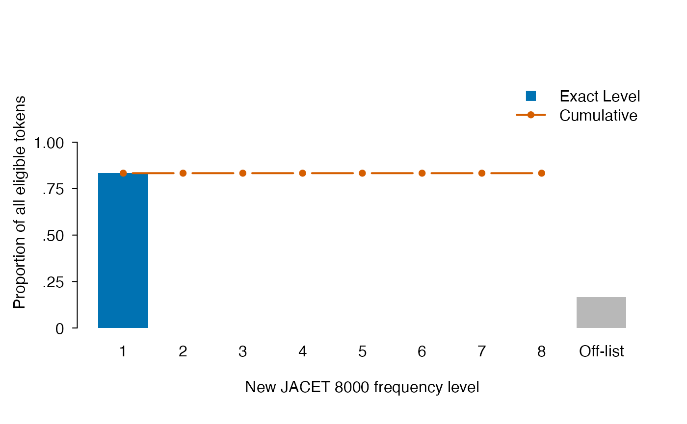
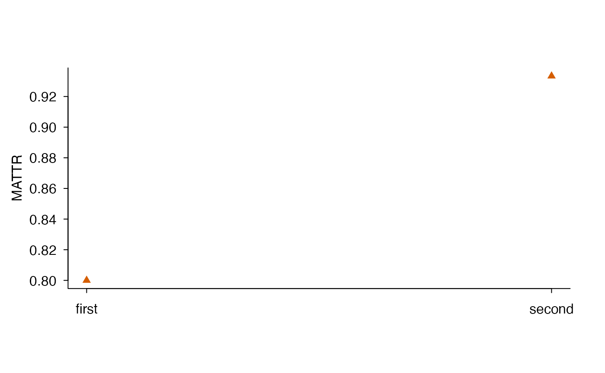

# From files to a diagnostic report

## Compare analysis conditions from local files

Start here to turn your own files into a table you can inspect, save and
report. The two paths below work with ldfreq 0.3.0.9002, without new
packages, downloads or an API key. English text is tokenized in R.
Japanese text uses prepared annotations: importing a file does not
perform Japanese morphological analysis.

The question is **how a declared counting decision changes the same
documents**. For English we preserve or lowercase spelling; for Japanese
we retain all body words or only words with a declared content POS.
These comparisons do not estimate writing ability or establish
equivalence between the two languages. The English files are 30 authored
teaching essays plus an empty file, not learner data. The five Japanese
files are deliberately short authored examples that also expose missing
annotations and unavailable scores.

### Keep diagnostics beside each value

Run this setup for either path. `diagnostic_rows()` is a small function
defined in this guide, not a new package API. It extracts diagnostics
already computed by the three requested metrics; it does not recalculate
MTLD. The full result objects retain method parameters and schema
identities in the saved record.

``` r
reader <- new.env(parent = baseenv())
sys.source(system.file("examples", "text-file-input.R",
  package = "ldfreq", mustWork = TRUE), reader)
settings <- list(metrics = c("ttr", "mattr", "mtld"),
  window_length = 50, mtld_threshold = 0.72)
calculate <- function(tokens) do.call(lexdiv_metrics_batch, c(list(tokens), settings))
diagnostic_rows <- function(result) {
  out <- as.data.frame(result)[c("document_id", "metric_id", "method_id",
    "value", "status", "missing_reason", "N", "V", "below_quality_floor")]
  fields <- c("forward_score", "reverse_score", "forward_complete_factors",
    "reverse_complete_factors", "forward_tail_credit", "reverse_tail_credit")
  for (field in fields) out[[field]] <- vapply(result$diagnostics, function(d) {
    if (is.null(d[[field]])) NA_real_ else as.numeric(d[[field]])
  }, numeric(1))
  available <- out$metric_id == "mtld" & out$status == "ok"
  out$mtld_tail_only <- ifelse(available,
    pmin(out$forward_complete_factors, out$reverse_complete_factors) == 0, NA)
  out$mtld_gap_percent <- ifelse(available,
    100 * abs(out$forward_score - out$reverse_score) /
      ((out$forward_score + out$reverse_score) / 2), NA_real_)
  out
}
```

`status` describes calculation availability; `below_quality_floor` is an
advisory length screen. Neither establishes precision.
`mtld_tail_only = TRUE` means no complete factor in at least one
direction. The directional gap is order sensitivity, **not a standard
error or confidence interval**; it can be zero when both scores depend
entirely on their tails. Keep these flags rather than silently excluding
documents. See the [factor-support
explanation](https://ryuya-dot-com.github.io/ldfreq/articles/designing-comparisons.html#inspect-mtld-factor-support)
and its length-association example when checking your own study sample.

### English: preserve or lowercase spelling

Replace `en_dir` with your TXT directory. Each file is one document,
including its paragraph breaks. Filename stems are IDs here; supply your
own mapping when that rule is unsuitable. No spelling correction,
lemmatization, name removal or British/American spelling conversion is
applied. Lowercasing can merge spellings such as `Rose` and `rose`; it
does not resolve their meanings.

``` r
en_dir <- system.file("examples", "text-input", "texts",
  package = "ldfreq", mustWork = TRUE)
en_paths <- sort(list.files(en_dir, pattern = "[.]txt$", full.names = TRUE,
  ignore.case = TRUE))
stopifnot(length(en_paths) > 0L)
en_ids <- tools::file_path_sans_ext(basename(en_paths))
stopifnot(!anyDuplicated(en_ids), all(nzchar(en_ids)))
en_files <- lapply(en_paths, reader$read_text_file, encoding = "UTF-8")
en_texts <- setNames(vapply(en_files, `[[`, character(1), "text"), en_ids)
en_sources <- do.call(rbind, lapply(en_files, `[[`, "source"))
en_sources$document_id <- en_ids
en_sources$source_file <- basename(en_paths)
en_prepared <- lapply(c("preserve", "lower"), function(case) {
  lexdiv_tokenize_batch(en_texts, tokenizer = "english",
    normalization = "NFC", case = case, keep_numbers = FALSE)
})
names(en_prepared) <- c("preserve", "lower")
en_inputs <- lapply(en_prepared, function(batch) lapply(batch, function(x) x$tokens$surface))
en_runs <- lapply(en_inputs, calculate)
en_table <- do.call(rbind, lapply(names(en_runs), function(condition) {
  out <- diagnostic_rows(en_runs[[condition]])
  out$condition <- condition
  out
}))
rownames(en_table) <- NULL
en_preview <- c(head(en_ids, 1), tail(en_ids, 1))
knitr::kable(subset(en_table, document_id %in% en_preview,
  c(document_id, condition, metric_id, N, V, value, status, missing_reason)),
  digits = 3, row.names = FALSE)
```

| document_id | condition | metric_id |   N |   V |   value | status  | missing_reason |
|:------------|:----------|:----------|----:|----:|--------:|:--------|:---------------|
| 001         | preserve  | ttr       | 107 |  86 |   0.804 | ok      | NA             |
| 001         | preserve  | mattr     | 107 |  86 |   0.856 | ok      | NA             |
| 001         | preserve  | mtld      | 107 |  86 | 152.653 | ok      | NA             |
| 031         | preserve  | ttr       |   0 |   0 |      NA | missing | empty_input    |
| 031         | preserve  | mattr     |   0 |   0 |      NA | missing | empty_input    |
| 031         | preserve  | mtld      |   0 |   0 |      NA | missing | empty_input    |
| 001         | lower     | ttr       | 107 |  83 |   0.776 | ok      | NA             |
| 001         | lower     | mattr     | 107 |  83 |   0.829 | ok      | NA             |
| 001         | lower     | mtld      | 107 |  83 | 133.572 | ok      | NA             |
| 031         | lower     | ttr       |   0 |   0 |      NA | missing | empty_input    |
| 031         | lower     | mattr     |   0 |   0 |      NA | missing | empty_input    |
| 031         | lower     | mtld      |   0 |   0 |      NA | missing | empty_input    |

Retain all rows, including `031`, whose empty input yields missing
values. Compare conditions by ID and metric, never by an assumed row
order. The table below counts availability separately for each condition
and for paired values. It does not select documents on the basis of an
observed score difference.

``` r
pair_fields <- c("document_id", "metric_id", "N", "value", "status", "mtld_tail_only")
en_pairs <- merge(subset(en_table, condition == "preserve", pair_fields),
  subset(en_table, condition == "lower", pair_fields),
  by = c("document_id", "metric_id"), all = TRUE,
  suffixes = c("_preserve", "_lower"))
stopifnot(nrow(en_pairs) == length(en_ids) * length(settings$metrics))
en_counts <- do.call(rbind, lapply(settings$metrics, function(metric) {
  p <- subset(en_pairs, metric_id == metric)
  a <- p$status_preserve == "ok" & is.finite(p$value_preserve)
  b <- p$status_lower == "ok" & is.finite(p$value_lower)
  data.frame(metric_id = metric, documents = nrow(p),
    preserve_available = sum(a), lower_available = sum(b),
    paired_available = sum(a & b), unpaired = sum(!(a & b)),
    preserve_tail_only = if (metric == "mtld") sum(p$mtld_tail_only_preserve, na.rm = TRUE) else NA,
    lower_tail_only = if (metric == "mtld") sum(p$mtld_tail_only_lower, na.rm = TRUE) else NA)
}))
knitr::kable(en_counts)
```

| metric_id | documents | preserve_available | lower_available | paired_available | unpaired | preserve_tail_only | lower_tail_only |
|:---|---:|---:|---:|---:|---:|---:|---:|
| ttr | 31 | 30 | 30 | 30 | 1 | NA | NA |
| mattr | 31 | 30 | 30 | 30 | 1 | NA | NA |
| mtld | 31 | 30 | 30 | 30 | 1 | 14 | 10 |

For these files N is unchanged, while lowercasing changes type identity.
This is a sensitivity analysis of one counting decision, not a test of
whether capitalization is correct. The tokenizer’s positions refer to
processed text; case conversion can change Unicode character length in
other inputs. Do not reuse these positions as original-text annotation
anchors. Both complete tokenizations, their exclusion records and
original texts are saved below.

### Japanese: all body words or content words

This path is independent of the English path after the shared setup. It
imports five TXT files and their authored annotation CSV. For your own
texts, prepare complete annotations with your chosen analyzer and
dictionary, and replace the declared body starts and provenance. The
[Japanese file
guide](https://ryuya-dot-com.github.io/ldfreq/articles/japanese-annotations.html#japanese-file-workflow)
explains source positions, title exclusion and review; the [analyzer
recipe](https://ryuya-dot-com.github.io/ldfreq/articles/japanese-annotations.html#use-gibasa-and-a-local-unidic-dictionary-in-r)
provides a separate route for generating annotations. The authored
example does not demonstrate analyzer accuracy.

``` r
ja_dir <- system.file("examples", "text-input", "japanese-workflow",
  package = "ldfreq", mustWork = TRUE)
ja_ids <- c("variants", "homophones", "unlisted", "no_targets", "empty")
ja_files <- lapply(file.path(ja_dir, paste0(ja_ids, ".txt")),
  reader$read_text_file, encoding = "UTF-8")
ja_texts <- setNames(vapply(ja_files, `[[`, character(1), "text"), ja_ids)
ja_sources <- do.call(rbind, lapply(ja_files, `[[`, "source"))
ja_sources$document_id <- ja_ids
ja_sources$source_file <- paste0(ja_ids, ".txt")
ja_csv <- reader$read_text_file(file.path(ja_dir, "annotations.csv"))
ja_connection <- textConnection(ja_csv$text, encoding = "UTF-8")
ja_annotations <- read.csv(ja_connection, colClasses = "character",
  na.strings = "<MISSING>", check.names = FALSE, encoding = "UTF-8")
close(ja_connection)
ja_annotations$token_index <- as.numeric(ja_annotations$token_index)
ja_import <- lexdiv_import_annotations(ja_annotations,
  data.frame(document_id = ja_ids, segment_id = "s1", text = unname(ja_texts)),
  list(language = "ja", analyzer = "authored", analyzer_version = "2",
    dictionary = "none", dictionary_version = "not-applicable",
    unit = "authored-file-workflow", normalization = "none"))
ja_tokens <- ja_import$tokens
```

Read the CSV through an explicitly UTF-8 connection and mark the parsed
strings as UTF-8 too, including on C/POSIX locales. Its literal
`<MISSING>` marker denotes unavailable annotations; the original CSV
text and its hash are retained. Next declare the selection policy.

``` r
# One complete segment per document; the body extends to its end.
ja_body_start <- setNames(c(5L, 4L, 1L, 1L, NA_integer_), ja_ids)
start <- unname(ja_body_start[ja_tokens$document_id])
stopifnot(!anyNA(start), !any(ja_tokens$start < start & ja_tokens$end >= start))
ja_body <- ja_tokens$start >= start & ja_tokens$surface != "\u3002"
# This teaching inventory declares nouns and verbs as content; particles as function.
ja_groups <- setNames(c("content", "content", "function"),
  c("\u540d\u8a5e", "\u52d5\u8a5e", "\u52a9\u8a5e"))
ja_group <- unname(ja_groups[ja_tokens$POS1])
ja_unknown <- ja_body & is.na(ja_group)
ja_selections <- list(all_body = ja_body,
  content = ja_body & !is.na(ja_group) & ja_group == "content")
ja_inputs <- lapply(ja_selections, function(keep) setNames(lapply(ja_ids, function(id) {
  ja_tokens$surface[keep & ja_tokens$document_id == id]
}), ja_ids))
```

The inputs stay named by document ID, including zero-token selections.
Build the diagnostic table without dropping those documents:

``` r
ja_runs <- lapply(ja_inputs, calculate)
ja_table <- do.call(rbind, lapply(names(ja_runs), function(condition) {
  out <- diagnostic_rows(ja_runs[[condition]])
  out$condition <- condition
  out$eligible_body_N <- vapply(out$document_id, function(id)
    sum(ja_body & ja_tokens$document_id == id), integer(1))
  out$unknown_selection_N <- vapply(out$document_id, function(id)
    if (condition == "content") sum(ja_unknown & ja_tokens$document_id == id) else 0L,
    integer(1))
  out$known_excluded_N <- out$eligible_body_N - out$N - out$unknown_selection_N
  out$selection_complete <- out$unknown_selection_N == 0L
  out$reportable_value <- ifelse(out$selection_complete, out$value, NA_real_)
  out
}))
rownames(ja_table) <- NULL
knitr::kable(subset(ja_table, metric_id == "ttr", c(document_id, condition,
  eligible_body_N, N, unknown_selection_N, known_excluded_N, value, reportable_value)),
  digits = 3, row.names = FALSE)
```

| document_id | condition | eligible_body_N | N | unknown_selection_N | known_excluded_N | value | reportable_value |
|:---|:---|---:|---:|---:|---:|---:|---:|
| variants | all_body | 5 | 5 | 0 | 0 | 0.800 | 0.800 |
| homophones | all_body | 9 | 9 | 0 | 0 | 0.667 | 0.667 |
| unlisted | all_body | 1 | 1 | 0 | 0 | 1.000 | 1.000 |
| no_targets | all_body | 0 | 0 | 0 | 0 | NA | NA |
| empty | all_body | 0 | 0 | 0 | 0 | NA | NA |
| variants | content | 5 | 3 | 0 | 2 | 1.000 | 1.000 |
| homophones | content | 9 | 6 | 0 | 3 | 0.667 | 0.667 |
| unlisted | content | 1 | 0 | 1 | 0 | NA | NA |
| no_targets | content | 0 | 0 | 0 | 0 | NA | NA |
| empty | content | 0 | 0 | 0 | 0 | NA | NA |

The original titles and punctuation stay in `ja_import`. Here only the
declared body is analyzed, excluding literal `。`; other corpora require
their own explicit punctuation policy. The small POS map covers this
example, not the full UniDic inventory. Extend it deliberately for your
analyzer: missing and unmapped POS are **unknown selections**, not
automatically function words. All-body analysis does not require POS;
content selection does. The invented word in `unlisted` therefore stays
in all-body TTR but cannot be assigned to the content condition. The
accounting identity is
`eligible_body_N = N + unknown_selection_N + known_excluded_N`.

`value` is the calculation on known selected tokens. `reportable_value`
withholds it when any eligible token has unknown membership; `status`
still describes the calculation, not selection completeness. Even a
nonmissing `reportable_value` does not establish measurement precision.
Keep both columns: this prevents an incomplete content-word sample from
appearing fully observed. `no_targets` contains only an excluded full
stop, whereas `empty` has no source tokens; the imported source retains
that distinction.

``` r
knitr::kable(as.data.frame(with(ja_table, table(condition, metric_id, status))))
```

| condition | metric_id | status  | Freq |
|:----------|:----------|:--------|-----:|
| all_body  | mattr     | missing |    5 |
| content   | mattr     | missing |    5 |
| all_body  | mtld      | missing |    3 |
| content   | mtld      | missing |    4 |
| all_body  | ttr       | missing |    2 |
| content   | ttr       | missing |    3 |
| all_body  | mattr     | ok      |    0 |
| content   | mattr     | ok      |    0 |
| all_body  | mtld      | ok      |    2 |
| content   | mtld      | ok      |    1 |
| all_body  | ttr       | ok      |    3 |
| content   | ttr       | ok      |    2 |

MATTR50 is unavailable for every file. MTLD nevertheless returns values
for two all-body selections and one content selection; all three fall
below its advisory length floor. A computable value does not make these
short samples suitable for a substantive MTLD comparison. They
illustrate accounting and missingness, not recommended lengths for
lexical analysis. Do not shrink the common window or concatenate
independent documents to create scores. Content-word selection also
removes intervening tokens: a window of 50 content words has a different
original-text span from 50 all-body words. Retain the selected source
occurrences rather than claiming equal coverage. For longer Japanese
texts, see the executed [word-unit
comparisons](https://ryuya-dot-com.github.io/ldfreq/articles/japanese-annotations.html#what-the-executed-comparisons-show).

### Save a complete record and a flat table

Run the appropriate record assignment after its language path. It stores
the original input, exact selected sequences, complete results,
diagnostics and settings. The methods text states computational choices;
replace the teaching sample description with your actual sampling,
writer/task structure, analyzer and dictionary information. Do not infer
these from filenames or scores.

``` r
en_record <- list(texts = en_texts, sources = en_sources, prepared = en_prepared,
  inputs = en_inputs, results = en_runs, diagnostics = en_table, paired = en_pairs,
  counts = en_counts, settings = settings, session = sessionInfo(),
  methods = paste(length(en_texts), "English input files were analyzed.",
    "Each file was one document. English tokenization used NFC, excluded numbers,",
    "URLs and emails, and retained contractions and hyphenated words.",
    "We compared case-preserved and lowercased surface forms without lemmatization",
    "or spelling correction, retaining all documents and diagnostic flags."))
```

``` r
ja_record <- list(texts = ja_texts, sources = ja_sources, annotation_source = ja_csv,
  imported = ja_import, body_start = ja_body_start, pos_groups = ja_groups,
  selections = ja_selections, unknown_selection = ja_unknown,
  inputs = ja_inputs, results = ja_runs, diagnostics = ja_table,
  settings = settings, session = sessionInfo(),
  methods = paste(length(ja_texts), "Japanese input files were analyzed with prepared",
    "annotations, analyzer authored version 2, no dictionary or normalization.",
    "We excluded titles using declared original-codepoint body starts and removed",
    "literal full stops. We compared all retained surface words with nouns and",
    "verbs in an explicit POS map; particles were excluded from the latter.",
    "Missing or unmapped POS remained unknown. Content results were withheld",
    "when selection was incomplete. No form was corrected or lemmatized."))
```

Set `record <- en_record` or `record <- ja_record`. This last block
works for either language. For your study, replace the temporary
directory with a persistent project directory, for example
`output_dir <- "results/english"`. Files in that directory are
overwritten on a repeat run; choose separate directories for different
analyses.

``` r
record <- en_record
output_dir <- tempfile("ldfreq-condition-report-")
dir.create(output_dir, recursive = TRUE)
mtld_method <- unique(subset(record$diagnostics, metric_id == "mtld")$method_id)
stopifnot(identical(mtld_method, "mtld_seq_bidir_dirmean_lt_nomin_linear_tail_v1"))
record$methods <- c(record$methods, sprintf(paste(
  "Calculations used ldfreq %s: full-document TTR, MATTR with a common window of %d,",
  "and MTLD method %s, threshold %g.",
  "MTLD used strict <, no minimum factor length, final-token closure checks,",
  "linear residual credit (1 - TTR) / (1 - threshold), and the arithmetic mean of directions.",
  "We retained unavailable results and reasons, the advisory length flag, complete",
  "factor counts and directional gaps. Gaps describe order sensitivity, not precision."),
  as.character(packageVersion("ldfreq")), record$settings$window_length,
  mtld_method, record$settings$mtld_threshold))
saveRDS(record, file.path(output_dir, "analysis.rds"), version = 2)
write.csv(record$diagnostics, file.path(output_dir, "diagnostics.csv"),
  row.names = FALSE, na = "<MISSING>", fileEncoding = "UTF-8")
writeLines(enc2utf8(record$methods), file.path(output_dir, "methods.txt"), useBytes = TRUE)
restored <- readRDS(file.path(output_dir, "analysis.rds"))
stopifnot(identical(restored, record))
replayed <- lapply(restored$inputs, function(tokens)
  do.call(lexdiv_metrics_batch, c(list(tokens), restored$settings)))
stopifnot(identical(replayed, restored$results))
cat(record$methods, sep = "\n\n")
#> 31 English input files were analyzed. Each file was one document. English tokenization used NFC, excluded numbers, URLs and emails, and retained contractions and hyphenated words. We compared case-preserved and lowercased surface forms without lemmatization or spelling correction, retaining all documents and diagnostic flags.
#> 
#> Calculations used ldfreq 0.3.0.9003: full-document TTR, MATTR with a common window of 50, and MTLD method mtld_seq_bidir_dirmean_lt_nomin_linear_tail_v1, threshold 0.72. MTLD used strict <, no minimum factor length, final-token closure checks, linear residual credit (1 - TTR) / (1 - threshold), and the arithmetic mean of directions. We retained unavailable results and reasons, the advisory length flag, complete factor counts and directional gaps. Gaps describe order sensitivity, not precision.
```

The CSV is a flat inspection table; **the RDS is the complete analysis
record**. It contains original text and selected words, so keep it under
the same access rules as the input. Replay here verifies calculations
under the installed software; it does not independently validate
annotations or estimates. Use a persistent software environment and keep
the original files for later reanalysis. For a text CSV instead of
separate files, use the [ID-preserving CSV input
recipe](https://ryuya-dot-com.github.io/ldfreq/articles/english-tokenization.html#alternatively-read-a-csv-containing-the-texts).
The remaining sections explain reference coverage, figures and
citations.

## Join study metadata and summarize documents

The question now is **which documents and writers contribute to each
reported summary**. Continue either file path above. The recipe keeps
one row per original document, condition and metric, then joins a study
table by ID. It uses standard R and guide-local functions on the
existing package installation. No human review is required for this
path; add that workflow when your study actually includes
occurrence-level judgments.

### Match study information without losing documents

A study table has one row per document. `writer_id` may repeat across
documents; `document_id` must not. The same structure works for speaker,
participant or source-author IDs when their role is explicitly declared.
Unknown writers or tasks remain `NA`, rather than being invented from
filenames. Keep task, group, time and corpus information in separate
columns when the study needs them.

``` r
join_study_metadata <- function(rows, metadata) {
  if (!is.data.frame(rows) || !is.data.frame(metadata) ||
      anyDuplicated(names(rows)) || anyDuplicated(names(metadata)) ||
      !"document_id" %in% names(rows) ||
      !all(c("document_id", "writer_id", "task") %in% names(metadata)))
    stop("Supply tables with unique column names and document_id, writer_id, task metadata.")
  valid_id <- function(x) is.character(x) && !anyNA(x) &&
    all(validUTF8(x)) && all(nzchar(trimws(x)))
  if (!valid_id(rows$document_id) || !valid_id(metadata$document_id))
    stop("Keep document IDs as nonblank character strings, including leading zeros.")
  if (anyDuplicated(metadata$document_id)) stop("Metadata contain duplicate document IDs.")
  missing <- setdiff(unique(rows$document_id), metadata$document_id)
  extra <- setdiff(metadata$document_id, rows$document_id)
  if (length(missing) || length(extra)) stop(paste(
    "Metadata must describe exactly the selected documents. Missing:",
    paste(missing, collapse = ", "), "; extra:", paste(extra, collapse = ", ")))
  for (field in c("writer_id", "task")) {
    x <- metadata[[field]]
    if (!is.character(x) || any(!is.na(x) & (!validUTF8(x) | !nzchar(trimws(x)))))
      stop("Writer/task labels must be character strings; use NA for unknown values.")
  }
  add <- setdiff(names(metadata), "document_id")
  if (any(add %in% names(rows))) stop("Rename colliding metadata columns before joining.")
  j <- match(rows$document_id, metadata$document_id)
  out <- rows
  out[add] <- metadata[j, add, drop = FALSE]
  out
}
```

This follows the earlier ID-matching example, with explicit failures for
missing/extra IDs and conflicting column names. If your metadata cover a
larger corpus, deliberately select the intended roster first and record
that selection. An unknown writer still needs a document row with
`writer_id = NA`.

For the English example, use the bundled study table; it is deliberately
in a different row order from the texts. Its ten writer IDs are
fictional, assigned to authored texts with shared passages. They are not
ten sampled participants. For your study, replace the CSV path and use
your actual recorded IDs.

``` r
study_record <- en_record
metadata_path <- system.file("examples", "text-input", "metadata.csv",
  package = "ldfreq", mustWork = TRUE)
metadata_input <- reader$read_text_file(metadata_path, encoding = "UTF-8")
metadata_connection <- textConnection(metadata_input$text, encoding = "UTF-8")
study_metadata <- read.csv(metadata_connection, colClasses = "character",
  na.strings = "<MISSING>", check.names = FALSE, encoding = "UTF-8")
close(metadata_connection)
use_nj8 <- TRUE
```

For the Japanese teaching path, substitute the following block for the
English metadata block, then run the remaining steps unchanged. These
deliberately fictional labels include an unknown author and task,
repeated authors, and a separate task containing only zero-token
selections. Supply an actual study CSV in research; do not infer
Japanese authorship or ability from these labels.

``` r
study_record <- ja_record
study_metadata <- data.frame(document_id = ja_ids,
  writer_id = c("authored-A", "authored-A", NA, "authored-B", "authored-B"),
  task = c("authored-body", "authored-body", NA, "zero-input", "zero-input"))
metadata_input <- list(source = "Authored metadata declared in this guide; not participant data.")
use_nj8 <- FALSE
```

### Retain settings, unavailable values and reporting decisions

Use the shared settings from this one analysis record. Do not combine
unrelated runs with different settings and label them as a single
condition. The added parameter columns also keep different windows or
thresholds apart in the summaries. This recipe covers the three metrics
requested above; full requested and effective parameters remain in
`study_record$results`.

``` r
study_rows <- study_record$diagnostics
stopifnot(all(study_rows$metric_id %in% c("ttr", "mattr", "mtld")))
study_rows$window_length <- ifelse(study_rows$metric_id == "mattr",
  study_record$settings$window_length, NA_real_)
study_rows$mtld_threshold <- ifelse(study_rows$metric_id == "mtld",
  study_record$settings$mtld_threshold, NA_real_)
if (!"reportable_value" %in% names(study_rows)) study_rows$reportable_value <- study_rows$value
if (!"selection_complete" %in% names(study_rows)) study_rows$selection_complete <- TRUE
study_table <- join_study_metadata(study_rows, study_metadata)
```

`value` is the computed value; `reportable_value` additionally reflects
the Japanese selection-completeness policy above. Neither column
automatically excludes short texts or tail-only MTLD estimates. Keep the
original diagnostics and state any further exclusion rule and its effect
on the sample explicitly.

For this English surface-form example, optionally attach NJ8 coverage
from the **same selected token sequences**. The denominator is retained
next to the coverage; it is checked against `N`. This does not change
the diversity values. For the Japanese path `use_nj8 = FALSE` leaves
this English reference unused. Select language-appropriate references
and matching units for other studies.

``` r
study_references <- NULL
study_coverage <- NULL
if (use_nj8) {
  study_references <- lapply(study_record$inputs, nj8_profile_batch, unit = "surface")
  study_coverage <- do.call(rbind, lapply(names(study_references), function(condition) {
    out <- study_references[[condition]]$coverage
    out$condition <- condition
    out$reference_unit <- "surface"
    out
  }))
  rownames(study_coverage) <- NULL
  study_table$nj8_eligible_tokens <- study_table$nj8_matched_tokens <- NA_real_
  study_table$nj8_token_coverage <- NA_real_
  for (condition in names(study_references)) {
    rows <- which(study_table$condition == condition)
    coverage <- study_coverage[study_coverage$condition == condition, , drop = FALSE]
    stopifnot(!anyDuplicated(coverage$document_id))
    j <- match(study_table$document_id[rows], coverage$document_id)
    stopifnot(!anyNA(j), all(coverage$eligible_tokens[j] == study_table$N[rows]))
    study_table$nj8_eligible_tokens[rows] <- coverage$eligible_tokens[j]
    study_table$nj8_matched_tokens[rows] <- coverage$matched_tokens[j]
    study_table$nj8_token_coverage[rows] <- coverage$token_coverage[j]
  }
}
knitr::kable(head(study_table[c("document_id", "writer_id", "condition",
  "metric_id", "N", "value", "reportable_value", "status", "mtld_tail_only")]),
  col.names = c("Document", "Writer", "Condition", "Metric", "N", "Computed",
    "Reportable", "Status", "Tail-only"), digits = 3)
```

| Document | Writer | Condition | Metric | N | Computed | Reportable | Status | Tail-only |
|:---|:---|:---|:---|---:|---:|---:|:---|:---|
| 001 | example_writer_01 | preserve | ttr | 107 | 0.804 | 0.804 | ok | NA |
| 001 | example_writer_01 | preserve | mattr | 107 | 0.856 | 0.856 | ok | NA |
| 001 | example_writer_01 | preserve | mtld | 107 | 152.653 | 152.653 | ok | TRUE |
| 002 | example_writer_02 | preserve | ttr | 129 | 0.729 | 0.729 | ok | NA |
| 002 | example_writer_02 | preserve | mattr | 129 | 0.792 | 0.792 | ok | NA |
| 002 | example_writer_02 | preserve | mtld | 129 | 108.104 | 108.104 | ok | TRUE |

The default NJ8 lookup normalizes case separately from tokenization, so
two case conditions can have the same reference coverage while their
diversity scores differ. Unmatched forms stay in the reference
denominator; they are not all spelling errors or unknown vocabulary.
Zero-token documents have undefined coverage, retained as missing. The
separate `study_coverage` table has one row per document and condition:
use that table for coverage totals, rather than summing coverage counts
repeated on every metric row. Complete resource versions, notices and
lookup records are saved in `study_references`.

### Describe documents within declared study groups

The following function describes available **document values**. A writer
with more documents contributes more values; this is not an equal-writer
mean. No test, confidence interval or independence assumption is
supplied. Choose the sampling unit and dependence structure before using
these rows with your usual modelling package. For group or time
comparisons, add those metadata columns to `study_group_keys`
explicitly; missing group labels remain visible.

``` r
summarize_study_documents <- function(rows, keys) {
  settings_keys <- c("condition", "metric_id", "method_id", "window_length", "mtld_threshold")
  needed <- c("document_id", "writer_id", "value", "reportable_value", "status", "metric_id",
    "selection_complete",
    "mtld_tail_only", "below_quality_floor", keys)
  if (!is.character(keys) || anyNA(keys) || anyDuplicated(keys) ||
      !all(settings_keys %in% keys) || !all(needed %in% names(rows)) || !nrow(rows))
    stop("Supply diagnostic rows and group keys retaining condition, metric, method and settings.")
  if (anyDuplicated(rows[c(keys, "document_id")]))
    stop("More than one result per document in a summary group; retain condition and setting keys.")
  groups <- unique(rows[keys])
  out <- lapply(seq_len(nrow(groups)), function(i) {
    keep <- rep(TRUE, nrow(rows))
    for (key in keys) {
      target <- groups[[key]][i]
      keep <- keep & if (is.na(target)) is.na(rows[[key]]) else
        !is.na(rows[[key]]) & rows[[key]] == target
    }
    d <- rows[keep, , drop = FALSE]
    calculated <- d$status == "ok" & is.finite(d$value)
    reported <- calculated & is.finite(d$reportable_value)
    values <- d$reportable_value[reported]
    known_writers <- function(x) length(unique(x[!is.na(x)]))
    data.frame(groups[i, , drop = FALSE], n_documents = nrow(d),
      n_writers_known = known_writers(d$writer_id),
      n_unknown_writer_documents = sum(is.na(d$writer_id)),
      n_calculated = sum(calculated), n_reported = length(values),
      n_unavailable = sum(!calculated), n_withheld = sum(calculated & !reported),
      n_selection_incomplete = sum(!d$selection_complete),
      n_reported_writers_known = known_writers(d$writer_id[reported]),
      n_reported_unknown_writer_documents = sum(is.na(d$writer_id[reported])),
      n_tail_only_reported = if (all(d$metric_id == "mtld"))
        sum(d$mtld_tail_only[reported], na.rm = TRUE) else NA_integer_,
      n_below_floor_reported = sum(d$below_quality_floor[reported], na.rm = TRUE),
      mean = if (length(values)) mean(values) else NA_real_,
      sd = if (length(values) > 1L) sd(values) else NA_real_,
      median = if (length(values)) median(values) else NA_real_, row.names = NULL)
  })
  do.call(rbind, out)
}
study_group_keys <- c("condition", "task", "metric_id", "method_id",
  "window_length", "mtld_threshold")
study_summary <- summarize_study_documents(study_table, study_group_keys)
knitr::kable(study_summary[c("condition", "task", "metric_id", "n_documents",
  "n_writers_known", "n_reported", "n_unavailable", "n_withheld", "n_selection_incomplete")],
  col.names = c("Condition", "Task", "Metric", "Docs", "Known writers", "Reported",
    "Unavailable", "Withheld", "Incomplete"))
```

| Condition | Task | Metric | Docs | Known writers | Reported | Unavailable | Withheld | Incomplete |
|:---|:---|:---|---:|---:|---:|---:|---:|---:|
| preserve | authored-description | ttr | 31 | 10 | 30 | 1 | 0 | 0 |
| preserve | authored-description | mattr | 31 | 10 | 30 | 1 | 0 | 0 |
| preserve | authored-description | mtld | 31 | 10 | 30 | 1 | 0 | 0 |
| lower | authored-description | ttr | 31 | 10 | 30 | 1 | 0 | 0 |
| lower | authored-description | mattr | 31 | 10 | 30 | 1 | 0 | 0 |
| lower | authored-description | mtld | 31 | 10 | 30 | 1 | 0 | 0 |

``` r
knitr::kable(study_summary[c("condition", "task", "metric_id", "n_reported", "mean", "sd", "median")],
  col.names = c("Condition", "Task", "Metric", "Reported", "Mean", "SD", "Median"), digits = 3)
```

| Condition | Task                 | Metric | Reported |    Mean |     SD |  Median |
|:----------|:---------------------|:-------|---------:|--------:|-------:|--------:|
| preserve  | authored-description | ttr    |       30 |   0.711 |  0.073 |   0.715 |
| preserve  | authored-description | mattr  |       30 |   0.796 |  0.081 |   0.792 |
| preserve  | authored-description | mtld   |       30 | 107.978 | 41.614 | 105.500 |
| lower     | authored-description | ttr    |       30 |   0.686 |  0.070 |   0.691 |
| lower     | authored-description | mattr  |       30 |   0.775 |  0.079 |   0.785 |
| lower     | authored-description | mtld   |       30 |  93.196 | 34.692 |  83.111 |

Each English condition/metric keeps 31 documents and ten fictional
writer IDs; 30 values are reported and one is unavailable. These are not
30 independent participants. Unknown authors are counted as unknown
documents, not one extra person. A task with no available values remains
a row with missing mean, SD and median; one reported value has an
undefined sample SD. Unknown task labels also remain a group. No absent
task levels are invented.

For Japanese `unlisted`, all-body TTR is retained under an unknown
task/author. Its only token has unknown POS, so the content condition
has no known selected tokens and no computed score.
`n_selection_incomplete` still counts that document. `n_withheld`
specifically counts finite calculated values withheld from reporting; it
does not count every incomplete selection. A partly known selection can
yield a finite `value` while `reportable_value` remains missing. The
zero-input group remains in both conditions. MATTR50 is unavailable
throughout. The short MTLD examples remain flagged; these summaries
illustrate the reporting rules, not suitable samples for a substantive
MTLD comparison.

### Save the study table and its full analysis record

``` r
study_record$study <- list(metadata = study_metadata, metadata_input = metadata_input,
  table = study_table, summary = study_summary, group_keys = study_group_keys,
  references = study_references, coverage = study_coverage,
  policy = "Document-weighted descriptive statistics of finite reportable values; no inference.")
study_record$study$methods <- paste(
  "Study metadata were matched by document ID with an exact document roster.",
  "Results retained counting conditions, method IDs, window lengths and thresholds.",
  "Within declared groups we reported document counts, known writers, unknown-writer",
  "documents, unavailable and withheld values, and document-weighted mean, sample SD",
  "and median of reportable values. Diagnostic flags did not automatically exclude texts.",
  "Repeated documents were not treated as independent participants for inference.")
study_output <- tempfile("ldfreq-study-report-")
dir.create(study_output)
saveRDS(study_record, file.path(study_output, "study.rds"), version = 2)
write.csv(study_table, file.path(study_output, "document-results.csv"),
  row.names = FALSE, na = "<MISSING>", fileEncoding = "UTF-8")
write.csv(study_summary, file.path(study_output, "descriptive-statistics.csv"),
  row.names = FALSE, na = "<MISSING>", fileEncoding = "UTF-8")
if (!is.null(study_coverage)) write.csv(study_coverage,
  file.path(study_output, "reference-coverage.csv"),
  row.names = FALSE, na = "<MISSING>", fileEncoding = "UTF-8")
writeLines(enc2utf8(study_record$study$methods),
  file.path(study_output, "study-methods.txt"), useBytes = TRUE)
study_restored <- readRDS(file.path(study_output, "study.rds"))
stopifnot(identical(study_restored, study_record), identical(
  summarize_study_documents(study_restored$study$table, study_restored$study$group_keys),
  study_restored$study$summary))
```

Replace the temporary output path with a persistent study directory in
actual work. CSV is an inspection/modelling view; the RDS retains input
texts, annotations or tokenizations, settings, complete results,
metadata and optional references. Use the earlier calculation-replay
block on this restored record to recalculate the original metrics. Keep
original source files and a recorded software environment as well. CSV
readers should keep IDs as character strings and reserve `<MISSING>` for
missing values. The methods text above describes this table step;
combine it with your actual sampling and calculation methods. This
executable example has not been tested for usability with novice users.

### Apply the same report steps to real learner writing

The [PELIC reporting
example](https://github.com/Ryuya-dot-com/ldfreq/tree/main/experiments/study-report)
applies these same three helper functions to saved results for **16
essays by 16 actual writers**, all on one prompt and at one recorded
course level. It verifies response, writer, prompt and course IDs
against the original metadata and preserves all 48 metric rows. It
reuses the [earlier PELIC
analysis](https://ryuya-dot-com.github.io/ldfreq/articles/designing-comparisons.html#a-public-learner-corpus-example);
it does not collect a second sample or recalculate its metrics.

| Metric  | Documents / writers | Reported |    Mean | Sample SD |  Median |
|---------|--------------------:|---------:|--------:|----------:|--------:|
| TTR     |             16 / 16 |       16 |  0.5552 |    0.0664 |  0.5540 |
| MATTR50 |             16 / 16 |       16 |  0.7347 |    0.0580 |  0.7429 |
| MTLD    |             16 / 16 |       16 | 54.2450 |   15.4654 | 51.3867 |

There are no unavailable or withheld values in this sample. Length
ranges from 70 to 314 selected tokens. No MTLD direction is tail-only;
the median forward/reverse gap is 8.54%, with a maximum of 47.08%.
Retaining those gaps beside values does not turn them into confidence
intervals. Course level is study context, not a validated ability
measure; this one-prompt example does not support group or proficiency
comparisons.

The repository example explains how to use an existing local PELIC
cache, create the report, and replay it in a fresh R session. Its
generated methods text distinguishes the software used for the saved
calculations (0.3.0.9002) from that used for reporting (0.3.0.9003).
Only aggregate tables and methods are published; original text, tokens
and document-level output remain local. Installation and vignette
building never download the corpus.

After creating the local report, inspect it with:

``` r
pelic <- readRDS("/path/to/local-report/study.rds")
pelic$study$summary[c("metric_id", "n_documents", "n_writers_known",
  "n_reported", "n_unavailable", "n_withheld", "mean", "sd", "median")]
pelic$study$diagnostic_summary
cat(pelic$study$methods, sep = "\n\n")
flat <- read.csv("/path/to/local-report/document-results.csv",
  colClasses = vapply(pelic$study$table, class, character(1)),
  na.strings = "<MISSING>", encoding = "UTF-8")
stopifnot(isTRUE(all.equal(flat, pelic$study$table, tolerance = 1e-14)))
```

Explicit column classes preserve IDs and all-missing character columns
such as `missing_reason`; automatic CSV type inference can change those
columns to logical. For your own data, replace the input and metadata in
the earlier file paths, rather than substituting texts into the
sample-specific PELIC verification script. The missing/withheld and
repeated-writer cases remain illustrated by the authored examples above.
Real-data integration and novice usability are separate questions; the
latter has not yet been evaluated.

## Question and unit of analysis

If your texts are in TXT files or a CSV, begin with the executable
[file-input
walkthrough](https://ryuya-dot-com.github.io/ldfreq/articles/english-tokenization.html#import-text-files).
It shows explicit document IDs, metadata joins, empty texts and saving
before returning to the reporting steps here.

Suppose we want to describe how two texts about reading differ in local
surface-word variety and coverage by New JACET 8000. These are separate
questions: repeating familiar words can change diversity without
changing list membership. The observations here are two project-authored
sentences; they do not represent learner groups or establish proficiency
differences.

We use the same English tokenizer, NFC normalization, lowercase
conversion, word selection, and 10-token MATTR window for both texts.
The small window makes the example executable; it is not a recommended
universal window. In a study, justify the common window from the task
and document-length distribution before comparing results. Keep writer
and task IDs with document IDs in the study’s own table.

``` r
texts <- c(
  first = "The student reads a book and discusses the book with a friend.",
  second = "The student explores a story and shares several ideas with a friend."
)
prepared <- lexdiv_tokenize_batch(
  texts, tokenizer = "english", normalization = "NFC", case = "lower"
)
diversity <- lexdiv_metrics_text_batch(
  prepared, metrics = c("ttr", "mattr"), window_length = 10
)
metrics <- diversity$results
knitr::kable(metrics[, c("document_id", "metric_id", "N", "V", "value", "status")])
```

| document_id | metric_id |   N |   V |     value | status |
|:------------|:----------|----:|----:|----------:|:-------|
| first       | ttr       |  12 |   9 | 0.7500000 | ok     |
| first       | mattr     |  12 |   9 | 0.8000000 | ok     |
| second      | ttr       |  12 |  11 | 0.9166667 | ok     |
| second      | mattr     |  12 |  11 | 0.9333333 | ok     |

The first text repeats `the`, `a`, and `book`; the second repeats `a`.
Both contain 12 tokens, but the first has 9 distinct surface forms and
the second has 11. MATTR rises from 0.800 to 0.933: on average, the
second text contains about 1.33 more distinct forms per 10-token window.
This describes greater local word variety under the common settings; it
cannot establish that one text is better. For other documents, inspect
`status` and `missing_reason`: a text below 10 tokens gets no value for
this requested MATTR, and its presence does not shrink the other
documents’ windows.

## Add level coverage without changing the word unit

The bundled NJ8 resource is a representative-lemma list. We deliberately
request surface-form coverage, so `reads` is looked up as `reads`, not
silently converted to `read`. This answers a surface-matching question.
For lemma-based research, explicitly annotate every document with the
same lemma procedure, report its coverage, and select `unit = "lemma"`.
Do not switch units only for documents with poor matching.

``` r
levels <- nj8_profile_batch(prepared, unit = "surface")
knitr::kable(levels$coverage[, c(
  "document_id", "eligible_tokens", "matched_tokens", "token_coverage", "type_coverage"
)])
```

| document_id | eligible_tokens | matched_tokens | token_coverage | type_coverage |
|:------------|----------------:|---------------:|---------------:|--------------:|
| first       |              12 |             10 |      0.8333333 |     0.7777778 |
| second      |              12 |              9 |      0.7500000 |     0.7272727 |

``` r
levels$lookup[!levels$lookup$matched, c("document_id", "term")]
#>    document_id      term
#> 3        first     reads
#> 7        first discusses
#> 15      second  explores
#> 19      second    shares
#> 21      second     ideas
```

The unmatched rows show which surface forms contribute to off-list
coverage. NJ8 token coverage is 83.3% (10/12) for the first text and
75.0% (9/12) for the second. Thus, the text with greater local variety
has lower surface-list coverage in this example. Inflected forms such as
`reads` can be off-list even when their lemma is familiar. They are not
automatically rare, difficult, or erroneous words. All eligible terms
remain in the denominator, including those not in NJ8.

For each document, the cumulative Level 8 token proportion equals its
total token coverage. Lower cumulative levels describe the fraction
found at or below that level, not a learner’s vocabulary knowledge.

``` r
level8 <- subset(levels$summary, weighting == "token" & level == 8)
stopifnot(isTRUE(all.equal(
  level8$cumulative_proportion, levels$coverage$token_coverage
)))
plot(nj8_profile(prepared[[1]], unit = "surface"), weighting = "token")
```



## Produce an analysis table and inspect it

[`lexdiv_widen()`](https://ryuya-dot-com.github.io/ldfreq/reference/lexdiv_convenience.md)
retains each metric’s definition, parameters, and counts. Its checks
prevent different MATTR windows from entering one metric column as if
they were the same specification. Coverage is then joined by explicit
IDs, preserving document order.

``` r
analysis <- lexdiv_widen(metrics)
coverage <- levels$coverage[match(analysis$document_id, levels$coverage$document_id), ]
stopifnot(identical(analysis$document_id, coverage$document_id))
analysis$nj8_surface_token_coverage <- coverage$token_coverage
analysis$nj8_surface_type_coverage <- coverage$type_coverage
knitr::kable(analysis[, c(
  "document_id", "ttr__value", "mattr__value",
  "nj8_surface_token_coverage", "nj8_surface_type_coverage"
)], col.names = c("Document", "TTR", "MATTR", "NJ8 token coverage", "NJ8 type coverage"),
digits = 3)
```

| Document |   TTR | MATTR | NJ8 token coverage | NJ8 type coverage |
|:---------|------:|------:|-------------------:|------------------:|
| first    | 0.750 | 0.800 |              0.833 |             0.778 |
| second   | 0.917 | 0.933 |              0.750 |             0.727 |

``` r
plot(metrics, metric_id = "mattr")
```



Report differences in the selected metric and differences in coverage
separately. These observations support a descriptive answer for the
supplied texts under the stated settings. They do not answer whether a
difference persists across writers or tasks; that requires a sampling
design and an appropriate analysis of independent and repeated
observations.

If the research question also concerns frequency in YouTube subtitles,
follow
[`vignette("tubelex-input", package = "ldfreq")`](https://ryuya-dot-com.github.io/ldfreq/articles/tubelex-input.md).
Keep that segmentation and its frequency results distinct from the
surface units selected above.

To inspect ambiguous occurrences before reporting, follow the [editable
decision
worksheet](https://ryuya-dot-com.github.io/ldfreq/articles/ambiguity-review.html#edit-decision-worksheet).
It keeps source context, unsubmitted cases, explicit unresolved
judgments and document-level review counts separate from
lexical-diversity scores.

## Prepare the figure at its publication size

Plots default to color and have no automatic title or subtitle. In both
color modes, advisory token floors are encoded by shape as well as
color: triangles are below the floor and circles are not. This follows
the redundant-coding principle described by [Wilke (2019, Chapter
20)](https://clauswilke.com/dataviz/redundant-coding.html). The common
blue/orange defaults are from the Okabe–Ito palette; the dedicated
`monochrome = TRUE` mode remains available. A palette alone does not
guarantee legibility: inspect line widths, point shapes, labels and the
actual output size.

Use a sans serif font and choose its size at the final figure
dimensions. [APA’s figure
guidance](https://www.apa.org/ed/precollege/psn/2020/09/apa-style-student-papers)
specifies 8–14 point text inside the image; this example uses 11 points.
Place the figure number, title and explanatory note in the manuscript,
outside the image. Do not add these as `main`, `sub`, or an embedded
caption.

The same plotted data can be exported as vector PDF or a 300-dpi PNG.
Replace the temporary paths below with your intended output paths;
follow the target journal’s file-format and resolution requirements. The
[`par()`](https://rdrr.io/r/graphics/par.html) adjustment below reduces
unused margins for this particular short-label example, and restores the
previous settings afterwards. Longer document labels need more room, a
larger figure, or a custom horizontal dot plot rather than smaller text.

``` r
draw_mattr <- function(monochrome = FALSE) {
  old <- par(mar = c(4.2, 4.5, 1, 1))
  on.exit(par(old))
  plot(metrics, metric_id = "mattr", monochrome = monochrome)
}
pdf_path <- tempfile(fileext = ".pdf")
pdf(pdf_path, width = 6.5, height = 4, pointsize = 11, useDingbats = FALSE)
pdf_rows <- draw_mattr()
dev.off()

png_path <- tempfile(fileext = ".png")
png(png_path, width = 6.5, height = 4, units = "in", res = 300, pointsize = 11)
png_rows <- draw_mattr(monochrome = TRUE)
dev.off()
stopifnot(identical(pdf_rows, png_rows))
unlink(c(pdf_path, png_path))
```

[Wilke (2019, Chapter
24)](https://clauswilke.com/dataviz/small-axis-labels.html) emphasizes
checking figures at the size at which they will be read. Increasing DPI
alone does not enlarge printed text, and shrinking a finished image also
shrinks its labels. These plot defaults are a starting point, not a
guarantee of every journal’s requirements or accessibility at every
device size.

These export examples use Latin-script labels. For Japanese labels,
select an installed font containing the required glyphs. Where
`capabilities("cairo")` is true,
[`cairo_pdf()`](https://stat.ethz.ch/R-manual/R-devel/library/grDevices/html/cairo.html)
can cover a wider range of UTF-8 glyphs and embed fonts; check the
resulting file on the target system. Pass the chosen `family` to
[`plot()`](https://rdrr.io/r/graphics/plot.default.html) as well as the
device, because package plots otherwise use their `"sans"` default.

### Show the observations and respect the design

The metric plot shows one point per computable document, not a bar of
group means. [Weissgerber et
al. (2015)](https://doi.org/10.1371/journal.pbio.1002128) show why
summary-only bars can conceal distributions and paired changes in
small-sample continuous data. This does not rule out bars for NJ8
category counts or coverage proportions. For annotation changes in the
same documents, overlay the original values or each condition’s
distribution on a common scale; the vocabulary-audit guide includes
raw-value and optional density recipes. Use common bandwidths and
appropriate bounds for continuous densities; discrete counts and very
small samples are shown as observations or frequencies. Retain the full
roster and report the numbers and reasons for unavailable values outside
the image. Missing scores are not zero values.

[Cumming (2014)](https://doi.org/10.1177/0956797613504966) emphasizes
effect sizes and uncertainty in estimation, while [Gabry et
al. (2019)](https://doi.org/10.1111/rssa.12378) place visualization
within model building and checking. For this workflow, we keep
descriptive output separate from inference: these figures do not fit a
model or generate confidence intervals. Choose the estimand, sampling
units and dependence structure before using an existing modelling
package for intervals or predictions. Overlapping MATTR windows are not
independent replicates, and a pooled lexical network does not identify a
person’s mental lexicon. A well-formatted figure does not supply those
missing assumptions.

## Plot local vocabulary diversity

One text can contain passages with very different amounts of repetition.
This example overlays local type-token ratios for 25-, 50- and 100-token
windows, so you can inspect both variation through the text and
sensitivity to the window choice. The following chunks form a complete,
runnable example after [installing
ldfreq](https://ryuya-dot-com.github.io/ldfreq/#installation); no
additional plotting package or downloaded corpus is required.

The 431-token English passage below was written for this demonstration.
It alternates more varied and more repetitive wording to illustrate the
method; it is not participant data or evidence of a learner-group
difference. Replace `trajectory_text` with your own text and run the
analysis and drawing chunks again. This three-window example requires at
least 100 selected tokens. The window sizes illustrate a comparison, not
universal recommended settings.

### Prepare the text and analysis

``` r
library(ldfreq)

trajectory_text <- paste(
  "On a bright autumn morning, a class visited a community garden beside the river.
   Volunteers welcomed the visitors and explained how an abandoned parking area
   had become a shared growing space. Narrow paths separated beds of vegetables,
   herbs, and flowers. Several students photographed insects, while others sketched
   the arrangement of plants in their notebooks. A gardener described the seasonal
   changes that shaped the work, from preparing soil in spring to collecting seeds
   before winter. The class divided into small teams and began exploring.",
  "Our group went to the garden to look at the plants. We looked at the plants
   near the path and then we looked at the plants near the wall. The plants near
   the path needed water. The plants near the wall needed water too. We brought
   water to the plants near the path. Then we brought water to the plants near
   the wall. We worked in the garden together, and we talked about the garden
   while we worked. At the end, we looked at the plants again.",
  "Beyond the familiar tasks, the visit raised unexpected questions about urban
   ecology. Flowering borders attracted pollinators, shaded corners retained
   moisture, and decomposing leaves supported organisms beneath the surface.
   Students compared textures, recorded observations, and proposed explanations
   for the uneven growth of neighboring seedlings. Their discussion connected
   drainage, sunlight, biodiversity, and the history of the site. One volunteer
   emphasized that apparently untidy habitats could provide valuable shelter.
   Another demonstrated how careful observation might reveal problems before
   visible damage appeared. These encounters encouraged curiosity and challenged
   assumptions about what a productive landscape should resemble.",
  "Back in the classroom, we talked about what we had seen. We talked about the
   plants, and we talked about the people who cared for the plants. We wrote
   about the garden in our books. Some students wrote about watering the plants.
   Other students wrote about looking at the plants. We shared our books and
   read what other students had written. We wanted to visit the garden again,
   because there were more things to see and more things to do.",
  "The final discussion moved from description toward practical decisions.
   Participants suggested accessible paths, rainwater storage, and a rotating
   schedule for maintenance. They considered conflicting priorities, estimated
   costs, and identified questions that would require consultation with residents.
   Rather than reaching an immediate agreement, the class assembled a provisional
   proposal with explicit reasons for each recommendation. The exercise showed
   how a shared experience could generate observation, repetition, explanation,
   and argument within a single account. Later revisions would connect these
   sections more clearly while preserving the details that made the visit memorable."
)

trajectory_prepared <- lexdiv_tokenize(trajectory_text, tokenizer = "english", case = "lower")
trajectory_tokens <- trajectory_prepared$tokens$surface
trajectory_methods <- lexdiv_methods()
trajectory_plan <- lexdiv_plan(
  presets = character(),
  grids = lexdiv_grid(
    trajectory_methods$method_id[trajectory_methods$metric_id == "mattr"],
    "window_length", c(25, 50, 100), request_id_prefix = "window"
  )
)
trajectory <- lexdiv_mattr_profile(trajectory_tokens, trajectory_plan)
```

[`lexdiv_mattr_profile()`](https://ryuya-dot-com.github.io/ldfreq/reference/lexdiv_mattr_profile.md)
returns the values and their window positions. The function below uses
base R to overlay those returned rows. Color and line type both identify
the window size; the plot contains no title or subtitle. The function is
defined here as an example, not exported by ldfreq.

### Draw the overlapping trajectories

``` r
draw_trajectory <- function(monochrome = FALSE) {
  old <- par(mar = c(4.2, 4.3, 2.2, 0.8), mgp = c(2.65, 0.65, 0),
             tcl = -0.25, family = "sans", las = 1, bty = "l")
  on.exit(par(old))
  colors <- if (monochrome) rep("black", 3) else
    c("#0072B2", "#D55E00", "#009E73")
  styles <- c(1, 5, 3)
  plot(trajectory, request_id = "window_1", type = "n",
       add_global_mean = FALSE, xlim = c(0, length(trajectory_tokens)), ylim = c(0, 1),
       xaxs = "i", yaxs = "i", yaxt = "n",
       xlab = "Position in text (window midpoint)",
       ylab = "Local type-token ratio", cex.lab = 1.05, cex.axis = 0.95)
  abline(h = seq(0.2, 0.8, 0.2), col = "#E6E6E6", lwd = 0.6)
  axis(2, at = seq(0, 1, 0.2), las = 1, cex.axis = 0.95)
  for (i in seq_along(colors)) {
    rows <- trajectory$windows[
      trajectory$windows$request_id == paste0("window_", i), ]
    lines(rows$window_midpoint, rows$value,
          col = colors[i], lty = styles[i], lwd = 2.1)
  }
  legend("top", inset = c(0, -0.12), xpd = NA,
         legend = c("25-token window", "50-token window", "100-token window"),
         col = colors, lty = styles, lwd = 2.1, bty = "n", horiz = TRUE,
         cex = 0.85, seg.len = 2.6, x.intersp = 0.7)
  invisible(trajectory)
}

draw_trajectory()
```


The horizontal axis is each window’s midpoint in the selected token
sequence. The vertical axis is **local TTR**: distinct surface forms
divided by the number of tokens in that window. Averaging a curve’s
values gives MATTR for that window length. Here, the averages are
approximately 0.825, 0.743 and 0.662 for the 25-, 50- and 100-token
windows, respectively.

The troughs correspond to repetitive passages in this constructed
example. Longer windows change both the scale and the local variation;
the curves are not interchangeable estimates of a window-free score.
Larger windows also start later and end earlier because only complete
windows are plotted. Overlapping windows are dependent observations, not
independent participants or confidence intervals. These curves do not
measure proficiency or writing quality. A higher line does not identify
a better window choice.

### Export the figure or use monochrome

Run the following code to save a 300-dpi PNG and a vector PDF in your
current working directory
([`getwd()`](https://rdrr.io/r/base/getwd.html)). These filenames are
replaced if they already exist. Use the PNG for sharing and inspect the
PDF at its intended publication size. Place any figure title and
explanatory note outside the image.

``` r
png("ldfreq-trajectory.png", width = 6.5, height = 4,
    units = "in", res = 300, pointsize = 11, bg = "white")
draw_trajectory()
dev.off()

pdf("ldfreq-trajectory.pdf", width = 6.5, height = 4,
    pointsize = 11, useDingbats = FALSE)
draw_trajectory()
dev.off()

# Display in black and white; line types still distinguish the windows.
draw_trajectory(monochrome = TRUE)
```

Keep the text, tokenization, full profile and session information with
the figure when you need to reproduce it. `trajectory$windows` provides
the plotted rows; `trajectory$summary` retains the MATTR values and
their specifications.

## Save enough to reproduce and report the analysis

Save the full results and preprocessing record, not just a CSV of
scores. The following round trip keeps list-columns and resource
identity intact. The saved object contains the input terms; handle it
under the study’s data access rules. It is not intended for automatic
public sharing.

``` r
record <- list(
  prepared = prepared, diversity = diversity, metrics = metrics, levels = levels,
  analysis = analysis, session = sessionInfo()
)
path <- tempfile(fileext = ".rds")
saveRDS(record, path)
stopifnot(identical(readRDS(path), record))
unlink(path)
levels$provenance[c("resource_version", "resource_bundled", "resource_citation")]
#> $resource_version
#> [1] "jacet2016-8000-v1"
#> 
#> $resource_bundled
#> [1] TRUE
#> 
#> $resource_citation
#> [1] "JACET Basic Word Revision Committee (Ed.). (2016). The New JACET List of 8000 Basic Words. Tokyo: Kirihara Shoten."
```

A methods statement for this example could read:

> We tokenized both texts with the ldfreq English word tokenizer
> (0.1.0), using NFC normalization and lowercase surface forms. We
> calculated TTR over each full text and MATTR with a common 10-token
> window. New JACET 8000 coverage used the bundled jacet2016-8000-v1
> table with the default NFKC/lowercase lookup normalization and
> parenthetical aliases. Off-list forms remained in the coverage
> denominator. We retained the full results, preprocessing records, and
> R/package session information.

In a real report, include the actual package version, selected
`method_id`, parameters, document counts, exclusions, task/writer
structure, and the reason for the window choice. Report effect sizes and
uncertainty using the study’s sampling units; these descriptive
functions do not choose an inferential model.

For **MTLD**, also state the threshold and **comparison operator (`<` or
`<=`)**, the minimum complete-factor length (none or the legacy ten
tokens), whether the last token is checked for closure, the
residual-tail rule, and how forward and reverse scores are combined.
These choices are not identified by the name “MTLD” alone. For the
current default, a methods statement could read:

> We calculated MTLD with ldfreq \[installed package version\], method
> `mtld_seq_bidir_dirmean_lt_nomin_linear_tail_v1`, using threshold
> 0.72. A factor closed when its running TTR was strictly less than 0.72
> (`<`, not `<=`), with no minimum factor length and with the final
> token included in closure checks. The residual factor contributed
> `(1 - TTR) / (1 - 0.72)`; we averaged the forward and reverse MTLD
> scores arithmetically.

Report diagnostic results separately from these calculation settings,
for example:

> Of \[number\] computable texts, \[number\] had no complete factor in
> at least one direction. We retained these values with a tail-only
> flag. The median absolute forward/reverse difference divided by their
> mean was \[percent\]%, a descriptive measure of order sensitivity, not
> an estimate of precision. We examined associations with token count
> within \[task/population strata\].

Fill these placeholders from your own results; the [factor-support and
length
checks](https://ryuya-dot-com.github.io/ldfreq/articles/designing-comparisons.html#inspect-mtld-factor-support)
provide executable code. State any prespecified exclusion rule and its
effect on document counts instead of silently removing flagged texts.

The version numbers have separate jobs: `packageVersion("ldfreq")`
identifies the software release; `contract_version` identifies the
metric definitions; `batch_schema_version` identifies the layout of a
batch result. They are not three interchangeable software versions. Use
the package version, exact method and settings in the methods section;
retain contract/schema metadata in the saved RDS for reanalysis. The
examples are checked as software examples; their usability has not been
established in a study of novice users.

Replace the version placeholder with
`as.character(packageVersion("ldfreq"))` and describe the actual
tokenization and exclusions. If using the legacy variant, report its
`method_id` and ten-token minimum instead. For migration comparisons,
record both definitions’ operators even when they are the same. The
[factor
screen](https://ryuya-dot-com.github.io/ldfreq/articles/designing-comparisons.html#identify-where-the-min10-restriction-can-matter)
identifies where the minimum-length rule can matter. Changing the
operator is a separate comparison: in teaching essay `024`, `<` gives
86.1956 and `<=` gives 64.3163 with every other setting fixed. Report
the reference value when expressing this change as a percentage.

## What to cite

Use `citation("ldfreq")` for the software. Cite the resources and
methods actually used, in addition to the software:

- **New JACET 8000:** JACET Basic Word Revision Committee (Ed.). (2016).
  *The New JACET List of 8000 Basic Words*. Tokyo: Kirihara Shoten. The
  original Japanese citation and permission notice are installed in
  `licenses/nj8/NOTICE.md`.
- **MATTR:** Covington, M. A., & McFall, J. D. (2010). Cutting the
  Gordian knot: The moving-average type-token ratio (MATTR). *Journal of
  Quantitative Linguistics, 17*(2), 94–100.
  <https://doi.org/10.1080/09296171003643098>.
- **MTLD and HD-D, if used:** McCarthy, P. M., & Jarvis, S. (2010).
  MTLD, vocd-D, and HD-D: A validation study of sophisticated approaches
  to lexical diversity assessment. *Behavior Research Methods, 42*,
  381–392. <https://doi.org/10.3758/BRM.42.2.381>.
- **TUBELEX, if used:** Nohejl et al. (2025). Beyond film subtitles: Is
  YouTube the best approximation of spoken vocabulary? *COLING 2025*.
  <https://aclanthology.org/2025.coling-main.641/>.

A method citation does not establish identity with every implementation
carrying the same metric name. Retain the exact ldfreq definition and
selected settings.
