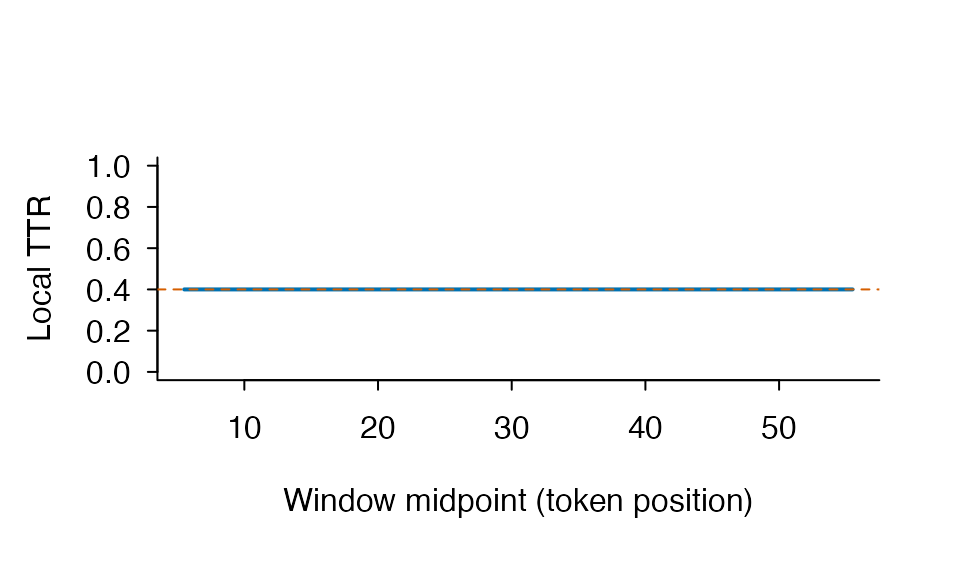

# Getting started with ldfreq

There are two common starting points. If you already have one character
value per token, use
[`lexdiv_metrics()`](https://ryuya-dot-com.github.io/ldfreq/reference/lexdiv_metrics.md).
If you have ordinary prose, use
[`lexdiv_metrics_text()`](https://ryuya-dot-com.github.io/ldfreq/reference/lexdiv_preprocessing.md).
The second route records how the text was tokenized, normalized, and
optionally lemmatized before it calls the same metric core.

``` r
library(ldfreq)

tokens <- c("the", "cat", "saw", "the", "other", "cat")
result <- lexdiv_metrics(tokens, metrics = c("ttr", "rttr", "yule_k"))
result
#> <lexdiv_results: 3 metrics; contract 0.2.0>
#>   metric_id        value status missing_reason N V below_quality_floor
#> 1       ttr    0.6666667     ok           <NA> 6 4               FALSE
#> 2      rttr    1.6329932     ok           <NA> 6 4               FALSE
#> 3    yule_k 1111.1111111     ok           <NA> 6 4                TRUE
```

For a named character vector or an ID/text table, use
[`lexdiv_tokenize_batch()`](https://ryuya-dot-com.github.io/ldfreq/reference/lexdiv_text_batch.md)
and
[`lexdiv_metrics_text_batch()`](https://ryuya-dot-com.github.io/ldfreq/reference/lexdiv_text_batch.md);
see [English tokenization and document
input](https://ryuya-dot-com.github.io/ldfreq/articles/english-tokenization.md).
For files on disk, the [TXT/folder/CSV
walkthrough](https://ryuya-dot-com.github.io/ldfreq/articles/english-tokenization.html#import-text-files)
runs with installed sample files and shows where to substitute your own
data. Use `tokenizer = "english"` to select the English lexical rules.
The examples below retain the original Unicode default so their
measurement choices stay explicit.

## Raw text without hidden preprocessing

The shortest raw-text workflow is a direct call to
[`lexdiv_metrics_text()`](https://ryuya-dot-com.github.io/ldfreq/reference/lexdiv_preprocessing.md).
Normalization, case, and number handling are explicit arguments rather
than global options.

``` r
raw_result <- lexdiv_metrics_text(
  "Cats and cat ran run.",
  normalization = "NFC",
  case = "preserve",
  metrics = "ttr"
)
raw_result
#> <lexdiv_text_results> 5/5 eligible tokens | unit=surface | inclusion=all
#> <lexdiv_results: 1 metric; contract 0.2.0>
#>   metric_id value status missing_reason N V below_quality_floor
#> 1       ttr     1     ok           <NA> 5 5               FALSE
```

Call
[`lexdiv_tokenize()`](https://ryuya-dot-com.github.io/ldfreq/reference/lexdiv_preprocessing.md)
separately when you want to inspect or annotate the tokens first. Its
offsets refer to the processed text, and its provenance keeps source and
processed text hashes without storing the source text itself.

``` r
tokenization <- lexdiv_tokenize(
  "Cats and cat ran run.",
  normalization = "NFC",
  case = "preserve"
)
tokenization
#> <lexdiv_tokenization> 5 tokens | NFC | preserve | numbers=removed | ldfreq-unicode-word-tokenizer 0.1.0
#>  token_index start end surface is_number
#>            1     1   4    Cats     FALSE
#>            2     6   8     and     FALSE
#>            3    10  12     cat     FALSE
#>            4    14  16     ran     FALSE
#>            5    18  20     run     FALSE
```

Lemma and content-word analyses require an explicit annotation source.
The example annotations are project-authored fixtures, not a recommended
universal lemmatizer. Missing annotations would be excluded and counted
in `unit_coverage` rather than imputed.

UPOS backend ID and version are always explicit and separate from lemma
backend ID and version, even if one documented pipeline generated both
layers.

``` r
annotated <- lexdiv_lemmatize(
  tokenization,
  lemmas = c("cat", "and", "cat", "run", "run"),
  upos = c("NOUN", "CCONJ", "NOUN", "VERB", "VERB"),
  backend_id = "vignette-fixture",
  backend_version = "1",
  upos_backend_id = "vignette-upos-fixture",
  upos_backend_version = "1"
)

lemma_content <- lexdiv_metrics_text(
  annotated,
  unit = "lemma",
  word_inclusion = "content",
  metrics = "ttr"
)
lemma_content$results
#> <lexdiv_results: 1 metric; contract 0.2.0>
#>   metric_id value status missing_reason N V below_quality_floor
#> 1       ttr   0.5     ok           <NA> 4 2               FALSE
lemma_content$token_audit
#>   token_index surface selected_unit unit_match_rule  upos eligible
#> 1           1    Cats           cat            <NA>  NOUN     TRUE
#> 2           2     and           and            <NA> CCONJ    FALSE
#> 3           3     cat           cat            <NA>  NOUN     TRUE
#> 4           4     ran           run            <NA>  VERB     TRUE
#> 5           5     run           run            <NA>  VERB     TRUE
#>   exclusion_reason
#> 1             <NA>
#> 2 non_content_upos
#> 3             <NA>
#> 4             <NA>
#> 5             <NA>
lemma_content$preprocessing
#> $contract_id
#> [1] "ldfreq-preprocessing"
#> 
#> $contract_version
#> [1] "0.4.0"
#> 
#> $tokenization
#> $tokenization$contract_id
#> [1] "ldfreq-preprocessing"
#> 
#> $tokenization$contract_version
#> [1] "0.4.0"
#> 
#> $tokenization$tokenizer_id
#> [1] "ldfreq-unicode-word-tokenizer"
#> 
#> $tokenization$tokenizer_version
#> [1] "0.1.0"
#> 
#> $tokenization$normalization
#> [1] "NFC"
#> 
#> $tokenization$case
#> [1] "preserve"
#> 
#> $tokenization$keep_numbers
#> [1] FALSE
#> 
#> $tokenization$token_pattern
#> [1] "[\\p{L}\\p{M}\\p{N}]+(?:['’\\-‐‑][\\p{L}\\p{M}\\p{N}]+)*"
#> 
#> $tokenization$source_text_sha256
#> [1] "5d33ea4730a56cb3c2ac4bd306ac925d31afc67a9daeb5abf5c7ce718ce1d544"
#> 
#> $tokenization$processed_text_sha256
#> [1] "5d33ea4730a56cb3c2ac4bd306ac925d31afc67a9daeb5abf5c7ce718ce1d544"
#> 
#> $tokenization$token_table_sha256
#> [1] "46c007ee7a36efea8e8f48b4edf0ca7a44d4aac4c1a9fbce075d851525ad29e7"
#> 
#> $tokenization$input_characters
#> [1] 21
#> 
#> $tokenization$processed_characters
#> [1] 21
#> 
#> $tokenization$output_tokens
#> [1] 5
#> 
#> $tokenization$annotation
#> $tokenization$annotation$method
#> [1] "supplied"
#> 
#> $tokenization$annotation$backend_id
#> [1] "vignette-fixture"
#> 
#> $tokenization$annotation$backend_version
#> [1] "1"
#> 
#> $tokenization$annotation$dictionary
#> NULL
#> 
#> $tokenization$annotation$upos_backend_id
#> [1] "vignette-upos-fixture"
#> 
#> $tokenization$annotation$upos_backend_version
#> [1] "1"
#> 
#> $tokenization$annotation$lemma_tokens
#> [1] 5
#> 
#> $tokenization$annotation$lemma_coverage
#> [1] 1
#> 
#> $tokenization$annotation$upos_tokens
#> [1] 5
#> 
#> $tokenization$annotation$upos_coverage
#> [1] 1
#> 
#> 
#> 
#> $selected_unit
#> [1] "lemma"
#> 
#> $word_inclusion
#> [1] "content"
#> 
#> $content_upos
#> [1] "ADJ"   "ADV"   "NOUN"  "PROPN" "VERB" 
#> 
#> $input_tokens
#> [1] 5
#> 
#> $eligible_tokens
#> [1] 4
#> 
#> $excluded_tokens
#> [1] 1
#> 
#> $unit_coverage
#> [1] 0.8
```

For a quick English lemma baseline, the optional `textstem` backend can
be selected explicitly. It supplies lemmas only; it does not infer UPOS
tags, so a content-word analysis still needs tags from a separately
identified source.

``` r
if (requireNamespace("textstem", quietly = TRUE)) {
  automatic_lemmas <- lexdiv_lemmatize(
    lexdiv_tokenize("The cats were running and studies.", case = "lower"),
    method = "textstem"
  )
  automatic_lemmas$tokens[, c("surface", "lemma")]
  automatic_lemmas$provenance$annotation
}
#> $method
#> [1] "textstem"
#> 
#> $backend_id
#> [1] "textstem::lemmatize_words"
#> 
#> $backend_version
#> [1] "0.1.4"
#> 
#> $dictionary
#> $dictionary$source
#> [1] "lexicon"
#> 
#> $dictionary$id
#> [1] "lexicon::hash_lemmas"
#> 
#> $dictionary$version
#> [1] "1.3.2"
#> 
#> $dictionary$sha256
#> [1] "d46e415a53f4f5133ee3e567902d2b51ce1f4928061eb35f84cf5bcfc7fc993d"
#> 
#> $dictionary$hash_method
#> [1] "sha256-utf8-byte-length-pairs-v1"
#> 
#> $dictionary$entries
#> [1] 41531
#> 
#> $dictionary$query_casefold
#> [1] "base-tolower"
#> 
#> $dictionary$query_locale
#> [1] "C.UTF-8"
#> 
#> $dictionary$unknown_form_policy
#> [1] "surface"
#> 
#> 
#> $upos_backend_id
#> NULL
#> 
#> $upos_backend_version
#> NULL
#> 
#> $lemma_tokens
#> [1] 6
#> 
#> $lemma_coverage
#> [1] 1
#> 
#> $upos_tokens
#> [1] 0
#> 
#> $upos_coverage
#> [1] 0
```

This separation is deliberate: changing forms to lemmas or restricting
the denominator to content words changes the measurement. It is not
merely a file cleaning step.

Flemma is a separate lexical unit because it groups forms without
preserving POS distinctions.
[`lexdiv_flemmatize()`](https://ryuya-dot-com.github.io/ldfreq/reference/lexdiv_flemmatize.md)
accepts a caller-supplied local AntBNC file; it neither bundles nor
downloads that resource. Unknown forms retain a normalized identity
value, while token rows record AntBNC, override, or identity matching.

The flemma adapter and parser identities are supplied by `ldfreq`.
`resource_version` and any `override_version` are caller-declared,
path-free labels; they are not file-content checks. Because the labels
are returned in provenance and overlap comparability output, they must
not contain paths, secrets, private hashes, or machine-specific details.
Local file names and content hashes are not retained in public flemma
provenance.

``` r
flemmas <- lexdiv_flemmatize(
  tokenization,
  "/path/to/antbnc_lemmas_ver_004.txt",
  resource_version = "004"
)
lexdiv_metrics_text(flemmas, unit = "flemma", metrics = "ttr")
```

The raw AntBNC mapping approximates, but does not reproduce, New Word
Level Checker. NWLC documents manual word-list alignment. New JACET
profiles therefore expose AntBNC-versus-headword conflicts and accept
explicit upstream overrides.

## Caller-supplied lexical norms

[`lexdiv_norm_profile()`](https://ryuya-dot-com.github.io/ldfreq/reference/lexdiv_norm_profile.md)
exact-matches caller-prepared terms against one caller-supplied table.
It does not download a norm, transform lookup terms, or infer that
measures with different units and directions are comparable.

``` r
synthetic_norms <- data.frame(
  term = c("cat", "run", "other"),
  familiarity = c(6, 5, NA_real_),
  concreteness = c(5, 3, 4),
  stringsAsFactors = FALSE
)
norm_specs <- data.frame(
  measure_id = c("familiarity", "concreteness"),
  value_column = c("familiarity", "concreteness"),
  construct_id = c("subjective_familiarity", "concreteness"),
  value_unit = c("seven_point_rating", "seven_point_rating"),
  direction = c("higher", "descriptive"),
  language = c("English", "English"),
  variety = c("unspecified", "unspecified"),
  population_id = c("example_adults", "example_adults"),
  collection_year = c("2025", "2025"),
  valid_min = c(1, 1),
  valid_max = c(7, 7),
  stringsAsFactors = FALSE
)
norm_resource <- list(
  resource_id = "synthetic_norms",
  resource_version = "1",
  creator = "Project-authored example",
  source_reference = "Getting-started synthetic fixture",
  data_license = "synthetic-example-only",
  transformation_id = "none",
  lookup_unit = "lowercase_lemma",
  resource_key_normalization_id = "caller-prepared-v1"
)

norm_profile <- lexdiv_norm_profile(
  c("cat", "cat", "other", "outside"),
  synthetic_norms,
  key = "term",
  measure_specs = norm_specs,
  resource = norm_resource
)
norm_profile$summary[, c(
  "measure_id", "weighting", "estimate", "resource_coverage",
  "value_coverage", "annotation_coverage", "status"
)]
#>     measure_id weighting estimate resource_coverage value_coverage
#> 1  familiarity     token 6.000000         0.7500000      0.5000000
#> 2  familiarity      type 6.000000         0.6666667      0.3333333
#> 3 concreteness     token 4.666667         0.7500000      0.7500000
#> 4 concreteness      type 4.500000         0.6666667      0.6666667
#>   annotation_coverage status
#> 1           0.6666667     ok
#> 2           0.5000000     ok
#> 3           1.0000000     ok
#> 4           1.0000000     ok
norm_profile$lookup
#>   input_index    term   measure_id       lookup_status value       value_status
#> 1           1     cat  familiarity    matched_resource     6           observed
#> 2           1     cat concreteness    matched_resource     5           observed
#> 3           2     cat  familiarity    matched_resource     6           observed
#> 4           2     cat concreteness    matched_resource     5           observed
#> 5           3   other  familiarity    matched_resource    NA missing_annotation
#> 6           3   other concreteness    matched_resource     4           observed
#> 7           4 outside  familiarity unknown_to_resource    NA not_applicable_oov
#> 8           4 outside concreteness unknown_to_resource    NA not_applicable_oov
```

Summary means are conditional on observed values among matched keys. OOV
terms and matched keys with missing values have different lookup states
and neither is imputed. Report the resource-, value-, and
annotation-coverage columns with the estimate. Caller metadata is
recorded as provenance; it is not a license decision or evidence that a
measure is valid for a new population. The lookup table retains the
supplied lexical terms, so apply the same data-handling care as for the
input.

## Corpus-relative frequency with coverage

[`tubelex_profile()`](https://ryuya-dot-com.github.io/ldfreq/reference/tubelex_profile.md)
applies explicit query normalization or identity matching. The resource
uses Treebank segmentation, which differs from
[`lexdiv_tokenize()`](https://ryuya-dot-com.github.io/ldfreq/reference/lexdiv_preprocessing.md);
character-vector alignment is the caller’s responsibility. It returns
original terms, lookup terms, unmatched rows, token/type coverage, and
matched-only conditional summaries.

``` r
# Manually prepared terms illustrate this sentence, not a general tokenizer.
frequency <- tubelex_profile(c("I", "do", "n't", "think", "it", "'s", "a", "book"))
frequency$summary
#>   weighting eligible_items matched_items coverage mean_zipf   sd_zipf
#> 1     token              8             8        1  6.810781 0.6196608
#> 2      type              8             8        1  6.810781 0.6196608
#>   mean_video_prevalence mean_channel_prevalence
#> 1            -0.2204532              -0.2396299
#> 2            -0.2204532              -0.2396299
frequency$coverage
#> $input_tokens
#> [1] 8
#> 
#> $input_types
#> [1] 8
#> 
#> $eligible_tokens
#> [1] 8
#> 
#> $eligible_types
#> [1] 8
#> 
#> $matched_tokens
#> [1] 8
#> 
#> $unmatched_tokens
#> [1] 0
#> 
#> $matched_types
#> [1] 8
#> 
#> $unmatched_types
#> [1] 0
#> 
#> $token_coverage
#> [1] 1
#> 
#> $type_coverage
#> [1] 1
frequency$lookup
#>   query_index  term lookup_term matched resource_word   count videos channels
#> 1           1     I           i    TRUE             i 3794340  83952    50926
#> 2           2    do          do    TRUE            do 1105372  78492    48095
#> 3           3   n't         n't    TRUE           n't  909491  72651    44756
#> 4           4 think       think    TRUE         think  438105  51625    32474
#> 5           5    it          it    TRUE            it 2917104  95070    56204
#> 6           6    's          's    TRUE            's 2400420  93407    54909
#> 7           7     a           a    TRUE             a 3637988 101717    59211
#> 8           8  book        book    TRUE          book   56208  12058     8921
#>       zipf video_prevalence channel_prevalence
#> 1 7.342551      -0.10018255        -0.12815245
#> 2 6.806923      -0.12938784        -0.15299159
#> 3 6.722213      -0.16297120        -0.18423958
#> 4 6.404994      -0.31135029        -0.32355139
#> 5 7.228367      -0.04617071        -0.08532559
#> 6 7.143702      -0.05383470        -0.09544910
#> 7 7.324276      -0.01682096        -0.06269081
#> 8 5.513220      -0.94290747        -0.88463833
```

TUBELEX is a general YouTube subtitle frequency space. Its values
describe frequency and prevalence relative to that corpus; they are not
direct measures of proficiency, writing quality, academic register, or
context-independent lexical sophistication.

Passing a `lexdiv_tokenization` object requires
`tokenization_mismatch = "allow"` for an explicit sensitivity analysis.
High coverage alone cannot validate segmentation. For multiple
documents,
[`tubelex_profile_batch()`](https://ryuya-dot-com.github.io/ldfreq/reference/tubelex_profile.md)
returns a named list of complete profiles while loading one verified
resource snapshot per call. See
[`vignette("designing-comparisons", package = "ldfreq")`](https://ryuya-dot-com.github.io/ldfreq/articles/designing-comparisons.md)
for a worked design.

## New JACET 8000 lexical levels

[`nj8_profile()`](https://ryuya-dot-com.github.io/ldfreq/reference/nj8_profile.md)
maps New JACET 8000 ranks to eight 1,000-rank levels. Omit `wordlist` to
use the bundled table, redistributed with JACET permission and source
attribution. Exact and cumulative token/type rates keep off-list items
in the denominator. An explicit data frame, CSV, or official-layout XLSX
remains supported. The next example deliberately supplies a small
synthetic table so that each level can be checked by hand.

``` r
synthetic_nj8 <- data.frame(
  NJ8 = c(1L, 1001L, 6001L, 8000L),
  Word = c("the", "develop", "rare", "extreme")
)
levels <- nj8_profile(annotated, synthetic_nj8, unit = "lemma")
levels$summary
#>    weighting level level_label items proportion cumulative_items
#> 1      token     1     Level 1     0          0                0
#> 2      token     2     Level 2     0          0                0
#> 3      token     3     Level 3     0          0                0
#> 4      token     4     Level 4     0          0                0
#> 5      token     5     Level 5     0          0                0
#> 6      token     6     Level 6     0          0                0
#> 7      token     7     Level 7     0          0                0
#> 8      token     8     Level 8     0          0                0
#> 9      token    NA    Off-list     5          1               NA
#> 10      type     1     Level 1     0          0                0
#> 11      type     2     Level 2     0          0                0
#> 12      type     3     Level 3     0          0                0
#> 13      type     4     Level 4     0          0                0
#> 14      type     5     Level 5     0          0                0
#> 15      type     6     Level 6     0          0                0
#> 16      type     7     Level 7     0          0                0
#> 17      type     8     Level 8     0          0                0
#> 18      type    NA    Off-list     3          1               NA
#>    cumulative_proportion
#> 1                      0
#> 2                      0
#> 3                      0
#> 4                      0
#> 5                      0
#> 6                      0
#> 7                      0
#> 8                      0
#> 9                     NA
#> 10                     0
#> 11                     0
#> 12                     0
#> 13                     0
#> 14                     0
#> 15                     0
#> 16                     0
#> 17                     0
#> 18                    NA
levels$coverage
#> $input_tokens
#> [1] 5
#> 
#> $eligible_tokens
#> [1] 5
#> 
#> $excluded_tokens
#> [1] 0
#> 
#> $selection_coverage
#> [1] 1
#> 
#> $matched_tokens
#> [1] 0
#> 
#> $off_list_tokens
#> [1] 5
#> 
#> $token_coverage
#> [1] 0
#> 
#> $eligible_types
#> [1] 3
#> 
#> $matched_types
#> [1] 0
#> 
#> $off_list_types
#> [1] 3
#> 
#> $type_coverage
#> [1] 0
```

Use `plot(levels)` for token proportions and their cumulative curve, or
`plot(levels, weighting = "type")` for normalized types.

For an object created by
[`lexdiv_flemmatize()`](https://ryuya-dot-com.github.io/ldfreq/reference/lexdiv_flemmatize.md),
set `unit = "flemma"` and use `flemma_conflict = "antbnc"`,
`"wordlist"`, or `"error"`. The lossless lookup retains the chosen
resolution and the alternative surface-headword rank/level.

## Reading results

Each requested metric receives one row. The `status` and
`missing_reason` columns state whether a value is available;
`requested_parameters` and `effective_parameters` are list-columns.
Contract and schema identifiers are ordinary columns so that they
survive row binding and tabular serialization.

| `status` | Meaning |
|----|----|
| `ok` | The requested method produced a value. |
| `missing` | The document was valid, but the method’s defined domain or requested parameter did not permit a value. |
| `invalid_input` | At least one invalid token made the document invalid; it was not silently deleted. |

Common `missing_reason` values distinguish empty input, insufficient
tokens for a formula, a document shorter than the requested
window/segment/sample, a zero denominator, and a missing MTLD factor.
Structural request errors such as an unknown metric ID stop the call
instead of creating a result row.

Short documents do not cause the requested method to change. For
example, an MATTR window larger than the document yields a structured
missing result rather than a smaller implicit window.

``` r
lexdiv_metrics(tokens, metrics = "mattr", window_length = 50L)
#> <lexdiv_results: 1 metric; contract 0.2.0>
#>   metric_id value  status                    missing_reason N V
#> 1     mattr    NA missing too_short_for_requested_parameter 6 4
#>   below_quality_floor
#> 1                TRUE
```

Expected-TTR D fits an explicit D curve to exact finite-population
expected TTR values. It uses no random sampling or arbitrary D cap and
is not CLAN VOCD.

``` r
lexdiv_metrics(
  rep(c("a", "b", "a", "c"), 20),
  metrics = "expected_ttr_d"
)
#> <lexdiv_results: 1 metric; contract 0.2.0>
#>        metric_id     value status missing_reason  N V below_quality_floor
#> 1 expected_ttr_d 0.1164681     ok           <NA> 80 3               FALSE
```

## Interpreting values

Within the same exact method and design, Maas a-squared and Yule’s K
conventionally decrease as repetition decreases. TTR, RTTR, CTTR,
Herdan’s C, MSTTR, MATTR, MTLD, HD-D, expected-TTR D, and Yule’s I
conventionally increase with observed lexical variety or lower
repetition. These methods primarily operationalize lexical variety and
repetition rather than the full multidimensional lexical-diversity
construct. Direction is meaningful only within the same method,
parameters, tokenization, normalization, sampling design, and comparable
texts. Scores from different metric IDs are not interchangeable because
their scales and length sensitivities differ.

The metrics describe lexical-distribution properties of the supplied
tokens. They are not direct measures of language proficiency, writing
quality, reader response, or communicative effectiveness. A separate
validated study design is needed to make claims about those constructs.

## Multiple documents

Batch input must carry explicit, unique document identifiers.

``` r
documents <- list(
  document_a = c("one", "two", "one"),
  document_b = c("alpha", "beta", "gamma", "delta")
)

lexdiv_metrics_batch(documents, metrics = c("ttr", "hdd"))
#> <lexdiv_batch_results: 2 documents; 4 metric records; schema 0.1.0>
#>   document_id metric_id     value  status                    missing_reason N V
#> 1  document_a       ttr 0.6666667      ok                              <NA> 3 2
#> 2  document_a       hdd        NA missing too_short_for_requested_parameter 3 2
#> 3  document_b       ttr 1.0000000      ok                              <NA> 4 4
#> 4  document_b       hdd        NA missing too_short_for_requested_parameter 4 4
#>   below_quality_floor
#> 1               FALSE
#> 2                TRUE
#> 3               FALSE
#> 4                TRUE
```

To compare the same documents with one explicit reference vocabulary,
use the directional reference-coverage API. It returns token- and
type-weighted rows separately, with the numerator and denominator
retained for downstream models.

``` r
reference_coverage <- lexdiv_reference_coverage(
  documents,
  reference = c("one", "two", "alpha"),
  reference_id = "study_list"
)
reference_coverage$summary[, c(
  "document_id", "weighting", "value", "numerator", "denominator", "status"
)]
#>   document_id weighting value numerator denominator status
#> 1  document_a     token  1.00         3           3     ok
#> 2  document_a      type  1.00         2           2     ok
#> 3  document_b     token  0.25         1           4     ok
#> 4  document_b      type  0.25         1           4     ok
```

This call performs exact matching only. Document repetition changes
token coverage but not type coverage, and an empty document remains a
structured missing result. Use `details = "terms"` only when exact
lexical strings may be retained in the result. This is coverage by the
supplied list, not a claim that the list or its matches measure
proficiency or writing quality.

For a tidy one-token-per-row table, make the document boundary explicit
before calling the batch API. The same adapter accepts `quanteda` tokens
objects through their registered
[`as.list()`](https://rdrr.io/r/base/list.html) method.

``` r
tidy_tokens <- data.frame(
  document_id = c("a", "a", "b", "b"),
  token = c("one", "two", "three", "three")
)
tidy_documents <- lexdiv_as_documents(tidy_tokens)
tidy_long <- lexdiv_metrics_batch(
  tidy_documents,
  metrics = c("ttr", "maas")
)
lexdiv_widen(tidy_long, values_from = "value")
#> <lexdiv_wide_results: 2 rows; 3 columns>
#>   document_id ttr     maas
#> 1           a 1.0 0.000000
#> 2           b 0.5 1.442695
```

Base-R plot methods require one metric selection when several
incompatible metric scales are present.

``` r
plot(tidy_long, metric_id = "ttr")
```


Plots use color by default. Set `monochrome = TRUE` for black and gray
output, for example
`plot(tidy_long, metric_id = "ttr", monochrome = TRUE)`. In both color
modes, metric and screening plots use triangles for points below the
advisory threshold and circles for other points. Explicit `pch` values
are retained. No title or subtitle is added automatically: put figure
numbers, titles and notes outside the image in the manuscript. This
option changes presentation only; the selected rows and invisible return
are the same in both modes. The default font is sans serif, tick labels
are horizontal and the frame is open. Explicit `family`, `las` and `bty`
arguments override these defaults. See the report guide for exporting at
the final publication size.

## Explicit method profiles

A profile plan records parameter variants before computation. The
`length_50_100` preset adds MSTTR and MATTR settings without duplicating
MTLD or turning descriptive token floors into alternative metric values.

``` r
plan <- lexdiv_plan(presets = "length_50_100")
profile <- lexdiv_profile(tokens, plan)
head(profile)
#> <lexdiv_profile_results: 6 specifications; schema 0.1.0>
#>   request_id metric_id     value  status                    missing_reason N V
#> 1        ttr       ttr 0.6666667      ok                              <NA> 6 4
#> 2       rttr      rttr 1.6329932      ok                              <NA> 6 4
#> 3       cttr      cttr 1.1547005      ok                              <NA> 6 4
#> 4     herdan    herdan 0.7737056      ok                              <NA> 6 4
#> 5       maas      maas 0.1262973      ok                              <NA> 6 4
#> 6      msttr     msttr        NA missing too_short_for_requested_parameter 6 4
#>   below_quality_floor
#> 1               FALSE
#> 2               FALSE
#> 3               FALSE
#> 4               FALSE
#> 5               FALSE
#> 6                TRUE

screen <- lexdiv_screen(profile)
head(screen)
#>         screen_schema_id screen_schema_version       profile_schema_id
#> 1 lexdiv-r-screen-result                 0.1.0 lexdiv-r-profile-result
#> 2 lexdiv-r-screen-result                 0.1.0 lexdiv-r-profile-result
#> 3 lexdiv-r-screen-result                 0.1.0 lexdiv-r-profile-result
#> 4 lexdiv-r-screen-result                 0.1.0 lexdiv-r-profile-result
#> 5 lexdiv-r-screen-result                 0.1.0 lexdiv-r-profile-result
#> 6 lexdiv-r-screen-result                 0.1.0 lexdiv-r-profile-result
#>   profile_schema_version                         plan_md5 request_index
#> 1                  0.1.0 b814e7fd802afac816d4a516fa1f4c4b             1
#> 2                  0.1.0 b814e7fd802afac816d4a516fa1f4c4b             1
#> 3                  0.1.0 b814e7fd802afac816d4a516fa1f4c4b             2
#> 4                  0.1.0 b814e7fd802afac816d4a516fa1f4c4b             2
#> 5                  0.1.0 b814e7fd802afac816d4a516fa1f4c4b             3
#> 6                  0.1.0 b814e7fd802afac816d4a516fa1f4c4b             3
#>   request_id                      specification_id metric_id
#> 1        ttr  ttr-4fb55d484c9910369ed7bfb8e1bb1631       ttr
#> 2        ttr  ttr-4fb55d484c9910369ed7bfb8e1bb1631       ttr
#> 3       rttr rttr-625d1c2f87613e36d94824f3d4ccd257      rttr
#> 4       rttr rttr-625d1c2f87613e36d94824f3d4ccd257      rttr
#> 5       cttr cttr-0541216b812c575de688815847d80352      cttr
#> 6       cttr cttr-0541216b812c575de688815847d80352      cttr
#>                       method_id N  screen_id minimum_tokens passes_screen
#> 1               ttr_v_over_n_v1 6  tokens_50             50         FALSE
#> 2               ttr_v_over_n_v1 6 tokens_100            100         FALSE
#> 3 rttr_guiraud_v_over_sqrt_n_v1 6  tokens_50             50         FALSE
#> 4 rttr_guiraud_v_over_sqrt_n_v1 6 tokens_100            100         FALSE
#> 5        cttr_v_over_sqrt_2n_v1 6  tokens_50             50         FALSE
#> 6        cttr_v_over_sqrt_2n_v1 6 tokens_100            100         FALSE
```

MATTR has an additional local diagnostic surface. It accepts a
MATTR-only canonical plan and returns each complete moving-window value
plus the number and nominal weight of windows containing each token
position.

``` r
methods <- lexdiv_methods()
mattr_method <- methods$method_id[methods$metric_id == "mattr"]
mattr_plan <- lexdiv_plan(
  presets = character(),
  grids = lexdiv_grid(
    mattr_method,
    "window_length",
    c(10, 20),
    request_id_prefix = "mattr"
  )
)
local_mattr <- lexdiv_mattr_profile(rep(tokens, 10), mattr_plan)
local_mattr$summary
#> <lexdiv_profile_results: 2 specifications; schema 0.1.0>
#>   request_id metric_id value status missing_reason  N V below_quality_floor
#> 1    mattr_1     mattr   0.4     ok           <NA> 60 4               FALSE
#> 2    mattr_2     mattr   0.2     ok           <NA> 60 4               FALSE
head(local_mattr$windows)
#>                           plan_md5 request_index request_id
#> 1 054deeb3bbc8ad065e56423650c6d90a             1    mattr_1
#> 2 054deeb3bbc8ad065e56423650c6d90a             1    mattr_1
#> 3 054deeb3bbc8ad065e56423650c6d90a             1    mattr_1
#> 4 054deeb3bbc8ad065e56423650c6d90a             1    mattr_1
#> 5 054deeb3bbc8ad065e56423650c6d90a             1    mattr_1
#> 6 054deeb3bbc8ad065e56423650c6d90a             1    mattr_1
#>                         specification_id metric_id              method_id
#> 1 mattr-49df2cfded9c0b1739bab49c65494921     mattr mattr_sliding_step1_v1
#> 2 mattr-49df2cfded9c0b1739bab49c65494921     mattr mattr_sliding_step1_v1
#> 3 mattr-49df2cfded9c0b1739bab49c65494921     mattr mattr_sliding_step1_v1
#> 4 mattr-49df2cfded9c0b1739bab49c65494921     mattr mattr_sliding_step1_v1
#> 5 mattr-49df2cfded9c0b1739bab49c65494921     mattr mattr_sliding_step1_v1
#> 6 mattr-49df2cfded9c0b1739bab49c65494921     mattr mattr_sliding_step1_v1
#>   window_index window_start window_end window_midpoint window_length
#> 1            1            1         10             5.5            10
#> 2            2            2         11             6.5            10
#> 3            3            3         12             7.5            10
#> 4            4            4         13             8.5            10
#> 5            5            5         14             9.5            10
#> 6            6            6         15            10.5            10
#>   distinct_types value
#> 1              4   0.4
#> 2              4   0.4
#> 3              4   0.4
#> 4              4   0.4
#> 5              4   0.4
#> 6              4   0.4
head(local_mattr$exposure)
#>                           plan_md5 request_index request_id
#> 1 054deeb3bbc8ad065e56423650c6d90a             1    mattr_1
#> 2 054deeb3bbc8ad065e56423650c6d90a             1    mattr_1
#> 3 054deeb3bbc8ad065e56423650c6d90a             1    mattr_1
#> 4 054deeb3bbc8ad065e56423650c6d90a             1    mattr_1
#> 5 054deeb3bbc8ad065e56423650c6d90a             1    mattr_1
#> 6 054deeb3bbc8ad065e56423650c6d90a             1    mattr_1
#>                         specification_id metric_id              method_id
#> 1 mattr-49df2cfded9c0b1739bab49c65494921     mattr mattr_sliding_step1_v1
#> 2 mattr-49df2cfded9c0b1739bab49c65494921     mattr mattr_sliding_step1_v1
#> 3 mattr-49df2cfded9c0b1739bab49c65494921     mattr mattr_sliding_step1_v1
#> 4 mattr-49df2cfded9c0b1739bab49c65494921     mattr mattr_sliding_step1_v1
#> 5 mattr-49df2cfded9c0b1739bab49c65494921     mattr mattr_sliding_step1_v1
#> 6 mattr-49df2cfded9c0b1739bab49c65494921     mattr mattr_sliding_step1_v1
#>   position exposure_count window_inclusion_rate nominal_observation_weight
#> 1        1              1            0.01960784                0.001960784
#> 2        2              2            0.03921569                0.003921569
#> 3        3              3            0.05882353                0.005882353
#> 4        4              4            0.07843137                0.007843137
#> 5        5              5            0.09803922                0.009803922
#> 6        6              6            0.11764706                0.011764706
plot(local_mattr, request_id = "mattr_1")
```



The plotted trajectory is descriptive. The package does not select an
optimal window, infer a universal adequate text length, or interpret
exposure weights as token-level causal contributions.

The versioned `below_quality_floor` field and requested screens are
advisory token-count evidence checks. Here, `quality` does not mean
writing quality, measurement validity, or reliability. The screens do
not change values or parameters or censor documents. Read them together
with `status`, `missing_reason`, `N`, `V`, and the method and parameter
identities.

The presets contain eleven methods; experimental expected-TTR D requires
explicit selection. Use
[`lexdiv_methods()`](https://ryuya-dot-com.github.io/ldfreq/reference/lexdiv_profile.md)
and
[`lexdiv_presets()`](https://ryuya-dot-com.github.io/ldfreq/reference/lexdiv_profile.md)
to inspect the twelve supported methods and their bounded presets.

## Definition sensitivity outside the versioned core

Maas and sequential MTLD have same-name formula and aggregation
variants. The separate variant surface makes those choices comparable
without changing the canonical registry or silently replacing a method.

``` r
variant_catalog <- lexdiv_variant_ids()
variant_catalog
#>   family                                               method_id direction
#> 1   maas                                           maas_a2_ln_v1     lower
#> 2   maas                                            maas_a_ln_v1     lower
#> 3   maas                                        maas_a2_log10_v1     lower
#> 4   maas                                         maas_a_log10_v1     lower
#> 5   mtld          mtld_seq_bidir_dirmean_lt_min10_linear_tail_v1    higher
#> 6   mtld     mtld_seq_bidir_dirmean_lt_min10_finaltail_linear_v1    higher
#> 7   mtld mtld_seq_bidir_mfl_dirmean_lt_min10_finaltail_linear_v1    higher
#> 8   mtld  mtld_seq_bidir_mfl_pooled_lt_min10_finaltail_linear_v1    higher
#>                    scale             reference_label
#> 1              a-squared            ldfreq-core:maas
#> 2                      a    common-formula:maas-a-ln
#> 3              a-squared            TAALED-0.32:maas
#> 4                      a common-formula:maas-a-log10
#> 5      tokens-per-factor      ldfreq-core-0.1.0:mtld
#> 6      tokens-per-factor           TAALED-0.32:mtldo
#> 7 adjusted-factor-length          TAALED-0.32:mtldav
#> 8 adjusted-factor-length            TAALED-0.32:mtld
#>                                                                      comparison_scope
#> 1                                                                  ldfreq-core-method
#> 2                                                             formula-comparison-only
#> 3               formula-aligned-with-taaled-0.32-maas-not-full-pipeline-compatibility
#> 4                                                             formula-comparison-only
#> 5                                                           legacy-ldfreq-core-method
#> 6 factorization-and-aggregation-comparator-for-taaled-0.32-not-official-compatibility
#> 7 factorization-and-aggregation-comparator-for-taaled-0.32-not-official-compatibility
#> 8 factorization-and-aggregation-comparator-for-taaled-0.32-not-official-compatibility

variant_results <- lexdiv_variant_metrics(
  rep(tokens, 10),
  mtld_thresholds = c(0.72, 0.92)
)
variant_results[, c(
  "family", "method_id", "reference_label", "value", "status"
)]
#> <lexdiv_variant_results: 12 rows; contract 0.1.0>
#>    family                                               method_id
#> 1    maas                                           maas_a2_ln_v1
#> 2    maas                                            maas_a_ln_v1
#> 3    maas                                        maas_a2_log10_v1
#> 4    maas                                         maas_a_log10_v1
#> 5    mtld          mtld_seq_bidir_dirmean_lt_min10_linear_tail_v1
#> 6    mtld          mtld_seq_bidir_dirmean_lt_min10_linear_tail_v1
#> 7    mtld     mtld_seq_bidir_dirmean_lt_min10_finaltail_linear_v1
#> 8    mtld     mtld_seq_bidir_dirmean_lt_min10_finaltail_linear_v1
#> 9    mtld mtld_seq_bidir_mfl_dirmean_lt_min10_finaltail_linear_v1
#> 10   mtld mtld_seq_bidir_mfl_dirmean_lt_min10_finaltail_linear_v1
#> 11   mtld  mtld_seq_bidir_mfl_pooled_lt_min10_finaltail_linear_v1
#> 12   mtld  mtld_seq_bidir_mfl_pooled_lt_min10_finaltail_linear_v1
#>                reference_label      value status
#> 1             ldfreq-core:maas  0.1615429     ok
#> 2     common-formula:maas-a-ln  0.4019240     ok
#> 3             TAALED-0.32:maas  0.3719663     ok
#> 4  common-formula:maas-a-log10  0.6098904     ok
#> 5       ldfreq-core-0.1.0:mtld 10.0000000     ok
#> 6       ldfreq-core-0.1.0:mtld 10.0000000     ok
#> 7            TAALED-0.32:mtldo  8.4000000     ok
#> 8            TAALED-0.32:mtldo  4.8000000     ok
#> 9           TAALED-0.32:mtldav  9.1111111     ok
#> 10          TAALED-0.32:mtldav  8.5555556     ok
#> 11            TAALED-0.32:mtld  9.1111111     ok
#> 12            TAALED-0.32:mtld  8.5555556     ok
```

The comparison-scope column is part of interpretation. A formula-level
TAALED-relevant row is not an official preprocessing or full-pipeline
compatibility claim.

## Auditing the formal contracts

The help pages explain ordinary use. Exact formulas, domains,
normalization rules, result schemas, and resource boundaries are
installed as JSON contracts:

``` r
contract_files <- c(
  "lexical-diversity-contract.json",
  "ldfreq-preprocessing-contract.json",
  "lexical-overlap-contract.json",
  "reference-coverage-contract.json",
  "norm-profile-contract.json",
  "lexical-diversity-variant-contract.json",
  "lexical-level-profile-contract.json",
  "tubelex-frequency-profile-contract.json"
)
contract_paths <- system.file("spec", contract_files, package = "ldfreq")
stopifnot(all(nzchar(contract_paths)))
basename(contract_paths)
#> [1] "lexical-diversity-contract.json"        
#> [2] "ldfreq-preprocessing-contract.json"     
#> [3] "lexical-overlap-contract.json"          
#> [4] "reference-coverage-contract.json"       
#> [5] "norm-profile-contract.json"             
#> [6] "lexical-diversity-variant-contract.json"
#> [7] "lexical-level-profile-contract.json"    
#> [8] "tubelex-frequency-profile-contract.json"
```

Use `jsonlite::read_json(contract_paths[[1]], simplifyVector = FALSE)`
when an R list representation is convenient. Reading the files does not
run a metric, download a resource, or expose caller file paths.

## Offline installed-package check

An installed smoke script exercises the public workflows without network
access or an external runtime:

``` r
smoke_path <- system.file("examples", "offline-smoke.R", package = "ldfreq")
stopifnot(nzchar(smoke_path))
source(smoke_path, local = TRUE)
```
