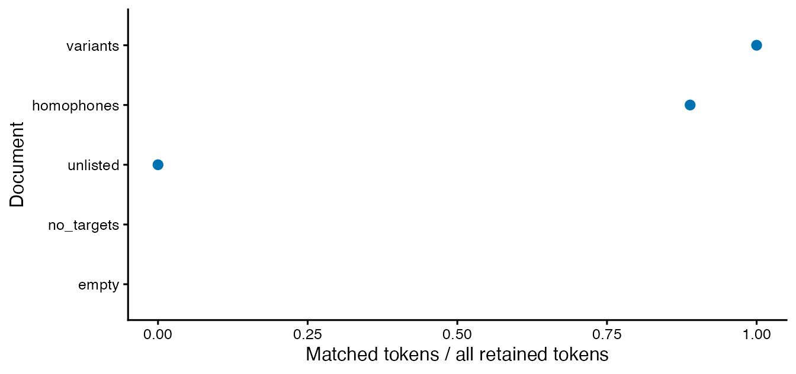

# Japanese annotations: from original text to lexical measures

For stimulus-item ratings and separately obtained AoA/BOI tables, see
[Japanese lexical
norms](https://ryuya-dot-com.github.io/ldfreq/articles/japanese-norms.md).
That workflow retains item IDs and norm-matching decisions independently
of morphological segmentation.

Japanese text needs an explicit word-unit decision. For example,
counting `国際連合` as one item or `国際 / 連合` as two changes both
vocabulary diversity and the available bigrams. The default Unicode
tokenizer in ldfreq does not perform Japanese morphological analysis.
Instead, use a Japanese analyzer and bring its complete annotations into
[`lexdiv_import_annotations()`](https://ryuya-dot-com.github.io/ldfreq/reference/lexdiv_import_annotations.md).

The importer checks the supplied surfaces against original text, derives
source positions, retains dictionary metadata and leaves missing
annotations missing. Use existing R packages for morphology and
concordances, and ldfreq to keep those input decisions visible in
lexical analyses. This is an integration and audit contribution, not a
new Japanese segmentation algorithm or a validated Japanese proficiency
scale.

For a complete first workflow, start with [Read files, review words and
save the analysis](#japanese-file-workflow). It uses small authored
TXT/CSV files and prepared annotations, so you can learn the decisions
without installing an analyzer. Then use the [gibasa
recipe](#use-gibasa-and-a-local-unidic-dictionary-in-r) to supply your
own annotations. File reading and morphological analysis are separate
steps.

For a smaller comparison without the optional review dependency, use
[all-body versus content-word
selection](https://ryuya-dot-com.github.io/ldfreq/articles/from-text-to-report.html#compare-japanese-pos-from-files).
It reads the same authored files, preserves unknown POS membership,
exposes calculation diagnostics, and saves a complete record and methods
text.

## An offline example

The package’s token-table importer supports R \>= 4.1. The optional
gibasa 1.1.3 recipe requires **R \>= 4.2**, as well as the separately
supplied dictionary. On R 4.1, import annotations prepared elsewhere or
use the offline example below; gibasa is not required to install or use
the core package.

These annotations are authored for illustration, not analyzer output or
a Japanese gold standard. The original examples in this guide are
covered by the package’s MIT license; no corpus or dictionary is
redistributed.

``` r
segments <- data.frame(
  document_id = c("essay", "empty"), segment_id = c("s1", "s1"),
  text = c("国際連合で国際協力を学ぶ。", "")
)
annotations <- data.frame(
  document_id = "essay", segment_id = "s1", token_index = 1:8,
  surface = c("国際", "連合", "で", "国際", "協力", "を", "学ぶ", "。"),
  lemma = c("国際", "連合", "で", "国際", "協力", "を", "学ぶ", NA_character_)
)
imported <- lexdiv_import_annotations(annotations, segments, list(
  language = "ja", analyzer = "authored", analyzer_version = "1",
  dictionary = "none", dictionary_version = "not-applicable",
  unit = "authored-fine", normalization = "none"
))
imported$tokens
#>   document_id segment_id token_index surface lemma start end
#> 1       essay         s1           1    国際  国際     1   2
#> 2       essay         s1           2    連合  連合     3   4
#> 3       essay         s1           3      で    で     5   5
#> 4       essay         s1           4    国際  国際     6   7
#> 5       essay         s1           5    協力  協力     8   9
#> 6       essay         s1           6      を    を    10  10
#> 7       essay         s1           7    学ぶ  学ぶ    11  12
#> 8       essay         s1           8      。  <NA>    13  13
```

`start` and `end` are **1-based inclusive Unicode codepoint positions
within the segment’s original text**. They are not whole-document
positions, byte offsets, UTF-16 offsets or positions after
normalization. The empty document remains in `imported$documents`, with
a zero-token segment. A sentence or turn is a caller-supplied segment;
the importer does not infer these boundaries.

Import **before filtering**. Apart from whitespace, every original
character must be covered, including punctuation. A skipped repeated
word, dropped punctuation, or normalized replacement causes an error. A
supplied `start` or `end` column must match the derived coordinates.
This verifies the alignment, not the correctness of POS, lexical units,
or the source’s sentence boundaries.

Whitespace annotations may be partial. For example, an analyzer can emit
CR tokens while omitting LF from CRLF line endings. A
whitespace-prefixed token uses the earliest exact match across
whitespace-only gaps; non-whitespace characters cannot be skipped.
Original line endings and positions are retained.

``` r
words <- imported$tokens[imported$tokens$surface != "。", ]
lexdiv_metrics(words$surface, metrics = "ttr")
#> <lexdiv_results: 1 metric; contract 0.2.0>
#>   metric_id     value status missing_reason N V below_quality_floor
#> 1       ttr 0.8571429     ok           <NA> 7 6               FALSE
phrases <- lexdiv_ngrams(words, "authored-ja-surface-no-punctuation-v1",
  term_col = "surface", documents = imported$documents$document_id)
phrases$documents
#>   document_id n input_tokens opportunities ngram_types         status
#> 1       essay 2            7             6           6             ok
#> 2       essay 3            7             5           5             ok
#> 3       empty 2            0             0           0 empty_document
#> 4       empty 3            0             0           0 empty_document
```

The seven retained tokens contain six distinct surface strings: TTR is
6/7. There are six adjacent bigram and five trigram opportunities. These
counts verify the example’s arithmetic; a seven-token text cannot
establish the reliability of a diversity measure. Choose
length-appropriate measures and report non-computable requests rather
than changing their parameters silently.

## Compare word units on the same original text

A different word unit changes the denominator as well as the vocabulary
being counted. Keep the original documents fixed, import both complete
annotations, and compare their source spans before calculating scores.
Here is a second, coarser **authored** annotation of the same teaching
text; neither annotation is presented as an official short-unit or
long-unit analysis.

``` r
coarse_rows <- data.frame(document_id = "essay", segment_id = "s1",
  token_index = 1:6,
  surface = c("国際連合", "で", "国際協力", "を", "学ぶ", "。"))
coarse <- lexdiv_import_annotations(coarse_rows, segments, list(
  language = "ja", analyzer = "authored", analyzer_version = "1",
  dictionary = "none", dictionary_version = "not-applicable",
  unit = "authored-coarse", normalization = "none"
))
unit_alignment <- lexdiv_align_annotations(imported, coarse)
unit_alignment$groups[c("keyword", "relation", "predicted_n", "reference_n")]
#>    keyword relation predicted_n reference_n
#> 1 国際連合    split           2           1
#> 2       で    exact           1           1
#> 3 国際協力    split           2           1
#> 4       を    exact           1           1
#> 5     学ぶ    exact           1           1
#> 6       。    exact           1           1

count_units <- function(x) {
  t <- x$tokens
  retained <- t$surface != "。"  # This teaching example's explicit selection.
  tokens <- setNames(lapply(x$documents$document_id, function(id) {
    t$surface[t$document_id == id & retained]
  }), x$documents$document_id)
  lexdiv_metrics_batch(tokens, metrics = "ttr")
}
count_units(imported)
#> <lexdiv_batch_results: 2 documents; 2 metric records; schema 0.1.0>
#>   document_id metric_id     value  status missing_reason N V
#> 1       essay       ttr 0.8571429      ok           <NA> 7 6
#> 2       empty       ttr        NA missing    empty_input 0 0
#>   below_quality_floor
#> 1               FALSE
#> 2                TRUE
count_units(coarse)
#> <lexdiv_batch_results: 2 documents; 2 metric records; schema 0.1.0>
#>   document_id metric_id value  status missing_reason N V below_quality_floor
#> 1       essay       ttr     1      ok           <NA> 5 5               FALSE
#> 2       empty       ttr    NA missing    empty_input 0 0                TRUE
```

The same sentence now has five retained tokens and five types, versus
seven tokens and six types before. TTR rises from 6/7 to 1 without a
change in the writer’s text. The empty document stays missing in both
conditions. Span alignment identifies the merges; it does not decide
which analysis is best.

In real data, check the **covered original characters after selection**,
too. A punctuation token in a fine analysis may be inside a retained
compound in a coarser analysis. Applying `!upos %in% c("PUNCT", "SYM")`
to both tables can therefore select different material. Do not remove
that internal punctuation by rewriting a token silently. Retain the
discrepancy or justify a shared source-span selection for the research
question.

### What the executed comparisons show

The [reproducible unit
comparison](https://github.com/Ryuya-dot-com/ldfreq/tree/main/experiments/japanese-units)
uses all 543 test sentences from UD Japanese GSD/GSDLUW r2.18. Their
published SUW/LUW annotations have identical sentence IDs and original
text. The [upstream
description](https://github.com/UniversalDependencies/UD_Japanese-GSDLUW/blob/71fd68633ab8c3439a48db3f3718c9ed80be9c6c/README.md)
specifies manually annotated layers following BCCWJ conventions. These
are news/blog sentences, not learner essays. The corpus is obtained
separately under CC BY-SA 4.0; the R package bundles neither its text
nor its annotations.

| All-token sentence summary         |       SUW |       LUW |
|------------------------------------|----------:|----------:|
| Median N                           |        21 |        17 |
| Median TTR                         |    0.9130 |    0.9259 |
| MATTR50 computable / all sentences |  29 / 543 |  10 / 543 |
| MTLD tail-only / computable        | 352 / 384 | 331 / 346 |

All-token counting includes punctuation to isolate boundaries over the
same covered characters; it is not a recommended lexical policy.
Excluding UPOS PUNCT/SYM produces different coverage in 54/543 sentence
pairs. The comparison records all cases and the 489-pair same-coverage
subset separately. MATTR50 holds the window’s token count fixed, not its
original-text span. Its paired all-token comparison has only ten
eligible sentences, not 543. Sentences are never concatenated to
manufacture eligible documents.

The many tail-only MTLD values illustrate why a finite score is
insufficient evidence of precision. Consult [factor support and length
checks](https://ryuya-dot-com.github.io/ldfreq/articles/designing-comparisons.html#inspect-mtld-factor-support).
The advisory 50-token floor is not a validated Japanese reliability
threshold.

A separate check reuses saved Sudachi A/B/C analyses of 28 Japanese
essays: **24 learner essays and four Japanese-L1 essays**. The same task
was sampled deterministically, with four writers per reported L1 across
seven groups; see the reproduction record for selection details.
Surface-form scores change in 24/28 essays between A and C:

| Metric  | A median | C median | Paired Spearman rho |
|---------|---------:|---------:|--------------------:|
| TTR     |   0.4316 |   0.4328 |              0.9907 |
| MATTR50 |   0.7082 |   0.7081 |              0.9880 |
| MTLD    |  43.9420 |  43.6272 |              0.9496 |

All 28 pairs are finite and retain the same original character coverage;
none has a tail-only MTLD flag. These small-sample observations do not
validate precision, proficiency discrimination or interchangeable score
scales, and are not an L2-only estimate. **Sudachi C is not relabeled
NINJAL LUW.** The public sentence comparison and the saved essay mode
comparison answer different questions.

For a methods section, report the actual source/version, unit, form,
selection, window and MTLD definition. For example, the essay check
above can be described as follows (replace these conditions with those
actually used in your study):

> We compared surface-form lexical diversity in the same 28 essays (24
> learner essays and four Japanese-L1 essays) using saved SudachiPy
> 0.6.11 / SudachiDict-core 20260428 annotations in modes A, B and C.
> Original text, including titles, was retained. Whitespace and
> auxiliary-symbol tokens were excluded; particles, auxiliaries and
> numbers were retained. MATTR used 50-token windows. MTLD used
> threshold .72, strict `<`, no minimum factor length, linear tail
> credit and the mean of directional scores. We checked
> original-character coverage, paired missingness and MTLD factor
> support before comparing scores. These comparisons assessed
> sensitivity to the analysis mode, not proficiency or measurement
> precision.

## Read files, review words and save the analysis

Suppose the first line is a title and your question concerns vocabulary
in the body. Deleting the title changes later character positions;
counting every target hit includes words outside your intended sample.
This example retains the whole file, selects the body by its original
positions, and reports body word counts separately from the lexical
identities you review.

The five authored files contain spelling variants, homophones, an
invented unlisted form, punctuation only, and an empty file. Their
annotations are **prepared by the example’s author**, not produced by a
hidden tokenizer. All files are MIT teaching material; no learner corpus
or dictionary is bundled. The CSV also contains authored `POS1` and
`goshu` labels for the descriptive profile below; `<MISSING>` marks
unassigned features. These are not UniDic results. Optional quanteda \>=
4.5.0 and a UTF-8 R session are needed for KWIC review. No Python or
external model is required for this walkthrough.

To run the complete example at once:

``` r
source(system.file("examples", "japanese-file-workflow.R", package = "ldfreq"))
as.data.frame(ja_file_record$metrics)  # All retained body words
ja_file_record$counts          # Reviewed target occurrences only
ja_file_output                 # Directory containing the complete RDS and count CSV
```

The following steps show the same recipe. The files and annotations are
separate inputs; replacing a TXT file also requires complete annotations
of its new text.

### 1. Read the original files and import prepared annotations

``` r
sys.source(system.file("examples", "text-file-input.R", package = "ldfreq", mustWork = TRUE),
  envir = environment())
ja_file_dir <- system.file("examples", "text-input", "japanese-workflow",
  package = "ldfreq", mustWork = TRUE)
ja_document_ids <- c("variants", "homophones", "unlisted", "no_targets", "empty")
ja_files <- lapply(ja_document_ids, function(id)
  read_text_file(file.path(ja_file_dir, paste0(id, ".txt")), encoding = "UTF-8"))
ja_file_manifest <- cbind(document_id = ja_document_ids,
  do.call(rbind, lapply(ja_files, `[[`, "source")))
ja_file_segments <- data.frame(document_id = ja_document_ids, segment_id = "s1",
  text = vapply(ja_files, `[[`, character(1), "text"))
ja_file_annotations <- utils::read.csv(
  text = read_text_file(file.path(ja_file_dir, "annotations.csv"))$text,
  colClasses = "character", check.names = FALSE, na.strings = "<MISSING>")
ja_file_annotations$token_index <- as.numeric(ja_file_annotations$token_index)
ja_file_import <- ldfreq::lexdiv_import_annotations(ja_file_annotations, ja_file_segments,
  list(language = "ja", analyzer = "authored", analyzer_version = "2",
    dictionary = "none", dictionary_version = "not-applicable",
    unit = "authored-file-workflow", normalization = "none"))
```

Each original file is one segment here. Whitespace gaps, including its
line breaks, are preserved. These are not inferred sentence boundaries.
The importer checks every non-whitespace character against
`annotations.csv` before any title or punctuation is excluded.
`ja_file_manifest` records encoding, byte hashes and a removed leading
BOM, if any. The [file input
guide](https://ryuya-dot-com.github.io/ldfreq/articles/english-tokenization.html#import-text-files)
explains explicit UTF-8/CP932 decoding in more detail.

| Object | One row represents | Keep it for |
|----|----|----|
| `ja_file_segments` | One original file/segment, including empty files | Original text and document IDs |
| `ja_file_import$tokens` | One prepared token with original character positions | Complete annotation before selection |
| `ja_file_selection` | One original token and its inclusion reason | Body and punctuation exclusions |
| `ja_file_after$occurrences` | One target occurrence, not one candidate | Context, status and recorded decisions |
| `ja_file_record` | The complete saved analysis | Reopening without the analyzer or source files |

### 2. Select the body without rewriting the text

``` r
# One segment and one contiguous body range per document in this small recipe.
# Empty original files have NA/NA bounds. Titles remain in the complete import.
ja_body_ranges <- data.frame(document_id = ja_document_ids,
  start = c(5L, 4L, 1L, 1L, NA_integer_),
  end = c(nchar(ja_file_segments$text[1:4], type = "chars"), NA_integer_),
  reason = c("Exclude authored title line", "Exclude authored title line",
    "Entire file", "Entire file", "Empty original file"))
```

The first body starts at character 5, after the title `リンゴ` and its
newline. The second starts at character 4, after `はし` and its newline.
Those are explicit decisions about these files, **not a rule that every
first line is a title**. Empty files retain unavailable bounds. The
helper is limited to one segment and one contiguous body range per
document; it rejects a range that cuts through a token. A boundary
change requires a new complete annotation, as shown
[below](#review-boundaries-before-lexical-identity).

This recipe excludes only the literal full stop `。` after selecting the
body. It retains particles and verbs. Other datasets need their own
declared policy for punctuation, numbers and proper nouns. Neither the
complete import nor its original token indices are edited.

Show the body-range validation and selection code

``` r
select_japanese_example_body <- function(imported, ranges) {
  s <- imported$segments; t <- imported$tokens
  if (anyDuplicated(s$document_id) || anyDuplicated(ranges$document_id) ||
      !setequal(s$document_id, ranges$document_id))
    stop("Supply one segment and one body-range row per document.")
  r <- ranges[match(s$document_id, ranges$document_id), ]
  width <- nchar(s$text, type = "chars")
  empty <- width == 0L
  if (!is.numeric(r$start) || !is.numeric(r$end) ||
      any(!is.na(r$start[empty]) | !is.na(r$end[empty])) ||
      anyNA(r$start[!empty]) || anyNA(r$end[!empty]) ||
      any(!is.finite(r$start[!empty]) | !is.finite(r$end[!empty])) ||
      any(r$start[!empty] != floor(r$start[!empty]) | r$end[!empty] != floor(r$end[!empty])) ||
      any(r$start[!empty] < 1 | r$end[!empty] > width[!empty] | r$start[!empty] > r$end[!empty]))
    stop("Use inclusive codepoint bounds within nonempty text, and NA/NA for empty files.")
  row <- match(t$document_id, s$document_id)
  inside <- t$start >= r$start[row] & t$end <= r$end[row]
  overlap <- t$end >= r$start[row] & t$start <= r$end[row]
  if (any(overlap & !inside))
    stop("A body range cuts through a token; review the range or complete annotation first.")
  # Explicit example policy: retain particles/verbs; exclude only the full stop.
  punctuation <- t$surface == "。"
  data.frame(t[c("document_id", "segment_id", "token_index", "start", "end", "surface")],
    in_body = inside, retained = inside & !punctuation,
    reason = ifelse(!inside, "outside_body", ifelse(punctuation, "full_stop", "retained")))
}
ja_file_selection <- select_japanese_example_body(ja_file_import, ja_body_ranges)
```

### 3. Inspect KWIC and record contextual decisions

``` r
ja_file_candidates <- data.frame(
  term = c("りんご", "リンゴ", "林檎", rep("はし", 3)),
  candidate_id = c(rep("apple", 3), "bridge", "chopsticks", "edge"),
  label = c(rep("林檎", 3), "橋", "箸", "端"))
ja_file_targets <- c("りんご", "リンゴ", "林檎", "はし", "ぷにょ語")
ja_file_resource <- list(resource_id = "authored-ja-file-candidates", resource_version = "1",
  source_reference = "ldfreq authored Japanese file workflow", data_license = "MIT")
ja_file_before <- ldfreq::lexdiv_ambiguity_review(ja_file_import, ja_file_targets,
  ja_file_candidates, ja_file_resource)
ja_file_context <- ja_file_before$occurrences
# Match by document + original token index, never by a sorted display's row number.
ja_file_key <- paste(ja_file_selection$document_id, ja_file_selection$token_index, sep = ":")
ja_file_context$in_body <- ja_file_selection$in_body[match(
  paste(ja_file_context$document_id, ja_file_context$token_index, sep = ":"), ja_file_key)]
ja_file_context[c("document_id", "surface", "pre", "post", "in_body", "status")]
#>   document_id  surface                        pre                     post
#> 1    variants   リンゴ                            りんご と リンゴ と 林檎
#> 2    variants   りんご                     リンゴ     と リンゴ と 林檎 。
#> 3    variants   リンゴ           リンゴ りんご と               と 林檎 。
#> 4    variants     林檎 リンゴ りんご と リンゴ と                       。
#> 5  homophones     はし                                はし を 渡る 。 はし
#> 6  homophones     はし                       はし       を 渡る 。 はし で
#> 7  homophones     はし       はし はし を 渡る 。     で 食べる 。 はし を
#> 8  homophones     はし       。 はし で 食べる 。               を 見る 。
#> 9    unlisted ぷにょ語                                                  。
#>   in_body        status
#> 1   FALSE    unreviewed
#> 2    TRUE    unreviewed
#> 3    TRUE    unreviewed
#> 4    TRUE    unreviewed
#> 5   FALSE    unreviewed
#> 6    TRUE    unreviewed
#> 7    TRUE    unreviewed
#> 8    TRUE    unreviewed
#> 9    TRUE no_candidates

# Authored demonstration decisions only. Title hits and the invented word
# remain unsubmitted. In a study, inspect context and use your own decisions.
ja_file_decisions <- ja_file_context[
  ja_file_context$in_body & ja_file_context$surface != "ぷにょ語",
  c("review_id", "occurrence_id")]
ja_file_decisions$status <- c(rep("selected", 5), "unresolved")
ja_file_decisions$candidate_id <- c(rep("apple", 3), "bridge", "chopsticks", NA_character_)
ja_file_decisions$reviewer <- "authored-example"
ja_file_decisions$reason <- c(rep("Author intends fruit", 3),
  "Author intends crossing a bridge", "Author intends eating with chopsticks",
  "Seeing context leaves the intended item unresolved")
ja_file_after <- ldfreq::lexdiv_ambiguity_review(ja_file_import, ja_file_targets,
  ja_file_candidates, ja_file_resource, decisions = ja_file_decisions)
```

Title hits remain visible with `in_body = FALSE`; they are unsubmitted
and do not enter the body counts. The body contains three spellings
intended as the fruit, two contextually identified uses of `はし`, a
third unresolved `はし`, and an invented word with no candidate. Even a
single candidate needs an explicit decision. The assignments in the code
express the author’s intended meanings; they are not automatic
correction or evidence of annotation accuracy.

For your own research, use the [CSV decision
worksheet](https://ryuya-dot-com.github.io/ldfreq/articles/ambiguity-review.html#edit-decision-worksheet)
to inspect, edit and reapply decisions by their fixed IDs. Keep
title/body membership beside the worksheet; do not delete the original
annotations to hide title hits. Changing the source, segmentation or
candidate inventory requires a new review. The body range is a separate
selection: save it with the review and rerun the selection/count steps
when it changes. The review ID does not certify a body range that was
never part of its input.

### 4. Report whole-body measures and target counts separately

| Document   | Body tokens | Surface types |   TTR | Status  |
|:-----------|------------:|--------------:|------:|:--------|
| variants   |           5 |             4 | 0.800 | ok      |
| homophones |           9 |             6 | 0.667 | ok      |
| unlisted   |           1 |             1 | 1.000 | ok      |
| no_targets |           0 |             0 |    NA | missing |
| empty      |           0 |             0 |    NA | missing |

The first two bodies contain 5 and 9 tokens, with 4 and 6 surface types.
These TTR values illustrate accounting on tiny texts, not a recommended
proficiency measure. Punctuation-only and empty documents both have no
retained words; their source counts distinguish them, while TTR remains
missing for both.

| Document   | Targets | Selected | Unresolved | No candidate | Coverage |
|:-----------|--------:|---------:|-----------:|-------------:|---------:|
| variants   |       3 |        3 |          0 |            0 |     1.00 |
| homophones |       3 |        2 |          1 |            0 |     0.67 |
| unlisted   |       1 |        0 |          0 |            1 |     0.00 |
| no_targets |       0 |        0 |          0 |            0 |       NA |
| empty      |       0 |        0 |          0 |            0 |       NA |

| Document | Selected surface types | Selected lexical types | All-target lexical types |
|:---|---:|---:|---:|
| variants | 3 | 1 | 1 |
| homophones | 1 | 2 | NA |
| unlisted | 0 | 0 | NA |
| no_targets | 0 | 0 | 0 |
| empty | 0 | 0 | 0 |

The variant spellings have 3 surface types and 1 selected lexical
identity on the same 3 targets. The two selected homophone occurrences
have 1 surface type and 2 identities. The third homophone is unresolved,
so the complete target lexical-type count stays `NA`, with coverage 2/3.
The invented form also stays unavailable, rather than receiving its own
identity as a fallback. For a document with no targets, zero target
types is an empty-set count, not a claim that its writer knows zero
words; selection coverage is unavailable.

`ja_file_metrics` uses every retained body word. `ja_file_counts`
describes only the declared targets. Do not replace the former’s V with
the latter’s selected identity count. An all-word lexical-identity
measure would require an explicit identity policy and adequate coverage
for the whole word population.

Show how the body measures and target tables are calculated

``` r
ja_file_words <- ja_file_import$tokens[ja_file_selection$retained, ]
ja_file_sequences <- stats::setNames(lapply(ja_document_ids, function(id)
  ja_file_words$surface[ja_file_words$document_id == id]), ja_document_ids)
ja_file_metrics <- ldfreq::lexdiv_metrics_batch(ja_file_sequences, metrics = "ttr")
# Keep all documents. Target identity counts do not describe all body words.
ja_file_occurrences <- ja_file_after$occurrences
ja_file_occurrences$in_body <- ja_file_context$in_body[
  match(ja_file_occurrences$occurrence_id, ja_file_context$occurrence_id)]
ja_file_counts <- do.call(rbind, lapply(ja_document_ids, function(id) {
  o <- ja_file_occurrences[ja_file_occurrences$document_id == id & ja_file_occurrences$in_body, ]
  selected <- o$status == "selected"
  v <- length(unique(o$candidate_id[selected]))
  data.frame(document_id = id,
    source_N = sum(ja_file_import$tokens$document_id == id),
    outside_body_N = sum(ja_file_selection$document_id == id & !ja_file_selection$in_body),
    target_N = nrow(o), selected_N = sum(selected),
    unreviewed_N = sum(o$status == "unreviewed"), unresolved_N = sum(o$status == "unresolved"),
    no_candidates_N = sum(o$status == "no_candidates"),
    selection_coverage = if (nrow(o)) sum(selected) / nrow(o) else NA_real_,
    target_surface_V = length(unique(o$surface)),
    target_lexical_V = if (all(selected)) v else NA_integer_,
    common_surface_V = length(unique(o$surface[selected])), common_lexical_V = v)
}))
ja_file_record <- list(files = ja_file_manifest, imported = ja_file_import,
  body_ranges = ja_body_ranges, selection = ja_file_selection,
  before = ja_file_before, after = ja_file_after, decisions = ja_file_decisions,
  metrics = ja_file_metrics, counts = ja_file_counts,
  policy = "One original file per segment; declared body ranges; exclude literal full stops; exact authored single-token candidates",
  session = utils::sessionInfo())
```

### 5. Save enough to resume

``` r
ja_file_output <- tempfile("japanese-file-review-")
dir.create(ja_file_output)
saveRDS(ja_file_record, file.path(ja_file_output, "analysis.rds"), version = 2)
utils::write.csv(ja_file_counts, file.path(ja_file_output, "target-counts.csv"),
  row.names = FALSE, fileEncoding = "UTF-8", na = "NA")
ja_file_restored <- readRDS(file.path(ja_file_output, "analysis.rds"))
stopifnot(identical(ja_file_restored, ja_file_record))
```

The recipe uses a temporary directory to avoid overwriting study files.
In your project, save the same complete `ja_file_record` to a chosen
persistent path:

``` r
saveRDS(ja_file_record, "japanese-file-analysis.rds", version = 2)
saved <- readRDS("japanese-file-analysis.rds")
saved$counts
saved$body_ranges
saved$selection[saved$selection$reason != "retained", ]
```

The RDS retains the original text, input hashes, annotations, body
ranges, inclusion reasons, candidates, before/after decisions, measures
and session. The CSV is an inspection table and cannot replace that
complete record. You can read the RDS without Python or a dictionary;
reapplying KWIC decisions requires quanteda. For other analyzers, import
their complete original surfaces and actual metadata into the same
workflow; never replace source text with a normalized form to make the
import succeed.

## Describe script, word origin and POS by document

Use a document profile to describe **what was counted** before
interpreting a diversity score. The installed
`japanese-document-profile.R` recipe takes a complete import, its
complete selection table, an explicit POS grouping and a condition
label. It returns ordinary data frames and keeps its inputs. It is an
explicitly sourced example, not an exported function or a new analyzer.

Continue from the file workflow above:

``` r
sys.source(system.file("examples", "japanese-document-profile.R", package = "ldfreq", mustWork = TRUE),
  envir = environment())
```

``` r
# A declared, deliberately partial example map; other POS remain unmapped.
ja_pos_groups <- c("名詞" = "content", "動詞" = "content", "形容詞" = "content",
  "形状詞" = "content", "副詞" = "content", "助詞" = "function", "助動詞" = "function")
ja_profile <- japanese_document_profile(ja_file_import, ja_file_selection,
  pos_groups = ja_pos_groups, condition = "authored-body-excluding-full-stops")
stopifnot(isTRUE(all.equal(ja_profile$documents$retained_N, as.data.frame(ja_file_metrics)$N)))
```

The example map groups some POS labels as `content` or `function`.
Pronouns, affixes, conjunctions and other unlisted labels remain
**unmapped**; this is a deliberately partial classification, not a
universal content-word definition. For your study, supply the labels and
grouping that match your dictionary and research question. The recipe
does not change which tokens you selected.

| Document | Source tokens | Outside body | Excluded in body | Retained tokens | Retained codepoints |
|:---|---:|---:|---:|---:|---:|
| variants | 7 | 1 | 1 | 5 | 10 |
| homophones | 13 | 1 | 3 | 9 | 16 |
| unlisted | 2 | 0 | 1 | 1 | 4 |
| no_targets | 1 | 0 | 1 | 0 | 0 |
| empty | 0 | 0 | 0 | 0 | 0 |

For each document, source tokens equal outside-body tokens plus
exclusions inside the body plus retained tokens. The original file,
including its title, line endings and spaces, remains available.
Character counts have two distinct populations: `original_text` covers
every original segment, whereas `retained_tokens` covers only the
surfaces of retained tokens, excluding gaps. The latter is not the
length of the original body including whitespace.

|     | Character category | Codepoints | All retained codepoints | Proportion |
|:----|:-------------------|-----------:|------------------------:|-----------:|
| 18  | han                |          2 |                      10 |        0.2 |
| 19  | hiragana           |          5 |                      10 |        0.5 |
| 20  | katakana           |          3 |                      10 |        0.3 |

The three fruit spellings appear in 5 retained tokens totaling 10
codepoints: 2 Han-script, 5 hiragana and 3 katakana. Their supplied
origin labels tell a different story:

|     | Document   | Origin label | Status   | Tokens | All retained tokens | Proportion |
|:----|:-----------|:-------------|:---------|-------:|--------------------:|-----------:|
| 6   | variants   | 和           | observed |      2 |                   5 |        0.4 |
| 7   | variants   | 漢           | observed |      3 |                   5 |        0.6 |
| 19  | homophones | 和           | observed |      9 |                   9 |        1.0 |
| 35  | unlisted   | NA           | missing  |      1 |                   1 |        1.0 |
| 48  | no_targets | NA           | missing  |      0 |                   0 |         NA |
| 61  | empty      | NA           | missing  |      0 |                   0 |         NA |

All three fruit spellings have the authored `漢` label; the two
particles have `和`. Writing a word in katakana does not make this
recipe assign it a loanword label. Actual [UniDic
output](https://clrd.ninjal.ac.jp/unidic/faq.html) supplies `goshu`
independently of surface spelling. Its labels, including proper-name and
symbol categories, are preserved as supplied. No origin is inferred for
a missing label, and character proportions are not scores of kanji
knowledge.

The character unit is the **original Unicode codepoint**, with no
normalization. Thus precomposed `が` has one codepoint; `か` followed by
a combining dakuten has two. These are not grapheme-cluster or
visual-character counts. The recipe uses [Unicode Script
properties](https://www.unicode.org/reports/tr24/) through stringi and
saves its ICU/Unicode versions. Its disjoint categories first separate
six shared kana signs (`ー`, `ｰ`, `゛`, `゜`, `ﾞ`, `ﾟ`), then combining
marks, decimal digits, whitespace, punctuation, symbols, Han, hiragana,
katakana, Latin and other codepoints. Han-script includes signs such as
`々`; it is not an educational kanji inventory. Half-width forms remain
half-width, and emoji sequences can contain several codepoints in
different categories.

Inspect the three tables and the source-linked rows directly:

``` r
ja_profile$documents[c("document_id", "pos_missing_N", "origin_missing_N", "pos_unmapped_N")]
#>   document_id pos_missing_N origin_missing_N pos_unmapped_N
#> 1    variants             0                0              0
#> 2  homophones             0                0              0
#> 3    unlisted             1                1              0
#> 4  no_targets             0                0              0
#> 5       empty             0                0              0
subset(ja_profile$tokens, retained &
  (pos_status == "missing" | pos_group_status == "unmapped"),
  select = c(document_id, segment_id, start, end, surface, pos_value, pos_group_status))
#>    document_id segment_id start end  surface pos_value pos_group_status
#> 21    unlisted         s1     1   4 ぷにょ語      <NA>          missing
```

| Output | Unit and denominator |
|----|----|
| `$documents` | One document under the declared condition, including empty documents; token and codepoint totals are separate. |
| `$characters` | One document/population/category; `denominator` includes every codepoint in that population, including whitespace and other characters where present. |
| `$features` | One document/feature/category/status; all retained tokens are the denominator, including missing and unmapped entries. Features are `pos`, `origin` and `pos_group`. |
| `$tokens` | Every original token with source anchors, selection reasons, raw labels, classification statuses and category-specific `char_` counts. |

`missing` means `NA`, blank-only text or literal `*`; the raw value
survives in `$tokens` and `$imported`. `unmapped` means a POS label
exists but has no entry in your grouping table. `field_present = FALSE`
distinguishes an absent input column from a present column with missing
entries. Feature columns must be character vectors. Supply `pos_col` and
`origin_col` if your columns have different names. A zero count with a
positive denominator is zero; an empty denominator produces `NA`
proportions.

Lexical-review decisions remain in `ja_file_record$after`: a decision
about a target’s lexical identity does not validate every POS/origin
label or change these descriptions automatically. The profile keeps the
full selection and input; the file-workflow record additionally keeps
body ranges, decisions and the existing N/V/TTR results. Save them
together:

``` r
ja_profile_record <- list(profile = ja_profile, file_review = ja_file_record)
saveRDS(ja_profile_record, file.path(ja_file_output, "document-profile.rds"), version = 2)
for (name in c("documents", "characters", "features"))
  utils::write.csv(ja_profile[[name]], file.path(ja_file_output, paste0("profile-", name, ".csv")),
    row.names = FALSE, fileEncoding = "UTF-8", na = "NA")
stopifnot(identical(readRDS(file.path(ja_file_output, "document-profile.rds")), ja_profile_record))
```

For a persistent study directory, change the output path explicitly. The
CSVs are analysis/inspection tables; the full RDS retains the original
sources and conditions. Recompute from the saved inputs and policy
without rerunning a model:

``` r
saved_profile <- readRDS(file.path(ja_file_output, "document-profile.rds"))$profile
replayed_profile <- japanese_document_profile(saved_profile$imported, saved_profile$selection,
  saved_profile$policy$pos_groups, saved_profile$policy$condition,
  pos_col = saved_profile$policy$pos_col, origin_col = saved_profile$policy$origin_col)
stopifnot(identical(replayed_profile, saved_profile))
```

Exact replay here uses the same software versions; retain the saved
counts and ICU/Unicode metadata when comparing results across software
upgrades. Changed source or partial/stale selection rows are rejected.
Reordering the selection table is allowed because its original token
anchors are checked. No API call, fee or additional dependency is needed
for these profiles.

To run both the file workflow and profiling example together in a fresh
session:

``` r
source(system.file("examples", "japanese-document-profile-demo.R", package = "ldfreq"))
ja_profile$documents
ja_file_output  # Temporary folder; choose a persistent output for your study.
```

## Connect document selections to reference frequency

A frequency mean can change because the selected words changed, because
lookup keys changed, or because some words could not be scored. Keep the
original occurrences and all three denominators visible. This recipe
connects the document profile above to the existing
[`lexdiv_norm_profile_batch()`](https://ryuya-dot-com.github.io/ldfreq/reference/lexdiv_norm_profile_batch.md)
calculation.

The following reference has **fictional teaching numbers, not TUBELEX
data or Japanese norms**. Its zero and missing value are deliberate
examples. No download, analyzer or API call is needed. Start with the
complete file/profile example above.

``` r
sys.source(system.file("examples", "japanese-frequency-documents.R", package = "ldfreq", mustWork = TRUE),
  envir = environment())
```

``` r
ja_frequency_keys <- ja_profile$tokens[c("document_id", "segment_id", "token_index", "start", "end", "surface")]
ja_frequency_keys$lookup_term <- ja_frequency_keys$surface
ja_frequency_keys$key_reason <- "Author-specified surface key for this teaching table"
# Apply existing authored decisions only at their original source spans.
for (i in seq_len(nrow(ja_file_after$occurrences))) {
  o <- ja_file_after$occurrences[i, ]
  row <- which(ja_frequency_keys$document_id == o$document_id &
    ja_frequency_keys$segment_id == o$segment_id &
    ja_frequency_keys$start == o$start & ja_frequency_keys$end == o$end)
  if (o$status == "selected") {
    ja_frequency_keys$lookup_term[row] <- ja_file_candidates$label[
      match(o$candidate_id, ja_file_candidates$candidate_id)]
    ja_frequency_keys$key_reason[row] <- "Explicit authored lexical decision and table-specific key"
  } else if (o$surface == "はし") {
    ja_frequency_keys$lookup_term[row] <- NA_character_
    ja_frequency_keys$key_reason[row] <- "No selected lexical candidate; key left unresolved"
  }
}
```

This table-specific key mapping reuses the authored lexical decisions.
It does not generate UniDic `orthBase` values. One ambiguous `はし`
remains unresolved; the invented `ぷにょ語` has a supplied key but no
entry in the teaching table. Every original token, including exclusions
and title words, has an anchored row. In your study, record the source
and reason for each key. A lexical decision alone does not establish
compatibility with a particular frequency table.

``` r
# Fictional values, including one observed zero and one missing annotation.
ja_demo_norms <- data.frame(word = c("林檎", "と", "を", "橋", "箸", "で", "渡る", "食べる", "見る"),
  per_million = c(10, 1000, 500, 2, 3, 200, 40, 60, 0),
  video_proportion = c(.1, .9, .8, .01, .02, .7, .2, .3, 0),
  channel_proportion = c(.2, .95, .9, .02, .03, .8, .3, .4, NA_real_))
ja_demo_measures <- names(ja_demo_norms)[-1]
ja_demo_specs <- data.frame(measure_id = ja_demo_measures, value_column = ja_demo_measures,
  construct_id = c("corpus_frequency", "video_range", "channel_range"),
  value_unit = c("occurrences_per_million_tokens", "proportion_of_videos", "proportion_of_channels"),
  direction = "descriptive", language = "Japanese", variety = "authored_example",
  population_id = "authored_demo", collection_year = "not_observed",
  valid_min = 0, valid_max = c(1e6, 1, 1))
ja_demo_resource <- list(resource_id = "authored_japanese_frequency", resource_version = "1",
  creator = "ldfreq authors", source_reference = "Fictional teaching values, not corpus estimates",
  data_license = "MIT", transformation_id = "none",
  lookup_unit = "authored_keys_with_explicit_lexical_decisions",
  resource_key_normalization_id = "identity")
ja_demo_reference <- list(norms = ja_demo_norms, key = "word", measure_specs = ja_demo_specs,
  resource = ja_demo_resource)
ja_frequency <- japanese_frequency_documents(ja_profile, ja_frequency_keys, ja_demo_reference)
```

| Document   | Retained | Key supplied | Matched | Key unresolved | Unmatched | Coverage |
|:-----------|---------:|-------------:|--------:|---------------:|----------:|---------:|
| variants   |        5 |            5 |       5 |              0 |         0 |    1.000 |
| homophones |        9 |            8 |       8 |              1 |         0 |    0.889 |
| unlisted   |        1 |            1 |       0 |              0 |         1 |    0.000 |
| no_targets |        0 |            0 |       0 |              0 |         0 |       NA |
| empty      |        0 |            0 |       0 |              0 |         0 |       NA |

Here `homophones` has 9 retained tokens, 8 supplied keys and 8 matches:
**full-token coverage is 8/9**, even though all 8 supplied keys match.
`unlisted` has coverage zero. Documents with no retained tokens have
`NA` coverage and means. The accounting identity is retained = matched +
unmatched + unresolved.

``` r
subset(ja_frequency$norms$summary, measure_id == "per_million",
  select = c(document_id, weighting, estimate, input_units, observed_value_units, missing_reason))
#>    document_id weighting estimate input_units observed_value_units
#> 1     variants     token  406.000           5                    5
#> 2     variants      type  505.000           2                    2
#> 7   homophones     token  163.125           8                    8
#> 8   homophones      type  115.000           7                    7
#> 13    unlisted     token       NA           1                    0
#> 14    unlisted      type       NA           1                    0
#> 19  no_targets     token       NA           0                    0
#> 20  no_targets      type       NA           0                    0
#> 25       empty     token       NA           0                    0
#> 26       empty      type       NA           0                    0
#>     missing_reason
#> 1             <NA>
#> 2             <NA>
#> 7             <NA>
#> 8             <NA>
#> 13 no_matched_keys
#> 14 no_matched_keys
#> 19     empty_input
#> 20     empty_input
#> 25     empty_input
#> 26     empty_input
```

The existing norm summaries use **resolved keys** as input units. Token
means weight occurrences; type means use unique exact lookup keys, not
independently identified lexemes. Both means use observed matched values
only. For `variants`, the fictional token mean is 406 and the type mean
is 505. For `homophones`, the frequency mean includes the observed zero
for `見る`; its missing channel value is omitted only from the channel
mean, whose observed denominator is shown. Always report these
conditional summaries beside `$documents`, whose coverage includes
unresolved keys. Type coverage for unresolved lexical identities is not
estimated. `$occurrences` retains source anchors, keys, reasons,
statuses and each `value_` column, including excluded occurrences for
inspection.

``` r
plot_japanese_frequency_coverage(ja_frequency)
```



``` r
# Use monochrome = TRUE for black and white.
```

The points use the complete retained-token denominator. Rows without a
point have no retained tokens; they are not plotted at zero. The figure
has no title or subtitle. Add the figure number, title and note in your
manuscript.

### Compare selection conditions on common original spans

``` r
# A second selection policy on unchanged text and unchanged lookup keys.
ja_content_selection <- ja_profile$selection
ja_content_keep <- !is.na(ja_profile$tokens$pos_group) & ja_profile$tokens$pos_group == "content"
ja_content_selection$reason[ja_content_selection$retained & !ja_content_keep] <- "outside_declared_content_group"
ja_content_selection$retained <- ja_content_selection$retained & ja_content_keep
ja_content_profile <- japanese_document_profile(ja_profile$imported, ja_content_selection,
  ja_pos_groups, condition = "authored-content-group")
ja_content_frequency <- japanese_frequency_documents(ja_content_profile, ja_frequency_keys, ja_demo_reference)
ja_frequency_comparison <- common_japanese_frequency(list(body = ja_frequency, content = ja_content_frequency))
```

`$all` retains each full selection. `$common` retains only the same
original document/segment/start/end/surface with a match and **all
supplied measures observed in every condition**. This is a conservative
complete-case comparison: it does not align a long token to two shorter
ones or impute missing values. Token indices may change after
segmentation, so commonality uses original spans, not row numbers or
token indices. Different original texts or reference tables are
rejected; comparison across reference resources is a separate operation.

| scope  | condition | document   | retained | observed |    mean |
|:-------|:----------|:-----------|---------:|---------:|--------:|
| all    | body      | variants   |        5 |        5 | 406.000 |
| all    | body      | homophones |        9 |        8 | 163.125 |
| all    | content   | variants   |        3 |        3 |  10.000 |
| all    | content   | homophones |        6 |        5 |  21.000 |
| common | body      | variants   |        3 |        3 |  10.000 |
| common | body      | homophones |        4 |        4 |  26.250 |
| common | content   | variants   |        3 |        3 |  10.000 |
| common | content   | homophones |        4 |        4 |  26.250 |

The common rows have identical frequency means here because both
conditions use the same keys and reference. Differences in their
full-selection means describe which tokens entered the analysis. They do
not establish a change in proficiency. The missing channel annotation
also excludes `見る` from this all-measure common set, although its
frequency itself is observed as zero. Choose your measure set before
forming the intersection and report the retained counts.

``` r
ja_frequency_record <- list(comparison = ja_frequency_comparison, review = ja_profile_record)
saveRDS(ja_frequency_record, file.path(ja_file_output, "frequency-analysis.rds"), version = 2)
utils::write.csv(ja_frequency$documents, file.path(ja_file_output, "frequency-documents.csv"),
  row.names = FALSE, fileEncoding = "UTF-8", na = "NA")
utils::write.csv(ja_frequency$norms$summary, file.path(ja_file_output, "frequency-summary.csv"),
  row.names = FALSE, fileEncoding = "UTF-8", na = "NA")
utils::write.csv(ja_frequency$occurrences, file.path(ja_file_output, "frequency-occurrences.csv"),
  row.names = FALSE, fileEncoding = "UTF-8", na = "NA")
```

The full RDS saves original text, complete annotations, earlier lexical
decisions, selection/key policies, the actual reference table and both
comparison scopes. CSV tables support inspection and analysis; they do
not replace that record. Choose a persistent output folder for a study.
Replay needs the saved reference, not a model, API key or a new
download:

``` r
ja_frequency_saved <- readRDS(file.path(ja_file_output, "frequency-analysis.rds"))
ja_frequency_inputs <- ja_frequency_saved$comparison$all
ja_frequency_replayed <- lapply(ja_frequency_inputs, function(x)
  japanese_frequency_documents(x$source_profile, x$keys, x$reference))
stopifnot(identical(ja_frequency_replayed, ja_frequency_inputs),
  identical(common_japanese_frequency(ja_frequency_replayed), ja_frequency_saved$comparison))
```

Run the entire authored workflow in a fresh session with:

``` r
source(system.file("examples", "japanese-frequency-demo.R", package = "ldfreq"))
ja_frequency$documents
ja_file_output
```

## Use gibasa and a local UniDic dictionary in R

[gibasa](https://paithiov909.github.io/gibasa/) supplies the MeCab
interface; ldfreq does not reimplement it. Install gibasa separately
with `install.packages("gibasa")`. Its optional installation
requirements are separate from those of ldfreq. A UTF-8 compiled
dictionary is also required.

This recipe is for **unidic-lite 1.0.8, based on UniDic 2.1.2**, with
the 26-field binary schema. It is a concrete integration example, not a
claim that this older dictionary is best for every contemporary Japanese
dataset. [unidic-lite](https://github.com/polm/unidic-lite) modifies the
original UniDic release; record both identities. Obtain its versioned
archive from the [release
files](https://pypi.org/project/unidic-lite/1.0.8/#files), verify the
published SHA-256, and extract it. R’s
[`download.file()`](https://rdrr.io/r/utils/download.file.html) and
[`untar()`](https://rdrr.io/r/utils/untar.html) can do this; no Python
runtime is needed to use the extracted dictionary in gibasa. Keep the
included dictionary license and source information with it. Set
`LDFREQ_UNIDIC_LITE_1_0_8` to the extracted `unidic_lite/dicdir`
directory before rendering this guide, or assign that path to `dic_dir`
and run the following chunks interactively. The package build runs the
authored examples offline; it does not download a dictionary.

Supply one sentence or turn per segment, with a separate roster for
original document IDs. The following strings are new examples, not
sampled corpus text. The full-width letters and an invented string
expose normalization and missing-feature decisions.

``` r
ja_segments <- data.frame(document_id = c("essay", "essay", "empty"),
  segment_id = c("s1", "s2", "s1"),
  text = c("国際連合で国際協力を学ぶ。", "ＡＩで学びました。 qzxv😀", ""))
```

gibasa needs a readable MeCab configuration file even when `sys_dic` is
explicit. This helper retains an existing `~/.mecabrc` (which gibasa’s
bundled MeCab checks before `MECABRC`), or uses a temporary empty
configuration when that file is absent. It records the configuration
hash, verifies that only the requested system dictionary is active, and
restores the prior environment on exit. It does not edit the home
configuration or request normalization or automatic sentence splitting.
Use a path without spaces for this gibasa recipe.

``` r
analyze_unidic <- function(segments, dic_dir) {
  rc <- path.expand("~/.mecabrc")
  temporary_rc <- !file.exists(rc)
  if (temporary_rc) {
    rc <- tempfile("mecabrc-")
    writeLines("", rc)
  }
  previous <- Sys.getenv("MECABRC", unset = NA_character_)
  on.exit({
    if (is.na(previous)) Sys.unsetenv("MECABRC") else Sys.setenv(MECABRC = previous)
    if (temporary_rc) unlink(rc)
  })
  Sys.setenv(MECABRC = rc)
  info <- gibasa::dictionary_info(sys_dic = dic_dir, user_dic = "")
  stopifnot(nrow(info) == 1L, info$type == 0L,
    tolower(gsub("-", "", info$charset)) == "utf8",
    normalizePath(info$file_path) == normalizePath(file.path(dic_dir, "sys.dic")))
  texts <- setNames(segments$text, paste0("input_", seq_len(nrow(segments))))
  raw <- gibasa::tokenize(texts, sys_dic = dic_dir, user_dic = "",
    split = FALSE, partial = FALSE)
  expanded <- as.data.frame(gibasa::prettify(raw,
    into = gibasa::get_dict_features("unidic26")))
  source_row <- match(as.character(raw$doc_id), names(texts))
  tokens <- data.frame(document_id = segments$document_id[source_row],
    segment_id = segments$segment_id[source_row], token_index = raw$token_id,
    surface = raw$token, raw_feature = raw$feature)
  features <- setdiff(names(expanded), c("doc_id", "sentence_id", "token_id", "token"))
  list(tokens = cbind(tokens, expanded[features]),
    configuration_sha256 = digest::digest(file = rc, algo = "sha256"))
}
analysis <- analyze_unidic(ja_segments, dic_dir)
ja_annotations <- analysis$tokens
ja_annotations[c("surface", "orthBase", "lemma", "lForm", "POS1")]
#>    surface orthBase lemma        lForm     POS1
#> 1     国際     国際  国際     コクサイ     名詞
#> 2     連合     連合  連合     レンゴウ     名詞
#> 3       で       で    で           デ     助詞
#> 4     国際     国際  国際     コクサイ     名詞
#> 5     協力     協力  協力 キョウリョク     名詞
#> 6       を       を    を           ヲ     助詞
#> 7     学ぶ     学ぶ  学ぶ       マナブ     動詞
#> 8       。       。    。         <NA> 補助記号
#> 9     ＡＩ     ＡＩ  ＡＩ     エーアイ     名詞
#> 10      で       で    で           デ     助詞
#> 11    学び     学ぶ  学ぶ       マナブ     動詞
#> 12    まし     ます  ます         マス   助動詞
#> 13      た       た    た           タ   助動詞
#> 14      。       。    。         <NA> 補助記号
#> 15    qzxv     <NA>  <NA>         <NA>     名詞
#> 16      😀     <NA>  <NA>         <NA> 補助記号
```

Use the feature schema for the **actual dictionary**, not the default
IPA schema of `prettify()`. The raw feature string is retained to make
the expansion auditable, including quoted commas and missing fields.
gibasa does not expose MeCab’s unknown-node flag in these rows: a
missing lemma is observable, but is not an independently verified
unknown-word classification. Do not fabricate a definitive unknown flag
from it.

``` r
dictionary_files <- c("sys.dic", "unk.dic", "char.bin", "matrix.bin", "dicrc")
dictionary_hashes <- setNames(lapply(file.path(dic_dir, dictionary_files),
  function(path) digest::digest(file = path, algo = "sha256")),
  paste0(dictionary_files, "_sha256"))
ja <- lexdiv_import_annotations(ja_annotations, ja_segments, c(list(
  language = "ja", analyzer = "gibasa/MeCab",
  analyzer_version = as.character(utils::packageVersion("gibasa")),
  dictionary = "unidic-lite", dictionary_version = "1.0.8 (UniDic 2.1.2)",
  unit = "UniDic-short-unit-analysis", normalization = "none",
  settings = "unidic26; split=FALSE; partial=FALSE; no user dictionary",
  configuration_sha256 = analysis$configuration_sha256,
  dictionary_source = "https://pypi.org/project/unidic-lite/1.0.8/"
), dictionary_hashes))
ja$tokens[c("document_id", "segment_id", "token_index", "surface",
  "orthBase", "lemma", "start", "end")]
#>    document_id segment_id token_index surface orthBase lemma start end
#> 1        essay         s1           1    国際     国際  国際     1   2
#> 2        essay         s1           2    連合     連合  連合     3   4
#> 3        essay         s1           3      で       で    で     5   5
#> 4        essay         s1           4    国際     国際  国際     6   7
#> 5        essay         s1           5    協力     協力  協力     8   9
#> 6        essay         s1           6      を       を    を    10  10
#> 7        essay         s1           7    学ぶ     学ぶ  学ぶ    11  12
#> 8        essay         s1           8      。       。    。    13  13
#> 9        essay         s2           1    ＡＩ     ＡＩ  ＡＩ     1   2
#> 10       essay         s2           2      で       で    で     3   3
#> 11       essay         s2           3    学び     学ぶ  学ぶ     4   5
#> 12       essay         s2           4    まし     ます  ます     6   7
#> 13       essay         s2           5      た       た    た     8   8
#> 14       essay         s2           6      。       。    。     9   9
#> 15       essay         s2           7    qzxv     <NA>  <NA>    11  14
#> 16       essay         s2           8      😀     <NA>  <NA>    15  15
```

Metadata and hashes record the declared dictionary snapshot. They do not
independently identify or license an arbitrary dictionary path. If you
change dictionary release, schema, user dictionary or settings, update
the metadata and verify the feature mapping again. Retain
user-dictionary hashes as well when used. RDS saves the imported tables
without requiring gibasa or the dictionary when reloading them for
analysis.

## Choose lexical forms and preserve exclusions

[UniDic’s terminology](https://clrd.ninjal.ac.jp/unidic/glossary.html)
distinguishes the observed surface, `orthBase` (orthographic base) and
`lemma` (lexeme label). In this example, surface `学び` has base and
lemma `学ぶ`; `まし` maps to `ます`. A lemma label alone need not
identify a unique lexeme: homographs may require reading, POS or
dictionary IDs. Do not use a first-match join to resolve collisions with
a reference table.

This explicit example excludes auxiliary symbols and whitespace tokens,
retains particles and auxiliary verbs, and requires an observed
`orthBase`. Inspect and save the exclusions rather than substituting
surface forms for missing bases. Change this selection if the research
question calls for a different lexical population, and change the
preprocessing label accordingly.

``` r
t <- ja$tokens
punctuation <- !is.na(t$POS1) & t$POS1 %in% c("補助記号", "空白")
has_whitespace <- stringi::stri_detect_regex(t$surface, "\\p{White_Space}")
missing_base <- is.na(t$orthBase) | !nzchar(t$orthBase)
keep <- !punctuation & !has_whitespace & !missing_base
selection <- data.frame(document_id = t$document_id, segment_id = t$segment_id,
  token_index = t$token_index, punctuation, has_whitespace, missing_base, retained = keep)
selected <- t[keep, ]
selected$term <- selected$orthBase
by_document <- setNames(lapply(ja$documents$document_id,
  function(id) selected$term[selected$document_id == id]), ja$documents$document_id)
results <- lexdiv_metrics_batch(by_document, metrics = "ttr")
grams <- lexdiv_ngrams(selected, "ja-unidic-lite-1.0.8-orthBase-selection-v1",
  documents = ja$documents$document_id)
results
#> <lexdiv_batch_results: 2 documents; 2 metric records; schema 0.1.0>
#>   document_id metric_id value  status missing_reason  N V below_quality_floor
#> 1       essay       ttr  0.75      ok           <NA> 12 9               FALSE
#> 2       empty       ttr    NA missing    empty_input  0 0                TRUE
grams$documents
#>   document_id n input_tokens opportunities ngram_types         status
#> 1       essay 2           12            10          10             ok
#> 2       essay 3           12             8           8             ok
#> 3       empty 2            0             0           0 empty_document
#> 4       empty 3            0             0           0 empty_document
```

The diversity calculation describes the retained sequence. N-grams also
respect segment boundaries and the **original** `token_index`: excluding
a particle, punctuation or an unavailable base leaves a gap, not a new
adjacent pair. Do not renumber `selected`. With quanteda installed,
`lexdiv_as_quanteda(selected, ja$segments, term_col = "term")` preserves
those gaps for concordances and other quanteda operations in a UTF-8 R
session.

``` r
saveRDS(list(imported = ja, selection = selection, metrics = results, ngrams = grams),
  "japanese-analysis.rds")
```

## Kana spellings and contextual lexical identity

Kana spelling is an observation, not evidence that a writer cannot
produce a kanji. Task instructions, input method and stylistic choices
can also matter. Keep two outcomes separate: what was written, and which
lexical item a reviewed occurrence represents. Inferring kanji knowledge
requires additional evidence, such as a production task with known
opportunities and permitted writing aids.

[UniDic’s hierarchy](https://clrd.ninjal.ac.jp/unidic/glossary.html)
retains orthographic variants below lexical entries. `orthBase` alone
does **not** merge all kana/kanji spellings; choosing `lemma` also pools
inflectional variation. For an orthography-only comparison, hold lexical
identity and grammatical form constant. A reading alone cannot
distinguish homophones. An analyzer’s selected entry is a candidate
annotation, not independent evidence that the writer meant that entry.
Segmentation errors require boundary review before lexical review.

The following example reuses the existing KWIC decision API. All text,
boundaries and candidates are authored; it requires optional
**quanteda** in a UTF-8 R session, but no downloaded corpus, dictionary,
Python or model. The IDs identify illustrative lexical items, not word
families or a validated inventory of word senses.

``` r
source(system.file("examples", "japanese-orthography.R", package = "ldfreq"))
spelling <- japanese_orthography_example
spelling$occurrences[, c("document_id", "segment_id", "pre", "keyword", "post",
  "status", "lexical_id", "lexical_label", "reason")]
#>   document_id segment_id                 pre  keyword                 post
#> 1    variants         s1                       りんご と リンゴ と 林檎 。
#> 2    variants         s1           りんご と   リンゴ           と 林檎 。
#> 3    variants         s1 りんご と リンゴ と     林檎                   。
#> 4  homophones         s1                         はし           を 渡る 。
#> 5  homophones         s2                         はし         で 食べる 。
#> 6  homophones         s3                         はし           を 見る 。
#> 7    unlisted         s1                     ぷにょ語                   。
#>          status lexical_id lexical_label
#> 1      selected      apple          林檎
#> 2      selected      apple          林檎
#> 3      selected      apple          林檎
#> 4      selected     bridge            橋
#> 5      selected chopsticks            箸
#> 6    unresolved       <NA>          <NA>
#> 7 no_candidates       <NA>          <NA>
#>                                                              reason
#> 1                           Intended fruit in this authored example
#> 2                           Intended fruit in this authored example
#> 3                           Intended fruit in this authored example
#> 4                         Crossing context in this authored example
#> 5                           Eating context in this authored example
#> 6 Seeing context does not identify which HASHI; retain alternatives
#> 7                                                              <NA>
spelling$counts
#>   document_id source_N target_N selected_N unreviewed_N unresolved_N
#> 1    variants        6        3          3            0            0
#> 2  homophones       12        3          2            0            1
#> 3    unlisted        2        1          0            0            0
#> 4  no_targets        1        0          0            0            0
#> 5       empty        0        0          0            0            0
#>   no_candidates_N selection_coverage surface_V lexical_V common_surface_V
#> 1               0          1.0000000         3         1                3
#> 2               0          0.6666667         1        NA                1
#> 3               1          0.0000000         1        NA                0
#> 4               0                 NA         0         0                0
#> 5               0                 NA         0         0                0
#>   common_lexical_V
#> 1                1
#> 2                2
#> 3                0
#> 4                0
#> 5                0
```

Only the declared **target occurrences** enter these counts; particles,
verbs and punctuation still remain in the source annotations and KWIC
context.

| Authored target set | Observed spellings | Reviewed lexical identities |
|----|----|----|
| `りんご`, `リンゴ`, `林檎` | 3 types in 3 occurrences | 1 type in the same 3 occurrences |
| `はし` in crossing and eating contexts | 1 type in 2 selected occurrences | 2 types in the same 2 occurrences |
| A third `はし` in a seeing context | Its surface is known | Identity remains unresolved |
| Invented `ぷにょ語` | Its surface is known | No candidate supplied; no identity fallback |

The three HASHI occurrences have selection coverage 2/3. Their
full-target `lexical_V` remains `NA`; the two resolved occurrences
support a conditional comparison, with `common_surface_V = 1` and
`common_lexical_V = 2`. Do not compare a complete surface count with an
incomplete lexical count as though their populations matched. Even a
single supplied candidate stays unreviewed until explicitly selected. An
absent candidate is not proof of a misspelling.

Original `surface`, `start` and `end` never change. Selected IDs and
labels are separate columns; the example does not rewrite kana into
kanji. Saving the whole object preserves the source, candidate
inventory, decisions and reviewer reasons:

``` r
saveRDS(spelling, "japanese-orthography-review.rds")
restored <- readRDS("japanese-orthography-review.rds")
```

### Review boundaries before lexical identity

The same example file also supplies `japanese_boundary_example`. In the
authored sentence `はしではしをつかいます。`, the intended meaning is
using chopsticks on a bridge. Compare two complete annotations of **the
same original text**:

- Split alternative: `はし / で / は / し / を / つかい / ます / 。`
- Reviewed alternative: `はし / で / はし / を / つかい / ます / 。`

A local probe with gibasa 1.1.3 and unidic-lite 1.0.8 (UniDic 2.1.2)
produced the split alternative. This is a concrete integration case, not
an estimate of analyzer accuracy on learner writing. The offline example
supplies both annotations explicitly and requires neither that analyzer
nor its dictionary.

``` r
boundary <- japanese_boundary_example
subset(boundary$alignment$groups, relation != "exact",
  select = c(start, end, pre, keyword, post, predicted_n, reference_n))
#>   start end    pre keyword           post predicted_n reference_n
#> 3     4   5 はしで    はし をつかいます。           2           1
boundary$boundary_decisions
#>   alignment_id document_id segment_id start end keyword selected_annotation
#> 3            3    boundary         s1     4   5    はし            reviewed
#>           reviewer
#> 3 authored-example
#>                                                                              reason
#> 3 Intended noun HASHI occupies characters 4-5; lexical identity reviewed separately
boundary$scores[, c("condition", "document_id", "N", "V", "value", "status")]
#>   condition document_id N V     value  status
#> 1     split    boundary 7 7 1.0000000      ok
#> 2     split       empty 0 0        NA missing
#> 3  reviewed    boundary 6 5 0.8333333      ok
#> 4  reviewed       empty 0 0        NA missing
boundary$review$occurrences[, c("start", "end", "keyword", "candidate_id", "reason")]
#>   start end keyword candidate_id
#> 1     1   2    はし       bridge
#> 2     4   5    はし   chopsticks
#>                                                                       reason
#> 1                                 Author intends the location to be a bridge
#> 2 Author intends the instrument to be chopsticks; not inferred from spelling
```

The [alignment
workflow](https://ryuya-dot-com.github.io/ldfreq/articles/annotation-alignment.md)
links original characters 4–5 to the two split tokens and the one
reviewed token. The decision and its reason are saved alongside both
complete annotation objects. Import the reviewed annotations afresh;
editing an imported object’s token rows in place invalidates its
identity. No lemma or POS is inherited automatically from a fragment.

The surface counts exclude only the full stop and retain all other
tokens: the split alternative has N = 7 and V = 7; the reviewed
alternative has N = 6 and V = 5. These illustrative TTR values describe
the supplied sequences, not proficiency. Restricting the comparison to
exact-span matches would discard the changed tokens and fail to measure
the effect under study.

Boundary selection does not decide whether either occurrence means
bridge, chopsticks or edge. Regenerate KWIC review on the new complete
annotations and record lexical decisions separately. The old split
exposes one whole-token HASHI, while the reviewed annotation exposes
two. Decisions from a previous segmentation have a different review ID
and cannot be silently reused.

This example accepts an analyst’s complete alternative segmentation; it
does not automatically repair boundaries or select the intended meaning.
Keep the whole `boundary` object when saving. Do not close gaps left by
excluded or unresolved tokens when forming n-grams or moving-window
measures.

[JASWRIC](https://language.sakura.ne.jp/jaswric/) illustrates the
practical issue: it supplies original transcriptions and edited texts,
including script changes, for Japanese L1 student writing. Its supplied
morphological analysis is based on the edited version. Such paired
materials can support a later sensitivity study, but the authored
example above is not a corpus-based accuracy evaluation. Script
proportions are descriptive; a kanji-production score additionally needs
a justified set of eligible words and acceptable spellings.

## Review inflected forms spanning several tokens

A morphological candidate can cover several analyzer tokens. For
example, `食べられる` can be represented by `食べ / られる`, while its
potential, passive and honorific analyses remain different candidates. A
span identifies a source occurrence; it does **not** automatically
redefine that occurrence as one word in a diversity calculation.
Inflectional analyses also differ from lexical senses and pedagogical
word-family membership.

The following explicitly sourced recipe works offline with authored
text, annotations and six authored format-demonstration rows. It uses
the existing annotation importer and stringi’s exact search; no new
analyzer or exported API is introduced. The earlier
[`lexdiv_ambiguity_review()`](https://ryuya-dot-com.github.io/ldfreq/reference/lexdiv_ambiguity_review.md)
workflow continues to handle single-token lexical candidates.

``` r
source(system.file("examples", "junimorph-spans.R", package = "ldfreq"))
source(system.file("examples", "junimorph-spans-demo.R", package = "ldfreq"))
span_demo <- junimorph_spans_example
span_demo$reviewed$occurrences[, c("pre", "keyword", "post", "start", "end",
  "token_from", "token_to", "candidate_count", "status")]
#>              pre    keyword post start end token_from token_to candidate_count
#> 1     私は納豆を 食べられる   。     6  10          5        6               3
#> 2 ここでは納豆が 食べられる   。     8  12          6        7               3
#> 3         先生が   食べます   。     4   7          3        4               1
#> 4           窓を     開ける   。     3   5          3        3               2
#> 5                  ぷにょる   。     1   4          1        1               0
#>          status
#> 1      selected
#> 2    unresolved
#> 3      selected
#> 4    unreviewed
#> 5 no_candidates
span_demo$counts
#>   target_spans selected_spans common_form_V common_lemma_label_V
#> 1            5              2             2                    1
#>   full_target_lemma_V source_N_before source_N_after
#> 1                  NA              26             26
```

This example selects two occurrences, leaves a repeated `食べられる`
unresolved, keeps `開ける` unreviewed, and identifies an invented form
with no supplied candidate. A requested but absent form and an empty
document are retained in the term/document summaries. On the **same two
selected spans**, two forms map to one lemma label. The complete
five-target lemma total is unavailable. All 26 original annotation
tokens remain unchanged before and after the review. These are
illustrative decisions, not an accuracy assessment.

Unlike the earlier quanteda token-window example, this span recipe’s
`window` is a number of **original Unicode codepoints** on either side.
KWIC includes original spaces and line endings. Matches cannot cross a
supplied segment. Exact substring matches whose endpoints fall inside
analyzer tokens remain visible as `boundary_mismatch`; lexical decisions
on them are rejected until the analyst supplies and imports a complete
reviewed segmentation.

All overlapping matches remain present. `overlap_n` and
`selected_overlap_n` expose overlapping source ranges; their counts
cannot be summed as a count of independent words. The recipe never
applies longest-match selection, merges token rows, removes exclusions
or automatically selects a single candidate. Its document summaries
count diagnostic spans, not word tokens.

### Connect a locally acquired J-UniMorph table

[J-UniMorph](https://github.com/cl-tohoku/J-UniMorph) supplies a
three-column `jpn` table (lemma, form, feature bundle) under CC BY 4.0.
Its filtered table and the pre-filtering hit-count file are different
inputs. Obtain `jpn` separately; the package includes only the reader
and authored examples.

``` r
reference <- read_junimorph("local-resources/jpn", list(
  resource_id = "J-UniMorph",
  resource_version = "jpn git blob 6b001fa9d33139bd9b85ffe70f74c1143ae9df24",
  source_reference = "https://github.com/cl-tohoku/J-UniMorph",
  data_license = "CC BY 4.0"
))
# Use the actual revision of your file; its SHA-256 is recorded automatically.
# ja is the complete annotation import above, before any filtering.
span_review <- review_morphology_spans(ja, reference)
span_review$documents
span_review$candidates[span_review$candidates$form == "食べられる", ]

# After inspecting an occurrence and the corresponding candidate table:
decision <- span_review$occurrences[chosen_row, c("review_id", "occurrence_id")]
decision$status <- "selected"             # or "unresolved"
decision$candidate_id <- chosen_candidate_id # NA_character_ for unresolved
decision$reviewer <- "analyst-id"
decision$reason <- "Record the contextual evidence or reason for withholding judgment"
reviewed <- review_morphology_spans(ja, reference, decisions = decision)
saveRDS(reviewed, "morphology-span-review.rds")
restored <- readRDS("morphology-span-review.rds")
replayed <- review_morphology_spans(restored$source, restored$reference,
  targets = restored$terms$form, decisions = restored$decisions,
  window = restored$provenance$window_codepoints)
stopifnot(identical(restored, replayed))
```

Source row IDs, original feature strings, duplicate records and file
identity are preserved. Changing the source annotations, reference table
or target set invalidates old decisions. Unreviewed and unresolved
occurrences are distinct; even one listed candidate requires an explicit
selection. The workflow accepts recorded decisions without claiming to
verify their linguistic correctness.

The inspected snapshot has 12,687 rows, 107 lemma labels and 10,848
forms. It is a limited inflection reference, not a comprehensive
Japanese vocabulary list. Matching is exact: kana/kanji variation,
spelling errors and missing forms are not silently normalized. A missing
match is not an unknown-word diagnosis. The example scans one form at a
time and is intended for bounded local analyses.

In the 28-essay diagnostic subset described below, the full table
produced 1,309 exact spans: 587 agreed with both supplied token
boundaries, including 409 multi-token spans; 722 had a boundary
mismatch. Of the aligned spans, 98 had multiple candidate rows. All
real-corpus decisions remain unreviewed; these counts measure matching
behavior, not error rates or contextual accuracy. Nested forms can
describe overlapping text and shorter portions of an inflectional
sequence. Inspect the whole context before interpreting a hit.

## Read locally acquired learner essays

The [NINJAL Essay
Database](https://mmsrv.ninjal.ac.jp/essay/essay_05.html) distributes a
text ZIP and separate essay/writer metadata workbooks. Obtain these
files directly from the provider under its **CC BY-NC-ND 4.0** terms.
They are not included in ldfreq. The following explicitly sourced reader
needs only the local ZIP and metadata tables; optional `readxl` reads
the workbooks.

``` r
source(system.file("examples", "ninjal-essays.R", package = "ldfreq"))
data_dir <- "ninjal-essay-data"
essays <- as.data.frame(readxl::read_excel(
  file.path(data_dir, "sakubun.xlsx"), col_types = "text"))
writers <- as.data.frame(readxl::read_excel(
  file.path(data_dir, "shipitsusha.xlsx"), col_types = "text"))

# Start with a small, explicitly selected subset of local files.
files <- head(essays[["日本語作文txt"]], 5)
corpus <- read_ninjal_essays(file.path(data_dir, "sakubun_txt.zip"),
  essays, writers, files = files, encoding = "UTF-8")
corpus$documents[, c("document_id", "writer_id", "task", "l1_reported",
  "writer_metadata_status", "source_encoding", "utf8_bom_removed")]

# With the optional analyzer configured above:
analysis <- analyze_unidic(corpus$segments, dic_dir)
# Import these complete annotations with the actual analyzer/dictionary
# metadata as above, before selecting lexical forms or excluding punctuation.
saveRDS(corpus, "ninjal-essays-local.rds")
```

The UTF-8 default is a declaration, not an encoding guess. For a mixed
archive, supply a named vector with each selected member’s inspected
encoding:

``` r
files <- essays[["日本語作文txt"]]
encodings <- setNames(rep("UTF-8", length(files)), files)
# A local list of member names verified as CP932, not a list of error words.
cp932_files <- readLines(file.path(data_dir, "verified-cp932-members.txt"), encoding = "UTF-8")
stopifnot(all(cp932_files %in% files))
encodings[cp932_files] <- "CP932"
corpus <- read_ninjal_essays(file.path(data_dir, "sakubun_txt.zip"),
  essays, writers, files = files, encoding = encodings)
```

Do not silence a decoding failure by replacing unreadable bytes or
guessing a different encoding for every failure. The reader rejects
failed conversions and failed byte round-trips. It records a removed
leading UTF-8 BOM separately; all subsequent characters and line endings
remain unchanged. Imported character positions refer to that decoded
text, not ZIP bytes. Raw member hashes and the archive hash retain the
connection to the downloaded files.

IDs come from the official metadata mapping, not filename slicing. A
missing writer row stays `missing` with an unavailable L1; duplicate
join keys stop the reader instead of duplicating essays. Source L1
labels, including nonresponse labels, are retained verbatim. Collection
country is not inferred to be L1.

In a local input check of the distribution downloaded on 2026-10-06, the
ZIP and essay workbook contained **1,777** matching files/records: 1,764
UTF-8 and 13 inspected CP932 files; 179 had a leading UTF-8 BOM. One
essay lacked a writer metadata match. These are observations of those
downloaded files, not the overview page’s historical total or guarantees
about future editions.

A diagnostic subset of 28 essays from one task (four per seven reported
L1 labels, including Japanese) produced 10,932 supplied annotation rows.
All source spans and non-whitespace text were checked. The selected
lexical population had 9,554 tokens, of which 139 had no lemma
annotation. Missing lemma is not an error rate or a verified
unknown-word classification. The input contains complete distributed
TXT, including titles and transcription notation. This verifies input,
alignment and counting, not segmentation accuracy, kanji knowledge or
group differences. Keep corpus text and individual review tables
locally; the earlier authored examples provide the distributable
workflow.

## Frequency resources and interpretation

The bundled
[`tubelex_profile()`](https://ryuya-dot-com.github.io/ldfreq/reference/tubelex_profile.md)
and
[`nj8_profile()`](https://ryuya-dot-com.github.io/ldfreq/reference/nj8_profile.md)
resources are **English**; do not treat unmatched Japanese tokens as
rare English words. Japanese
[TUBELEX](https://github.com/naist-nlp/tubelex) has different
surface/base/lemma and dictionary-version variants. Sharing MeCab does
not by itself establish compatible keys: normalization, dictionary
version, POS definition and selection also matter. The [Japanese
stimulus
guide](https://ryuya-dot-com.github.io/ldfreq/articles/japanese-stimuli.md)
connects reviewed `orthBase` keys to one separately acquired, pinned
Japanese TUBELEX table. It records denominators and key transformations
without claiming to reproduce upstream tokenization. Its unigram tables
cannot supply n-gram co-occurrences.

Surface frequency for a kana spelling and frequency for a reviewed
lexical entry answer different questions. Do not silently substitute the
frequency of its kanji spelling or sum homophones merely because they
share a reading. Use a compatible lexical-unit table or report that the
requested frequency is unavailable; a lexical selection does not create
sense-specific frequencies.

To apply the same document workflow to the **separately acquired, pinned
Japanese TUBELEX base table**, first follow the acquisition instructions
in [Japanese stimulus
selection](https://ryuya-dot-com.github.io/ldfreq/articles/japanese-stimuli.md).
Continue from the actual `ja` import in the gibasa section; do not pass
the teaching reference above as TUBELEX. This example selects the whole
source except auxiliary symbols and whitespace, while retaining
missing-base tokens in the full denominator.

``` r
source(system.file("examples", "japanese-frequency-documents.R", package = "ldfreq"))
source(system.file("examples", "japanese-tubelex.R", package = "ldfreq"))
t <- ja$tokens
anchors <- c("document_id", "segment_id", "token_index", "start", "end", "surface")
mask <- t[anchors]
mask$in_body <- TRUE
excluded <- (!is.na(t$POS1) & t$POS1 %in% c("補助記号", "空白")) |
  stringi::stri_detect_regex(t$surface, "\\p{White_Space}")
mask$retained <- !excluded
mask$reason <- ifelse(excluded, "auxiliary_symbol_or_whitespace", "retained")
profile <- japanese_document_profile(ja, mask,
  c("名詞" = "content", "動詞" = "content", "助詞" = "function", "助動詞" = "function"),
  condition = "whole-source-with-missing-bases")
items <- t[anchors]
items$item_id <- paste0("source-", seq_len(nrow(t)))
items$term <- t$surface
items$orth_base <- t$orthBase
absent <- is.na(items$orth_base) | !nzchar(stringi::stri_trim_both(items$orth_base)) | items$orth_base == "*"
items$orth_base[absent] <- NA_character_
items$base_reason <- ifelse(absent, "No dictionary orthBase assigned",
  "Recorded unidic-lite 1.0.8 orthBase; not an independent contextual judgment")
frequency_path <- file.path("japanese-resources", "tubelex-ja-base-pos.tsv.xz")
eligible <- nzchar(stringi::stri_trim_both(items$term))
items$base_reason[!eligible] <- "Whitespace token not sent to word-key lookup"
lookup <- profile_japanese_tubelex_items(items[eligible, ], frequency_path)
keys <- items[anchors]
keys$lookup_term <- lookup$items$tubelex_lookup_term[match(items$item_id, lookup$items$item_id)]
keys$key_reason <- items$base_reason
reference <- lookup$reference
reference$source <- lookup$source  # File hash, totals, normalization and versions.
frequency_documents <- japanese_frequency_documents(profile, keys, reference)
frequency_documents$documents
frequency_documents$norms$summary
saveRDS(list(frequency = frequency_documents, lookup = lookup), "japanese-frequency.rds")
```

The local reader now returns its complete inspected aggregate in
`$reference`, so document batches and later replay use the same table
rather than a queried-only excerpt. Keys receive the reader’s declared
NFKC/lowercase transformation; original surfaces and positions stay
unchanged. The majority POS remains reference information, not a POS- or
sense-specific frequency. Saving the full reference consumes more space
than saving a summary alone. No Japanese aggregate or source corpus is
added to the package, and normal examples never download it.

For an external Japanese norm table, prepare and check unique keys and
use
[`lexdiv_norm_profile()`](https://ryuya-dot-com.github.io/ldfreq/reference/lexdiv_norm_profile.md)
with the table’s actual metadata and missingness. For n-gram
frequencies, supply permitted local reference counts through the [n-gram
workflow](https://ryuya-dot-com.github.io/ldfreq/articles/ngram-profiles.md).
Neither approach requires redistributing the underlying corpus. Access
to a source does not itself establish a right to redistribute it; check
the terms of the actual artifact used.

Analyzing Japanese learner texts, native-speaker texts, or instructional
materials is possible with this input path. Software alignment tests do
not validate learner-error tokenization, lexical sophistication, or
equivalence between English and Japanese scores. Evaluate those
questions against suitable annotated data and external outcomes. Use
[`lexdiv_align_annotations()`](https://ryuya-dot-com.github.io/ldfreq/reference/lexdiv_align_annotations.md)
for source-span comparisons involving splits and merges; the label
comparison in
[`lexdiv_compare_annotations()`](https://ryuya-dot-com.github.io/ldfreq/reference/lexdiv_compare_annotations.md)
requires identical token rows. Span alignment alone does not establish
which segmentation is linguistically correct.
