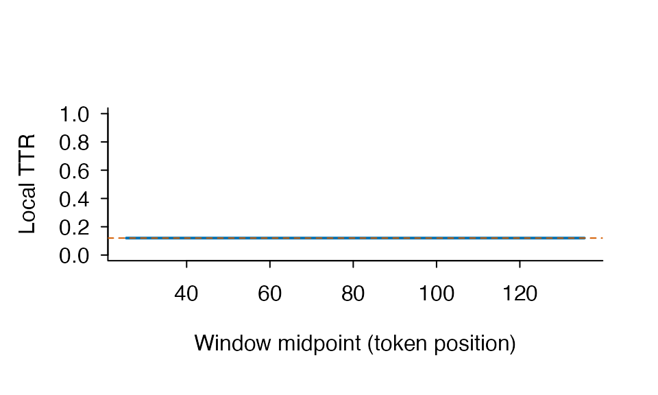
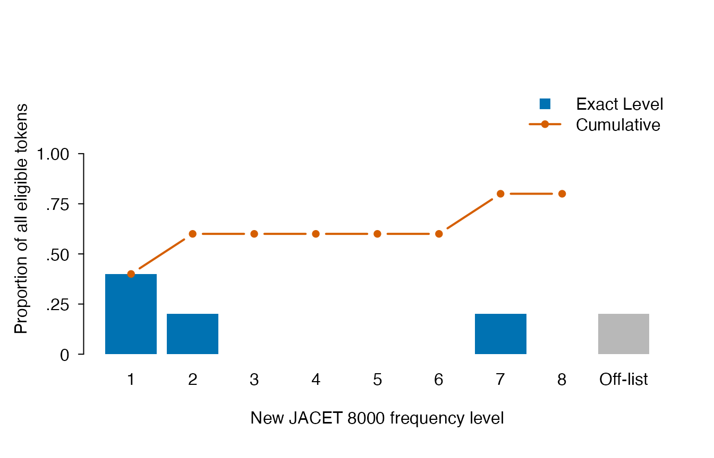

# Preprocessing, parameter sensitivity, and frequency coverage

``` r
library(ldfreq)
```

## What `ldfreq` adds to the R ecosystem

R already has mature lexical-diversity implementations. In particular,
`quanteda.textstats::textstat_lexdiv()` integrates with `quanteda`
tokens and document-feature matrices, while
[`koRpus::lex.div()`](https://rdrr.io/pkg/koRpus/man/lex.div-methods.html)
includes raw-character, lemma, HD-D, MTLD, and MTLD-MA workflows.
`ldfreq` does not claim that these metrics were absent from R.

The narrower contribution of `ldfreq` is an auditable measurement
boundary:

| Question | `ldfreq` representation |
|----|----|
| Which formula and boundary variant ran? | `method_id` and metric contract |
| Which window, segment, or sample was requested? | requested and effective parameter list-columns |
| Was a short-text request computable? | structured `status` and `missing_reason` |
| Did a screen change or censor a value? | no; screens are separate rows |
| Which raw-text decisions created the units? | preprocessing contract and token audit |
| Which resource produced a frequency value? | version, manifest hash, formula, and lookup identity |
| How much of the text matched that resource? | adjacent token/type coverage |

This makes `ldfreq` complementary to broad text-processing ecosystems
rather than a replacement for them.

## Why preprocessing is a measurement decision

Caltabellotta, Van Steendam, Noreillie, and Peters (2026,
<https://doi.org/10.1016/j.asw.2026.101039>) found that lemmatization
and the inclusion of all words versus content words materially changed
MATTR and frequency-based sophistication results. Their empirical
best-performing choice in one English/French study should not be
converted into a universal software default. `ldfreq` therefore exposes
the alternatives and their coverage.

``` r
tokenization <- lexdiv_tokenize("Cats and cat ran run.")
annotated <- lexdiv_lemmatize(
  tokenization,
  lemmas = c("cat", "and", "cat", "run", "run"),
  upos = c("NOUN", "CCONJ", "NOUN", "VERB", "VERB"),
  backend_id = "vignette-fixture",
  backend_version = "1",
  upos_backend_id = "vignette-upos-fixture",
  upos_backend_version = "1"
)

surface <- lexdiv_metrics_text(tokenization, metrics = "ttr")
lemma_all <- lexdiv_metrics_text(
  annotated,
  unit = "lemma",
  metrics = "ttr"
)
lemma_content <- lexdiv_metrics_text(
  annotated,
  unit = "lemma",
  word_inclusion = "content",
  metrics = "ttr"
)

data.frame(
  operationalization = c("surface/all", "lemma/all", "lemma/content"),
  N = c(surface$results$N, lemma_all$results$N, lemma_content$results$N),
  V = c(surface$results$V, lemma_all$results$V, lemma_content$results$V),
  TTR = c(
    surface$results$value,
    lemma_all$results$value,
    lemma_content$results$value
  )
)
#>   operationalization N V TTR
#> 1        surface/all 5 5 1.0
#> 2          lemma/all 5 3 0.6
#> 3      lemma/content 4 2 0.5
```

The point is not that TTR is preferred. The example demonstrates that
the lexical unit and denominator change the estimand before any
diversity formula is selected.

### Exact content-word overlap between two texts

The same annotation boundary supports type-set overlap. A second text
must be tokenized and annotated explicitly; `ldfreq` does not guess its
UPOS tags or lemmas.

``` r
comparison <- lexdiv_lemmatize(
  lexdiv_tokenize("Cats and birds ran."),
  lemmas = c("cat", "and", "bird", "run"),
  upos = c("NOUN", "CCONJ", "NOUN", "VERB"),
  backend_id = "vignette-fixture",
  backend_version = "1",
  upos_backend_id = "vignette-upos-fixture",
  upos_backend_version = "1"
)

content_overlap <- lexdiv_content_overlap(
  annotated,
  comparison,
  unit = "lemma",
  details = "terms",
  document_ids = c("essay", "reference")
)
content_overlap$summary[, c(
  "measure_id", "value", "numerator", "denominator", "status"
)]
#>                  measure_id     value numerator denominator status
#> 1             jaccard_types 0.6666667         2           3     ok
#> 2                dice_types 0.8000000         4           5     ok
#> 3      a_covered_by_b_types 1.0000000         2           2     ok
#> 4      b_covered_by_a_types 0.6666667         2           3     ok
#> 5 overlap_coefficient_types 1.0000000         2           2     ok
content_overlap$coverage
#>   document_id input_tokens content_tokens eligible_tokens excluded_tokens
#> 1       essay            5              4               4               1
#> 2   reference            4              3               3               1
#>   missing_upos_tokens non_content_upos_tokens missing_unit_tokens
#> 1                   0                       1                   0
#> 2                   0                       1                   0
#>   identity_fallback_tokens eligible_types upos_coverage unit_coverage
#> 1                        0              2             1             1
#> 2                        0              3             1             1
#>   content_unit_coverage selection_coverage
#> 1                     1               0.80
#> 2                     1               0.75
content_overlap$shared_terms
#>   term token_count_a token_count_b
#> 1  cat             2             1
#> 2  run             2             1
```

Because `details = "terms"` retains exact lexical strings, the result
provenance and print method disclose their presence. The default
comparability policy is fail-closed unless an analysis explicitly
selects `mismatch = "warn"` or `"allow"`. The comparison is
unit-relevant: surface uses tokenizer and UPOS settings; lemma also uses
its annotation method/backend; flemma instead uses the fixed flemma
adapter/parser and declared resource/override settings while ignoring
lemma backend identity because the flemma adapter consumes surface
forms. UPOS labels are always supplied separately from lemma labels.
Strict flemma comparison requires present, equal caller-declared
resource versions. Two inputs with no overrides are comparable on the
override setting; otherwise both need the same declared override
version. The four-column comparability table discloses label values and
match status but does not compare file bytes or content hashes.

All five rows use distinct exact types, but not the same denominator.
Jaccard uses the union, Dice uses the sum of set sizes, the two coverage
measures use A or B, and the overlap coefficient uses the smaller set. A
strict subset can therefore have overlap coefficient 1 while Jaccard
remains below 1. Missing UPOS, non-content UPOS, and missing selected
units are counted separately, so the coverage table is part of the
interpretation rather than an optional quality label.

Changing `unit = "lemma"` to `"surface"` changes the estimand and may
change the value. None of these exact lexical-sharing measures detects
plagiarism or directly measures semantic similarity, coherence,
proficiency, or writing quality.

### Directional reference coverage across documents

When the research question is how much of several documents belongs to
one reference vocabulary, pairwise Jaccard or Dice values introduce the
wrong denominator.
[`lexdiv_reference_coverage()`](https://ryuya-dot-com.github.io/ldfreq/reference/lexdiv_reference_coverage.md)
instead retains both the number of matched document items and the full
document denominator.

``` r
coverage_documents <- list(
  essay_a = c("cat", "cat", "run", "rare"),
  essay_b = c("bird", "run", "unknown")
)
reference_coverage <- lexdiv_reference_coverage(
  coverage_documents,
  reference = c("cat", "bird", "run"),
  reference_id = "analysis_list",
  details = "terms"
)
reference_coverage$summary[, c(
  "document_id", "weighting", "value", "numerator", "denominator", "status"
)]
#>   document_id weighting     value numerator denominator status
#> 1     essay_a     token 0.7500000         3           4     ok
#> 2     essay_a      type 0.6666667         2           3     ok
#> 3     essay_b     token 0.6666667         2           3     ok
#> 4     essay_b      type 0.6666667         2           3     ok
reference_coverage$terms
#>   document_id  reference_id    term document_token_count reference_token_count
#> 1     essay_a analysis_list     cat                    2                     1
#> 2     essay_a analysis_list    rare                    1                     0
#> 3     essay_a analysis_list     run                    1                     1
#> 4     essay_b analysis_list    bird                    1                     1
#> 5     essay_b analysis_list     run                    1                     1
#> 6     essay_b analysis_list unknown                    1                     0
#>   matched
#> 1    TRUE
#> 2   FALSE
#> 3    TRUE
#> 4    TRUE
#> 5    TRUE
#> 6   FALSE
```

The token row counts every repeated document occurrence; the type row
counts each distinct document term once. Repeating an entry in the
reference changes neither value. The function does not normalize or
annotate terms, so comparable surface, lemma, or flemma vectors must be
constructed explicitly upstream. Term detail is opt-in because it copies
exact lexical strings into the result.

### Flemma as a caller-supplied resource transformation

For NWLC-oriented sensitivity analysis,
[`lexdiv_flemmatize()`](https://ryuya-dot-com.github.io/ldfreq/reference/lexdiv_flemmatize.md)
reads a local AntBNC lemma-list file supplied by the analyst. The
payload is never bundled or downloaded. Unknown forms use
normalized-surface identity fallback so they remain visible as off-list
items, and explicit overrides take precedence over the raw AntBNC
mapping.

``` r
antbnc_fixture <- tempfile(fileext = ".txt")
writeLines(
  c(
    "cat\t->\tcat\tcats",
    "run\t->\tran\trun",
    "the\t->\tthe"
  ),
  antbnc_fixture,
  useBytes = TRUE
)

flemma_annotations <- lexdiv_flemmatize(
  tokenization,
  antbnc_fixture,
  resource_version = "synthetic-vignette-fixture"
)
unlink(antbnc_fixture)

flemma_annotations$tokens[, c(
  "surface", "flemma", "flemma_matched", "flemma_match_rule"
)]
#>   surface flemma flemma_matched flemma_match_rule
#> 1    Cats    cat           TRUE            antbnc
#> 2     and    and          FALSE          identity
#> 3     cat    cat           TRUE            antbnc
#> 4     ran    run           TRUE            antbnc
#> 5     run    run           TRUE            antbnc
lexdiv_metrics_text(flemma_annotations, unit = "flemma", metrics = "ttr")
#> <lexdiv_text_results> 5/5 eligible tokens | unit=flemma | inclusion=all
#> <lexdiv_results: 1 metric; contract 0.2.0>
#>   metric_id value status missing_reason N V below_quality_floor
#> 1       ttr   0.6     ok           <NA> 5 3               FALSE
```

For a real analysis, replace the synthetic fixture with a legitimately
obtained local AntBNC file and declare its version. The adapter and
parser identities are fixed by `ldfreq`; `resource_version` and, when
overrides are non-empty, `override_version` are caller labels rather
than inferred content identities. They are disclosed in provenance and
overlap comparability output, so use path-free, non-sensitive labels and
never put secrets or private hashes in them. The local file name and
content hash are not retained in public provenance; a source-byte digest
is used only for caching and is never copied to public provenance or
results.

This is an explicit approximation boundary. NWLC reports using a
manually modified AntBNC mapping aligned to its selected word lists. Raw
AntBNC can map a surface form that is an independent New JACET headword
to a different family lemma.
[`nj8_profile()`](https://ryuya-dot-com.github.io/ldfreq/reference/nj8_profile.md)
records these conflicts and lets an analysis retain AntBNC, prefer the
word-list headword, or stop for explicit review.

### Resource-defined word families

For a step-by-step introduction, start with [Word families, roots, and
affixes](https://ryuya-dot-com.github.io/ldfreq/articles/word-families-and-affixes.md).
It connects counting units, coverage, part counts and
occurrence-specific judgments. This section provides the detailed input
contracts and alternatives.

**Choose a family definition before counting.** A lemma usually links
inflected forms; a derivational family may also include words such as
`reusability`. Flemma and word family are not interchangeable. Bauer and
Nation (1993, <https://doi.org/10.1093/ijl/6.4.253>) describe graded
inclusion criteria; an inventory’s inclusion level is not a frequency
band or evidence that a learner knows every member.

Experimental
[`lexdiv_family_profile()`](https://ryuya-dot-com.github.io/ldfreq/reference/lexdiv_family_profile.md)
accepts a plain form–family table and complete
[`lexdiv_import_annotations()`](https://ryuya-dot-com.github.io/ldfreq/reference/lexdiv_import_annotations.md)
output. It needs no corpus download, Python, model or additional
dependency. This offline example contains **authored decisions**, not
verified entries from Nation’s lists:

``` r
family_env <- new.env(parent = baseenv())
sys.source(system.file("examples", "word-families.R", package = "ldfreq",
  mustWork = TRUE), family_env)
family_example <- family_env$word_families_example
families <- family_example$profile
families$dictionary
#>   record_id        form    family_id
#> 1       r01         use          USE
#> 2       r02        uses          USE
#> 3       r03 reusability          USE
#> 4       r04        bank BANK_FINANCE
#> 5       r05        bank   BANK_RIVER
families$documents[c("document_id", "selected_tokens", "matched_tokens",
  "unresolved_tokens", "family_types", "family_ttr", "status")]
#>   document_id selected_tokens matched_tokens unresolved_tokens family_types
#> 1    complete               4              4                 0            1
#> 2  unresolved               2              0                 2           NA
#> 3       empty               0              0                 0            0
#>   family_ttr     status
#> 1       0.25   complete
#> 2         NA incomplete
#> 3         NA      empty
family_example$comparison
#>      unit metric_id     value N V
#> 1 surface       ttr 0.7500000 4 3
#> 2 surface     mattr 1.0000000 4 3
#> 3   lemma       ttr 0.5000000 4 2
#> 4   lemma     mattr 0.6666667 4 2
#> 5  flemma       ttr 0.5000000 4 2
#> 6  flemma     mattr 0.6666667 4 2
#> 7  family       ttr 0.2500000 4 1
#> 8  family     mattr 0.3333333 4 1
```

In `use uses reusability use.`, excluding supplied `PUNCT` leaves four
tokens. They contain three surface types, two authored lemmas/flemmas
and one authored family: TTR is .75, .50 and .25 respectively. Every
comparison uses the same four ordered occurrences. The window of three
for MATTR is only a short arithmetic illustration, not a recommended
setting for research.

The `bank quux.` document is incomplete: `bank` has two candidate
families and `quux` is unlisted. Neither is silently assigned a family,
and complete family types/TTR are `NA`. Inspect original context and
both candidates:

``` r
families$occurrences[families$occurrences$status %in% c("ambiguous", "unlisted"),
  c("document_id", "segment_id", "token_index", "pre", "keyword", "post", "status")]
#>   document_id segment_id token_index   pre keyword   post    status
#> 6  unresolved         s1           1          bank  quux. ambiguous
#> 7  unresolved         s1           2 bank     quux      .  unlisted
families$candidates[families$candidates$document_id == "unresolved", ]
#>   document_id segment_id token_index record_id form    family_id
#> 5  unresolved         s1           1       r04 bank BANK_FINANCE
#> 6  unresolved         s1           1       r05 bank   BANK_RIVER
families$members
#>   document_id family_id     surface       query n
#> 1    complete       USE         use         use 2
#> 2    complete       USE        uses        uses 1
#> 3    complete       USE reusability reusability 1
```

#### Use Nation’s bundled BNC/COCA inventory

[`bnccoca_data()`](https://ryuya-dot-com.github.io/ldfreq/reference/bnccoca_data.md)
returns Nation’s **Level 6, Version 1.0.0** family lists under **CC
BY-SA 4.0**, including attribution and ShareAlike conditions. Its
`dictionary` contains 75,679 headword/member rows in 25,000 families;
each of the 25 frequency/range bands contains 1,000 families. The source
is [Nation’s official resource
page](https://www.wgtn.ac.nz/lals/resources/paul-nations-resources/vocabulary-analysis-programs).
The source spellings and memberships are preserved, including uppercase
keys.

``` r
sys.source(system.file("examples", "bnccoca-families.R", package = "ldfreq",
  mustWork = TRUE), family_env)
nation <- family_env$bnccoca_example
nation$profile$documents[c("document_id", "selected_tokens", "matched_tokens",
  "unresolved_tokens", "family_types", "family_ttr", "status")]
#>   document_id selected_tokens matched_tokens unresolved_tokens family_types
#> 1      listed               4              4                 0            2
#> 2    unlisted               2              1                 1           NA
#>   family_ttr     status
#> 1        0.5   complete
#> 2         NA incomplete
nation$candidates[c("document_id", "headword", "frequency_band")]
#>   document_id headword frequency_band
#> 1      listed      USE              1
#> 2      listed      USE              1
#> 3      listed   COLOUR              1
#> 4      listed   COLOUR              1
#> 5    unlisted      USE              1
```

The example explicitly uses `normalization = "nfkc_lower"`. Its first
text, `use uses colour color`, contains four tokens and two source
families. The second, `use reusability`, has an unlisted form:
**REUSABILITY is absent from this snapshot**, even though the earlier
authored example assigns it to USE. Complete family types and TTR
therefore remain `NA`. Inspect the original KWIC, rather than inventing
a family or interpreting noncoverage as an error:

``` r
nation$profile$occurrences[nation$profile$occurrences$status == "unlisted",
  c("document_id", "pre", "keyword", "post", "status")]
#>   document_id  pre     keyword post   status
#> 6    unlisted use  reusability      unlisted
```

`reference <- bnccoca_data()` exposes `reference$dictionary` and
`reference$resource` directly for
`lexdiv_family_profile(annotations, reference$dictionary, reference$resource, normalization = "nfkc_lower")`.
The result retains the table, source IDs, citation and license. Save the
whole `reference` as well to retain conversion metadata and
supplementary lists. The installed example joins frequency bands by
**record ID**; matching a candidate is not a corpus frequency estimate
or a learner knowledge score.

Inclusion **Level 6** and frequency **band 6** are different variables.
The Level 3 partial lists are a separate resource, not obtainable by
filtering these frequency bands. The first bands also reflect
pedagogical decisions. Each member does not have a separate Bauer–Nation
affix-level annotation.

`reference$supplementary` keeps proper names, marginal words,
transparent compounds and acronyms separate, with `NA` frequency bands.
Membership in a proper-name list does not label the use of that string
in context. Placeholder slots 26–30 and Range software are excluded. Any
explicit combination with the core dictionary needs its own declared
scope and candidate checks. See
[`?bnccoca_data`](https://ryuya-dot-com.github.io/ldfreq/reference/bnccoca_data.md)
and the installed `licenses/bnccoca/NOTICE.md`.

#### Compare counting units without hiding unlisted words

Family membership and dictionary coverage answer different questions. A
smaller type count can reflect grouping words into families, or dropping
words that the inventory does not list. Compare units on **the same
occurrence IDs**, while reporting coverage of the original selection
separately.

The following explicitly sourced recipe uses the authored lemmas in the
example above. It runs no analyzer and adds no exported API. Surface and
lemma types use the supplied strings verbatim; case/spelling decisions
should be made explicitly upstream. Family lookup retains its declared
`nfkc_lower` normalization.

``` r
sys.source(system.file("examples", "family-count-comparison.R", package = "ldfreq",
  mustWork = TRUE), family_env)
counts <- family_env$compare_family_counts(nation$profile)
counts$documents[c("document_id", "selected_tokens", "matched_tokens",
  "unlisted_tokens", "ambiguous_tokens", "missing_lemma_tokens",
  "common_tokens", "token_coverage")]
#>   document_id selected_tokens matched_tokens unlisted_tokens ambiguous_tokens
#> 1      listed               4              4               0                0
#> 2    unlisted               2              1               1                0
#>   missing_lemma_tokens common_tokens token_coverage
#> 1                    0             4            1.0
#> 2                    0             1            0.5
counts$comparison[c("document_id", "scope", "unit", "N", "V", "ttr", "status")]
#>    document_id           scope    unit N  V  ttr     status
#> 1       listed    all_selected surface 4  4 1.00   complete
#> 2       listed    all_selected   lemma 4  3 0.75   complete
#> 3       listed    all_selected  family 4  2 0.50   complete
#> 4       listed common_resolved surface 4  4 1.00   complete
#> 5       listed common_resolved   lemma 4  3 0.75   complete
#> 6       listed common_resolved  family 4  2 0.50   complete
#> 7     unlisted    all_selected surface 2  2 1.00   complete
#> 8     unlisted    all_selected   lemma 2  2 1.00   complete
#> 9     unlisted    all_selected  family 2 NA   NA incomplete
#> 10    unlisted common_resolved surface 1  1 1.00   complete
#> 11    unlisted common_resolved   lemma 1  1 1.00   complete
#> 12    unlisted common_resolved  family 1  1 1.00   complete
```

For `use uses colour color`, all four occurrences are covered: surface,
lemma, and family types are 4, 3, and 2. `colour` and `color` remain
distinct supplied lemmas but share a source family. For
`use reusability`, the full selection has two tokens and an unavailable
family total/TTR. The `common_resolved` comparison contains only `use`:
N = 1 and TTR = 1 for each unit. **That conditional value is not the
family TTR of the original two-token text.**

`all_selected` keeps each unit’s unavailable totals as `NA` when its
assignments are incomplete. `common_resolved` is the intersection of
selected occurrences with a known lemma and an assigned family.
`observed_types` counts known values without claiming a complete total.
Empty selections have zero types and undefined TTR. The recipe also
accepts an explicit `selected` logical vector in profile row order,
limited to the profile’s known-selected rows; its returned `selection`
keeps document/segment/token IDs. Do not reuse a vector after reordering
rows.

Keep unresolved occurrences available for inspection:

``` r
o <- counts$profile$occurrences
o[counts$selection$selected & o$status != "matched",
  c("document_id", "token_index", "pre", "keyword", "post", "status")]
#>   document_id token_index  pre     keyword post   status
#> 6    unlisted           2 use  reusability      unlisted
```

Use this subset for type counts and TTR only. Removing unresolved
occurrences does not justify closing gaps for moving-window measures or
n-grams. A string match is not an accuracy score, and supplementary-list
membership does not establish a proper noun in context. Save the full
result and the reference:

``` r
saveRDS(list(counts = counts, reference = nation$reference,
  session = sessionInfo()), "family-comparison.rds")
saved <- readRDS("family-comparison.rds")
recounted <- family_env$compare_family_counts(saved$counts$profile,
  selected = saved$counts$selection$selected)
stopifnot(identical(recounted, saved$counts))
```

This workflow was also checked locally using 140 original essays from
**ICNALE GRA V2.1**, retaining 31,902 saved lexical tokens and their
lemmas. Document counts and assignments agreed with a separate direct
dictionary lookup; 30,892 tokens matched the core inventory. This is an
implementation check on a fixed input, not independent validation of
contextual family assignments. ICNALE texts and individual records are
not included in the package; the example above uses authored text.
Dataset source: Ishikawa, S. (2024), *The ICNALE Global Rating Archives
(V2.1)*, Kobe University.

#### Supply a different inventory

For a different inventory, prepare character columns `record_id`,
`form`, `family_id` and optionally `upos`. Repeated forms are allowed;
assign only when all matching records agree on one family. Optional POS
matching requires exact UD tags. If your inventory contains inclusion
levels or alternative definitions, select the intended rows explicitly
**before** lookup and record that rule in `family_definition`. Preserve
extra level/band columns for inspection.

``` r
dictionary <- read.csv("my-family-table.csv", colClasses = "character",
  fileEncoding = "UTF-8")
resource <- list(resource_id = "my-family-table", resource_version = "1",
  language = "en", source_reference = "Full inventory citation",
  data_license = "Terms applying to this locally obtained table",
  family_definition = "Exact inclusion criteria and filtering used",
  lookup_unit = "surface")
families <- lexdiv_family_profile(annotations, dictionary, resource,
  unit = "surface", normalization = "identity", exclude_pos = c("PUNCT", "SYM"))
saveRDS(families, "family-profile.rds")
restored <- readRDS("family-profile.rds")
replayed <- lexdiv_family_profile(restored$annotations, restored$dictionary,
  restored$provenance$resource, unit = restored$provenance$unit,
  normalization = restored$provenance$normalization,
  exclude_pos = restored$provenance$exclude_pos,
  context_chars = restored$provenance$context_chars, review = restored$review)
stopifnot(identical(restored, replayed))
```

Use `normalization = "nfkc_lower"` only when NFKC, trimming and English
lowercasing fit the inventory. `unit = "lemma"` or `"flemma"` uses an
already supplied annotation column; it does not run an analyzer. Family
IDs remain unchanged. Missing POS makes selection unknown when
exclusions are requested; `conditional_token_coverage` then describes
known-selected tokens only, while whole-selection coverage is
unavailable. Read coverage beside the unresolved counts, not as an
annotation-accuracy estimate.

For other metrics, the installed example passes ordered family IDs from
a **complete** document to
[`lexdiv_metrics()`](https://ryuya-dot-com.github.io/ldfreq/reference/lexdiv_metrics.md).
Never remove unresolved tokens and join the survivors for MATTR. The
pooled summary is also not an average of document TTRs. Do not resolve a
context-dependent form by changing the global table for all its
occurrences. Affix decomposition, inventory licensing and empirical
validation remain separate tasks.

#### Apply contextual judgments to individual occurrences

When a declared inventory distinguishes two families for the same
spelling, `review_input` prepares the existing
[`lexdiv_ambiguity_review()`](https://ryuya-dot-com.github.io/ldfreq/reference/lexdiv_ambiguity_review.md)
workflow. Use `review =` to apply the resulting judgments to the family
profile. This optional review preparation uses quanteda; basic family
lookup and replay of saved judgments do not require loading quanteda or
running a language model.

``` r
if (requireNamespace("quanteda", quietly = TRUE)) {
  sys.source(system.file("examples", "word-family-review.R", package = "ldfreq",
    mustWork = TRUE), family_env)
  contextual <- family_env$word_family_review_example
  contextual$reviewed$occurrences[
    contextual$reviewed$occurrences$surface == "bank",
    c("segment_id", "pre", "keyword", "post", "lookup_status",
      "status", "family_id", "review_record_id", "reviewer", "reason")]
  contextual$reviewed$documents[c("document_id", "selected_tokens",
    "review_selected_tokens", "unresolved_tokens", "family_types", "family_ttr")]
}
#>   document_id selected_tokens review_selected_tokens unresolved_tokens
#> 1     example               8                      2                 0
#> 2       empty               0                      0                 0
#>   family_types family_ttr
#> 1            7      0.875
#> 2            0         NA
```

The authored sentences are `The bank lends money.` and
`The river bank floods.` The two occurrences receive different families
under this **illustrative** definition. Excluding punctuation still
leaves eight tokens. Before review, two occurrences are ambiguous and
complete family TTR is unavailable. After the two supplied judgments,
seven families give TTR = 7/8. The original dictionary and automatic
lookup remain unchanged in the saved result. These choices do not assert
that every inventory separates the two meanings, or that grouping by
meaning and grouping by derivation are the same operation.

For your own profile, use its prepared inputs without editing their
candidate set or resource snapshot. Decisions identify **record IDs**,
not family IDs:

``` r
stopifnot(length(families$review_input$targets) > 0)
review <- do.call(lexdiv_ambiguity_review,
  c(list(x = families$annotations), families$review_input))
write.csv(review$occurrences, "family-decisions.csv", row.names = FALSE, na = "")
# Review the source/context and fill status, candidate_id, reviewer and reason.
# Use selected + a record ID, or unresolved + an empty candidate_id.
# Omit unreviewed rows from this decision file; source tokens remain retained.
decisions <- read.csv("family-decisions.csv", colClasses = "character",
  na.strings = "", check.names = FALSE)
review <- do.call(lexdiv_ambiguity_review,
  c(list(x = families$annotations), families$review_input, list(decisions = decisions)))
p <- families$provenance
reviewed <- lexdiv_family_profile(families$annotations, families$dictionary,
  p$resource, unit = p$unit, normalization = p$normalization,
  exclude_pos = p$exclude_pos, context_chars = p$context_chars, review = review)
saveRDS(reviewed, "reviewed-families.rds")
```

Character CSV input preserves IDs such as `01` and literal `NA`; empty
fields are missing. A `selected` judgment applies only to that source
occurrence. An explicit `unresolved` judgment also withholds a
previously automatic match; unreviewed occurrences keep their lookup
result. Report `review_selected_tokens` and `review_unresolved_tokens`
beside coverage, and inspect `lookup_status` and `lookup_family_id` when
explaining what changed. Original contexts and the complete review,
including judgment reasons, remain in `$review`.

The generic review display lists candidate records by original surface.
If the same surface has different POS/lemma annotations across
occurrences, consult `$candidates` using document/segment/token IDs to
check eligibility. A selected record for the wrong POS or lemma, or a
decision on an excluded or unknown-selection token, is rejected. Review
cannot invent missing inventory entries, fix annotations or silently
reinclude excluded tokens.

Changes to the source annotations, dictionary contents/order, resource
definition, selected unit, normalization or exclusions invalidate the
review snapshot. Recreate the review and reassess judgments; do not copy
old IDs into a new snapshot. Context-window changes alone do not
invalidate judgments. Independent reviewers can use the same prepared
input and compare their results with
[`lexdiv_compare_ambiguity()`](https://ryuya-dot-com.github.io/ldfreq/reference/lexdiv_compare_ambiguity.md)
before applying an adjudicated review. This preserves disagreement; it
does not establish independent judgment or linguistic correctness by
itself.

### Source-linked roots and affixes

The installed `word-parts.R` recipe counts **supplied analyses** at
original occurrences. It is an explicitly sourced example helper, not an
exported API or an automatic morphology analyzer. It needs no Python,
model, network or quanteda. Family membership remains a separate input
and is not inferred.

``` r
parts_env <- new.env(parent = baseenv())
sys.source(system.file("examples", "word-parts.R", package = "ldfreq",
  mustWork = TRUE), parts_env)
sys.source(system.file("examples", "word-parts-demo.R", package = "ldfreq",
  mustWork = TRUE), parts_env)
word_parts <- parts_env$word_parts_example$profile
word_parts$occurrences[c("surface", "status", "analysis_id",
  "observed_root_occurrences", "observed_prefix_occurrences",
  "observed_suffix_occurrences", "observed_inflection_occurrences",
  "observed_derivation_occurrences")]
#>         surface     status analysis_id observed_root_occurrences
#> 1      teachers   complete          01                         1
#> 2       smaller   complete          02                         1
#> 3         reuse   complete          03                         1
#> 4      transmit   complete          04                         1
#> 5  transmission   complete          05                         1
#> 6             .   excluded        <NA>                        NA
#> 7          bank  ambiguous        <NA>                        NA
#> 8          went unanalysed          w1                        NA
#> 9          quux   unlisted        <NA>                        NA
#> 10            .   excluded        <NA>                        NA
#>    observed_prefix_occurrences observed_suffix_occurrences
#> 1                            0                           2
#> 2                            0                           1
#> 3                            1                           0
#> 4                            1                           0
#> 5                            1                           1
#> 6                           NA                          NA
#> 7                           NA                          NA
#> 8                           NA                          NA
#> 9                           NA                          NA
#> 10                          NA                          NA
#>    observed_inflection_occurrences observed_derivation_occurrences
#> 1                                1                               1
#> 2                                1                               0
#> 3                                0                               1
#> 4                                0                               1
#> 5                                0                               2
#> 6                               NA                              NA
#> 7                               NA                              NA
#> 8                               NA                              NA
#> 9                               NA                              NA
#> 10                              NA                              NA
word_parts$documents[c("document_id", "selected_tokens", "complete_coverage",
  "observed_affix_occurrences", "affix_occurrences", "affixes_per_token", "status")]
#>   document_id selected_tokens complete_coverage observed_affix_occurrences
#> 1       parts               5                 1                          7
#> 2   uncertain               3                 0                          0
#> 3       empty               0                NA                          0
#>   affix_occurrences affixes_per_token     status
#> 1                 7               1.4   complete
#> 2                NA                NA incomplete
#> 3                 0                NA      empty
```

These are **authored teaching examples**, not imported MorphoLex or
Nation entries. The first document contains five selected tokens.
`teachers` contributes one root, derivational `-er` and inflectional
`-s`; comparative `-er` in `smaller` has a different ID. The five tokens
contain seven affix occurrences, so affixes per token is 7/5. The
proportion of tokens containing affixes is 1. These are different
denominators. The alternate authored analysis leaves `transmit`
undivided: inspect `parts_env$word_parts_example$alternative` to see six
affix occurrences and five root types, compared with seven and four in
the first analysis. Neither choice establishes what a learner knows or
mentally decomposes.

The second document retains ambiguous `bank`, explicitly unanalysed
`went`, and unlisted `quux`; its complete totals are unavailable, not
zero. Empty documents retain zero counts and undefined proportions. A
`partial` analysis contributes its known parts to `observed_*` counts
but leaves full totals unavailable. `complete` is always relative to the
declared **analysis scope**: a complete derivational analysis can omit
inflection by design.

Prepare two plain data frames with character identifiers:

| Table | Required columns | Meaning |
|----|----|----|
| `analyses` | `analysis_id`, `form`, `completeness` | Unique analysis IDs; exact surface forms; `complete`, `partial` or `unanalysed`. Optional `upos` requires exact UD POS matching. Multiple eligible analyses remain ambiguous. |
| `parts` | `analysis_id`, `part_index`, `part_id`, `canonical`, `role`, `process`, `boundness` | One row per part, including repeated parts. Roles: `root`, `prefix`, `suffix`. Processes: `none` for roots; `inflection`, `derivation`, `unknown` for affixes. Boundness: `free`, `bound`, `unknown`; affixes must be bound. |

`part_index` is consecutive display order **within each analysis**, not
an attachment sequence or a derivation tree. A complete analysis must
contain a root and classify its affix processes. Rootless or other
unsupported analyses remain partial/unanalysed. Multiple roots are
permitted. Parts with a shared ID must have consistent canonical form
and classification. Homographic affixes with different functions need
different IDs when the source distinguishes them. Additional metadata
columns are retained; they are not interpreted as trees, validated
substring coordinates, or evidence of semantic transparency.

The authored `mit/miss` example uses one root ID with a retained
`realization` column. This expresses an explicit analytical choice, not
a rule that unifies similar strings. A **base** can already contain
several parts before another affix is attached; this recipe counts
listed parts and does not reconstruct those formation stages. Nonaffixal
processes such as conversion or irregular inflection are not diagnosed
by a zero affix count.

The required `resource` declarations are `resource_id`,
`resource_version`, `language`, `source_reference`, `data_license`,
`analysis_scope`, and `analysis_basis`.
`word_parts_profile(annotations, analyses, parts, resource, exclude_pos = character(), context_chars = 30L, max_rows = 1e6)`
accepts complete
[`lexdiv_import_annotations()`](https://ryuya-dot-com.github.io/ldfreq/reference/lexdiv_import_annotations.md)
output. Matching is exact and case-sensitive; there is no lemma fallback
or silent normalization. Missing POS makes exclusion unknown, and
whole-selection coverage is then unavailable. Row ceilings apply to each
reference table, source tokens and candidate/part expansion, not total
memory. Keep inputs scoped to the analysis at hand.

``` r
# Full tables remain available beside aggregate results.
word_parts$part_occurrences
#>    document_id segment_id token_index      surface completeness analysis_id
#> 1        parts          s           1     teachers     complete          01
#> 2        parts          s           1     teachers     complete          01
#> 3        parts          s           1     teachers     complete          01
#> 4        parts          s           2      smaller     complete          02
#> 5        parts          s           2      smaller     complete          02
#> 6        parts          s           3        reuse     complete          03
#> 7        parts          s           3        reuse     complete          03
#> 8        parts          s           4     transmit     complete          04
#> 9        parts          s           4     transmit     complete          04
#> 10       parts          s           5 transmission     complete          05
#> 11       parts          s           5 transmission     complete          05
#> 12       parts          s           5 transmission     complete          05
#>    part_index  part_id canonical   role    process boundness realization
#> 1           1    TEACH     teach   root       none      free       teach
#> 2           2 ER_AGENT        er suffix derivation     bound          er
#> 3           3     S_PL         s suffix inflection     bound           s
#> 4           1    SMALL     small   root       none      free       small
#> 5           2  ER_COMP        er suffix inflection     bound          er
#> 6           1 RE_AGAIN        re prefix derivation     bound          re
#> 7           2      USE       use   root       none      free         use
#> 8           1    TRANS     trans prefix derivation     bound       trans
#> 9           2 MIT_MISS       mit   root       none     bound         mit
#> 10          1    TRANS     trans prefix derivation     bound       trans
#> 11          2 MIT_MISS       mit   root       none     bound        miss
#> 12          3      ION       ion suffix derivation     bound         ion
word_parts$frequency
#>    document_id  part_id canonical   role    process boundness
#> 1        parts    TEACH     teach   root       none      free
#> 2        parts ER_AGENT        er suffix derivation     bound
#> 3        parts     S_PL         s suffix inflection     bound
#> 4        parts    SMALL     small   root       none      free
#> 5        parts  ER_COMP        er suffix inflection     bound
#> 6        parts RE_AGAIN        re prefix derivation     bound
#> 7        parts      USE       use   root       none      free
#> 8        parts    TRANS     trans prefix derivation     bound
#> 9        parts MIT_MISS       mit   root       none     bound
#> 10       parts      ION       ion suffix derivation     bound
#>    observed_occurrences
#> 1                     1
#> 2                     1
#> 3                     1
#> 4                     1
#> 5                     1
#> 6                     1
#> 7                     1
#> 8                     2
#> 9                     2
#> 10                    1
word_parts$occurrences[word_parts$occurrences$status == "ambiguous",
  c("document_id", "segment_id", "token_index", "pre", "keyword", "post")]
#>   document_id segment_id token_index pre keyword        post
#> 7   uncertain          s           1        bank  went quux.
word_parts$candidates
#>   document_id segment_id token_index analysis_id         form completeness
#> 1       parts          s           1          01     teachers     complete
#> 2       parts          s           2          02      smaller     complete
#> 3       parts          s           3          03        reuse     complete
#> 4       parts          s           4          04     transmit     complete
#> 5       parts          s           5          05 transmission     complete
#> 6   uncertain          s           1          b1         bank     complete
#> 7   uncertain          s           1          b2         bank     complete
#> 8   uncertain          s           2          w1         went   unanalysed
```

`frequency` reports observed part occurrences by document and part ID;
absent rows are not assertions of complete zero counts. Read it with
`documents`. Alternative candidates do not contribute to frequency until
an analysis is uniquely eligible. This recipe supports inspection, but
does not yet apply occurrence-specific reviewer decisions or
automatically choose a candidate.

``` r
saveRDS(word_parts, "word-parts.rds")
restored <- readRDS("word-parts.rds")
stopifnot(identical(do.call(parts_env$word_parts_profile, restored$inputs), restored))
# For caller-prepared CSV input, preserve IDs and distinguish literal NA from missing.
analyses <- read.csv("analyses.csv", colClasses = "character", na.strings = "",
  fileEncoding = "UTF-8", check.names = FALSE)
parts <- read.csv("parts.csv", colClasses = "character", na.strings = "",
  fileEncoding = "UTF-8", check.names = FALSE)
parts$part_index <- as.numeric(parts$part_index) # validated by the recipe
```

#### Different resources answer different morphological questions

Nation’s lists group forms into educational families. MorphoLex provides
segmentation and morphological variables.
[MorphyNet](https://github.com/kbatsuren/MorphyNet) separates
derivational source–target relations from inflectional lemma–form
relations. Its English derivational table records `transmit` →
`retransmit` with prefix `re`, and `transmit` → `transmitter` with
suffix `er`. A relation is not a complete word segmentation; graph
connectivity does not establish a Nation family. MorphyNet’s 15
languages do not include Japanese. It uses CC BY-SA 3.0. A nine-row
teaching excerpt is bundled; the full file is read from a separately
obtained local copy as shown below.

For Japanese, [J-UniMorph](https://github.com/cl-tohoku/J-UniMorph) is a
CC BY 4.0 candidate for **inflectional features**, not an English-style
educational family inventory. Its filtered `jpn` snapshot has 12,687
records for 107 lemmas. For example, `食べられる` has potential, passive
and honorific analyses; `開ける` also permits distinct lemma analyses.
Keep the original features and multiple candidates. These forms can span
several UniDic short units, so matching them requires an explicit
source-span or whole-form unit. Joining by a single short-unit token
would change the question.

Neither resource is a contextual analyzer supplied by ldfreq. Japanese
inflection, productive derivation, compound structure and homophony
require different relations and evidence. UniDic lemmas or shared kanji
alone do not define a derivational family; verb forms in J-UniMorph do
not constitute a complete Japanese vocabulary or a frequency norm. See
Matsuzaki et al. (2024),
[J-UniMorph](https://aclanthology.org/2024.sigmorphon-1.2/), for its
scope.

#### Inspect MorphyNet formation relations

[`morphynet_read_derivations()`](https://ryuya-dot-com.github.io/ldfreq/reference/morphynet_read_derivations.md)
reads the official six-column derivational TSV in R, preserving original
words, POS, affixes and line IDs. It needs no Python, model or extra
package. For the complete English v1 reference, obtain
[`eng.derivational.v1.tsv`](https://github.com/kbatsuren/MorphyNet/blob/main/eng/eng.derivational.v1.tsv)
from the official repository, retain its CC BY-SA 3.0 terms, and read
it:

``` r
reference <- morphynet_read_derivations("eng.derivational.v1.tsv",
  language = "en", resource_version = "English v1")
reference$resource$source_sha256
saveRDS(reference, "morphynet-reference.rds")
```

The English file checked for this guide has 225,131 relations and
SHA-256
`5920edacc1888b14464fc5cd96beea0a721221d56d1dc0e49de22f4c7c537c50`.
Language/version are your declarations; the reader does not authenticate
every possible supplied file. It rejects invalid formats and retains a
hash of the actual input. POS symbols remain unchanged, including `U`;
the source row `teach -> teacher` has N/N tags, not an automatically
corrected V/N pair. Supplied relations can include multiword fields,
which are retained literally.

The installed example uses **nine unchanged rows** selected for six
words, with a mapping to their original source lines. This small excerpt
is not a reference for estimating vocabulary coverage. The contexts and
reviewer decisions are authored illustrations:

``` r
morphynet_env <- new.env(parent = baseenv())
sys.source(system.file("examples", "morphynet-relations.R", package = "ldfreq",
  mustWork = TRUE), morphynet_env)
morphynet <- morphynet_env$morphynet_example
morphynet$reference$relations[
  morphynet$reference$relations$target_word == "reusability",
  c("source_word", "target_word", "source_pos", "target_pos", "morpheme", "affix_position")]
#>   source_word target_word source_pos target_pos morpheme affix_position
#> 4       reuse reusability          N          N  ability         suffix
#> 6    reusable reusability          J          N      ity         suffix
#> 7   usability reusability          N          N       re         prefix
```

Reusability has incoming relations from `reuse` with `ability`,
`reusable` with `ity`, and `usability` with `re`. **Do not count these
as three affixes in one occurrence.** They are separate formation
relations that can coexist. Nor does their presence supply missing
membership in Nation’s inventory.

The example builds a candidate table by matching each exact
`target_word` to the requested surface, then uses the existing review
API when quanteda is available. Source/target words and POS remain
visible beside the relation ID. A study must declare what selecting one
relation means; context alone does not guarantee a unique morphological
derivation.

``` r
if (!is.null(morphynet$reviewed)) {
  morphynet$reviewed$occurrences[c("segment_id", "pre", "keyword", "post",
    "candidate_count", "status", "reason")]
  morphynet$selected[c("segment_id", "surface", "source_word", "target_word",
    "morpheme", "affix_position")]
}
#>   segment_id     surface source_word target_word morpheme affix_position
#> 1         s2 reusability    reusable reusability      ity         suffix
```

There are five targeted occurrences. The two instances of `reusability`
retain all three relations; the illustration selects `reusable + ity`
for one and withholds selection for the other. The single incoming
relations of `retransmit` and `transmitter` also remain unreviewed until
explicitly chosen. `teachers` has no candidate in this excerpt: that is
not an affix count of zero, a lack of inflection or evidence that a
learner made an error. The complete source token/segment roster,
including the empty document, is retained. Review summaries describe the
declared targets, not all corpus tokens.

``` r
saveRDS(morphynet, "morphynet-review.rds")
restored <- readRDS("morphynet-review.rds")
replayed <- lexdiv_ambiguity_review(restored$annotations, restored$targets,
  restored$candidates, restored$resource,
  decisions = restored$reviewed$decisions)
stopifnot(identical(replayed, restored$reviewed))
```

Reading saved tables requires no quanteda; regenerating KWIC review
does. The review API currently matches whitespace-free single-token
surfaces. Do not delete spaces from multiword targets or silently
substitute lemmas to force a match. Case normalization, lemma-based
alignment, complete derivation trees and validated
morphological-productivity estimates are separate tasks. For adaptation
or redistribution, retain source attribution and applicable ShareAlike
terms; see `licenses/morphynet/NOTICE.md`.

#### Use the bundled MorphoLex reference

MorphoLex-en supplies canonical segmentation and root/affix variables
(Sánchez-Gutiérrez et al., 2018,
<https://doi.org/10.3758/s13428-017-0981-8>). The package includes all
34 worksheets (68,624 word records and the aggregate prefix/suffix/root
tables), plus the original data dictionary, from
<https://github.com/hugomailhot/MorphoLex-en>. **These data use CC
BY-NC-SA 4.0, not the MIT license of the R code.** Noncommercial sharing
and adaptation require attribution and the applicable ShareAlike
conditions; commercial use is not granted by that license. See the
installed `licenses/morpholex/NOTICE.md`.

``` r
morpholex <- morpholex_data(c("0-1-1", "All roots"))
word_rows <- morpholex$sheets[["0-1-1"]]
word_rows[word_rows$Word %in% c("teacher", "teachers"),
  c("Word", "MorphoLexSegm", "ROOT1_FamSize", "ROOT1_Freq_HAL")]
#>          Word MorphoLexSegm ROOT1_FamSize ROOT1_Freq_HAL
#> 6247  teacher {(teach)}>er>             4          84480
#> 6248 teachers {(teach)}>er>             4          84480
morpholex$provenance$data_license
#> [1] "CC BY-NC-SA 4.0"
```

Tables retain character values, including identifiers and missing cells.
Convert a numeric measure explicitly when needed, for example
`as.numeric(word_rows$ROOT1_FamSize)`.
[`morpholex_data()`](https://ryuya-dot-com.github.io/ldfreq/reference/morpholex_data.md)
without arguments returns all sheets; `$provenance$sheet_catalog` lists
their names and dimensions. Two source `Word` cells (ELP IDs 42162 and
65908) are logical values and appear as `TRUE` and `FALSE`; an exact
lowercase query will not match them. The source values are preserved, so
any case normalization should be an explicit decision. No `readxl`,
Python, model, or internet connection is needed for bundled data. The
word-parts recipe can use the same snapshot:

``` r
sys.source(system.file("examples", "morpholex-word-parts.R", package = "ldfreq",
  mustWork = TRUE), parts_env)
forms <- c("transmit", "transport", "transmission", "teacher", "teachers")
reference <- parts_env$read_morpholex_parts(
  sheets = c("0-1-0", "0-1-1", "1-1-0"),
  words = forms)
reference$analyses
#>   analysis_id         form completeness      segmentation source_sheet
#> 1       41878     transmit     complete      {(transmit)}        0-1-0
#> 2       41881 transmission     complete {(transmit)}>ion>        0-1-1
#> 3       43741      teacher     complete     {(teach)}>er>        0-1-1
#> 4       43742     teachers     complete     {(teach)}>er>        0-1-1
#> 5       41903    transport     complete   {<trans<(port)}        1-1-0
reference$unlisted_words # absent from the selected sheets, not necessarily the workbook
#> character(0)
source <- data.frame(document_id = "example", segment_id = "s",
  text = paste(forms, collapse = " "))
tokens <- data.frame(document_id = "example", segment_id = "s",
  token_index = seq_along(forms), surface = forms)
imported <- lexdiv_import_annotations(tokens, source,
  list(language = "en", analyzer = "authored", analyzer_version = "1",
    dictionary = "none", dictionary_version = "1", unit = "word", normalization = "none"))
profile <- parts_env$word_parts_profile(imported, reference$analyses,
  reference$parts, reference$resource)
profile$documents[c("root_occurrences", "affix_occurrences", "complete_coverage")]
#>   root_occurrences affix_occurrences complete_coverage
#> 1                5                 4                 1
```

These five source entries give five root occurrences and four affix
occurrences. Save the complete reference/profile pair to keep both
inputs and results:

``` r
saveRDS(list(reference = reference, profile = profile), "morpholex-profile.rds")
# Optional: read an explicitly obtained workbook instead; requires readxl.
local_reference <- parts_env$read_morpholex_parts(path = "MorphoLEX_en.xlsx",
  sheets = c("0-1-0", "0-1-1", "1-1-0"), words = forms)
```

The reader retains all columns of selected source rows, selected sheet
names, requested/missing words and a workbook SHA-256. It extracts
recorded canonical parts and checks them against the reported PRS
signature and morpheme count. Unsupported syntax or inconsistent counts
remain `unanalysed`; the recipe never repairs an entry by guessing. It
does not validate linguistic accuracy or the derivation tree, and
preserves root boundness as unknown. Original POS and numeric variables
remain in `source_rows`; POS is not silently mapped to UD.

In the inspected workbook, `transmit` is undivided, `transport` is
`trans- + port`, and `transmission` uses canonical `transmit + -ion`.
Both `teacher` and `teachers` use `teach + -er`. Thus, its complete
counts describe **reported derivational segmentation, excluding
inflection**. The whole-word TUBELEX frequency, MorphoLex’s cumulative
root frequency/family size, and observed root counts in a target corpus
remain separate variables with their own reference populations. Do not
infer missing inflections, root meanings, learner knowledge, or
productivity from these counts.

#### Connect families and morphology at the same occurrences

To explain a vocabulary profile, keep family membership, recorded
segmentation and incoming formation relations alongside the **same
source occurrence**. The explicitly sourced recipe below reuses
[`lexdiv_family_profile()`](https://ryuya-dot-com.github.io/ldfreq/reference/lexdiv_family_profile.md),
the word-parts recipe and
[`lexdiv_ambiguity_review()`](https://ryuya-dot-com.github.io/ldfreq/reference/lexdiv_ambiguity_review.md).
It requires optional quanteda in a UTF-8 R session. Text and decisions
are authored; references are the bundled Nation/MorphoLex snapshots and
the nine-row MorphyNet teaching excerpt.

``` r
source(system.file("examples", "morphology-link.R", package = "ldfreq"))
source(system.file("examples", "morphology-link-demo.R", package = "ldfreq"))
linked <- morphology_link_example$reviewed
linked$occurrences[, c("surface", "family_status", "morpholex_lookup_status",
  "morpholex_review_status", "morphynet_candidate_count", "morphynet_review_status")]
#>       surface family_status morpholex_lookup_status morpholex_review_status
#> 1     teacher      unlisted                complete                selected
#> 2    teachers      unlisted                complete              unresolved
#> 3 reusability      unlisted                unlisted           no_candidates
#> 4 reusability      unlisted                unlisted           no_candidates
#> 5        quux      unlisted                unlisted           no_candidates
#>   morphynet_candidate_count morphynet_review_status
#> 1                         1              unreviewed
#> 2                         0           no_candidates
#> 3                         3                selected
#> 4                         3              unresolved
#> 5                         0           no_candidates
linked$documents[, c("document_id", "eligible_N", "morpholex_selected_complete_N",
  "reviewed_suffix_instances", "full_suffix_instances", "selected_suffix_relations")]
#>   document_id eligible_N morpholex_selected_complete_N
#> 1     example          5                             1
#> 2       empty          0                             0
#>   reviewed_suffix_instances full_suffix_instances selected_suffix_relations
#> 1                         1                    NA                         1
#> 2                         0                     0                         0
```

The five occurrences include two instances of `reusability`. Each has
three MorphyNet candidates; the example selects `reusable + ity` for one
occurrence and withholds selection for the other. Only one relation
enters the selected relation table. The MorphoLex analysis chosen for
`teacher` contributes one recorded root and one derivational suffix. The
`teachers` choice is withheld. Full-population suffix totals remain
`NA`; an unlisted or unreviewed occurrence is not assigned zero affixes.
The empty document remains in the output.

Use the outputs for different purposes:

| Output | Unit and use |
|----|----|
| `occurrences` | One row per eligible original token, with unchanged source positions/family assignments and separate lookup/review states |
| `documents` | One row per document; eligible denominator, resource match coverage, selected/withheld counts and explicitly reviewed part/relation totals |
| `reviews` | Complete KWIC reviews and candidate tables, including reviewer identities and reasons |
| `reviewed_parts` | Parts of explicitly selected **complete** segmentations, retaining root/prefix/suffix and process labels |
| `reviewed_relations` | Explicitly selected one-step relations, retaining original source/target words and POS; not a full affix decomposition |

The selection vector must identify eligible rows of the complete family
input. Context-only punctuation, numbers or other excluded chunks stay
outside that denominator. Repeated equal surfaces remain separate
occurrences. A decision for an excluded occurrence is rejected; no row
is silently duplicated by a one-to-many reference join. Candidate
alternatives are kept in the review tables, rather than summed as
observed morphemes.

Morphology matching uses the supplied surface **exactly**, without a
lemma fallback or POS inference. The family profile retains its
separately declared lookup policy. The source annotations record any
earlier case/spelling transformation; attaching morphology does not
change that processing. An explicitly selected reference analysis is
still not independently verified linguistic truth, and MorphoLex’s
derivational scope still excludes inflection.

``` r
saveRDS(linked, "linked-morphology.rds")
restored <- readRDS("linked-morphology.rds")
stopifnot(identical(do.call(link_morphology_candidates, restored$inputs), restored))
# For your corpus, pass its existing family profile, an explicit token selection,
# the MorphoLex adapter output and your locally read complete MorphyNet reference:
linked_corpus <- link_morphology_candidates(family, morpholex_reference,
  morphynet_reference, selected = eligible_tokens)
# Inspect candidates and submit decisions using each review's occurrence/review IDs.
```

A local input check with **ICNALE GRA V2.1**, 140 original essays,
reused 31,902 saved lexical tokens and preserved every source ID,
position, family assignment and document denominator. MorphoLex matched
30,690 occurrences, with 30,680 passing the adapter’s
complete-segmentation checks and 10 retained as unanalysed. The full
English MorphyNet v1 table matched 4,592 occurrences, including 401 with
multiple incoming relations; 4,348 occurrences matched all three
inventories. These are exact-surface lookup counts for resources with
different purposes, not comparative accuracy or learner morphology
scores. Real-corpus choices remain unreviewed. The restricted texts and
individual outputs are kept locally; the executable example above
supplies public text.

## Length and parameter sensitivity

Bestgen (2024, <https://doi.org/10.1111/lang.12630>) distinguishes
ordinary text-length dependence from sensitivity to the reduction or
window parameter. Bestgen (2025,
<https://doi.org/10.1016/j.rmal.2024.100168>) further shows why MATTR is
useful for within-text fluctuation but should not be treated as a
parameter-free universal score.

[`lexdiv_plan()`](https://ryuya-dot-com.github.io/ldfreq/reference/lexdiv_profile.md)
and
[`lexdiv_profile()`](https://ryuya-dot-com.github.io/ldfreq/reference/lexdiv_profile.md)
preserve parameter variants as different requests:

``` r
long_tokens <- rep(
  c("one", "two", "three", "one", "four", "five", "one", "six"),
  20
)
plan <- lexdiv_plan(presets = "length_50_100")
profile <- lexdiv_profile(long_tokens, plan)
profile[profile$metric_id %in% c("mattr", "msttr"), c(
  "request_id", "metric_id", "value", "status", "N", "V"
)]
#> <lexdiv_profile_results: 4 specifications; schema unknown>
#>    request_id metric_id value status   N V
#> 6       msttr     msttr  0.12     ok 160 6
#> 7       mattr     mattr  0.12     ok 160 6
#> 12  msttr_100     msttr  0.06     ok 160 6
#> 13  mattr_100     mattr  0.06     ok 160 6
```

The whole-text mean alone hides the local trajectory and the fact that
endpoint positions occur in fewer complete windows.
[`lexdiv_mattr_profile()`](https://ryuya-dot-com.github.io/ldfreq/reference/lexdiv_mattr_profile.md)
reuses the same MATTR specifications and exposes both quantities without
retaining token strings:

``` r
methods <- lexdiv_methods()
mattr_method <- methods$method_id[methods$metric_id == "mattr"]
mattr_plan <- lexdiv_plan(
  presets = character(),
  grids = lexdiv_grid(
    mattr_method,
    "window_length",
    c(50, 100),
    request_id_prefix = "mattr"
  )
)
local_mattr <- lexdiv_mattr_profile(long_tokens, mattr_plan)
local_mattr$diagnostics
#>                           plan_md5 request_index request_id
#> 1 87ff1ea3ad85b576a183aff79ead8d16             1    mattr_1
#> 2 87ff1ea3ad85b576a183aff79ead8d16             2    mattr_2
#>                         specification_id status missing_reason   N V
#> 1 mattr-6222b052a319a68f2646f23c693b6edc     ok           <NA> 160 6
#> 2 mattr-e35ef158983787e77450e852e7ffc5c8     ok           <NA> 160 6
#>   window_length window_count endpoint_exposure_count maximum_exposure_count
#> 1            50          111                       1                     50
#> 2           100           61                       1                     61
#>   exposure_weight_sum local_mean core_value reconciliation_error
#> 1                   1       0.12       0.12                    0
#> 2                   1       0.06       0.06                    0
head(local_mattr$windows)
#>                           plan_md5 request_index request_id
#> 1 87ff1ea3ad85b576a183aff79ead8d16             1    mattr_1
#> 2 87ff1ea3ad85b576a183aff79ead8d16             1    mattr_1
#> 3 87ff1ea3ad85b576a183aff79ead8d16             1    mattr_1
#> 4 87ff1ea3ad85b576a183aff79ead8d16             1    mattr_1
#> 5 87ff1ea3ad85b576a183aff79ead8d16             1    mattr_1
#> 6 87ff1ea3ad85b576a183aff79ead8d16             1    mattr_1
#>                         specification_id metric_id              method_id
#> 1 mattr-6222b052a319a68f2646f23c693b6edc     mattr mattr_sliding_step1_v1
#> 2 mattr-6222b052a319a68f2646f23c693b6edc     mattr mattr_sliding_step1_v1
#> 3 mattr-6222b052a319a68f2646f23c693b6edc     mattr mattr_sliding_step1_v1
#> 4 mattr-6222b052a319a68f2646f23c693b6edc     mattr mattr_sliding_step1_v1
#> 5 mattr-6222b052a319a68f2646f23c693b6edc     mattr mattr_sliding_step1_v1
#> 6 mattr-6222b052a319a68f2646f23c693b6edc     mattr mattr_sliding_step1_v1
#>   window_index window_start window_end window_midpoint window_length
#> 1            1            1         50            25.5            50
#> 2            2            2         51            26.5            50
#> 3            3            3         52            27.5            50
#> 4            4            4         53            28.5            50
#> 5            5            5         54            29.5            50
#> 6            6            6         55            30.5            50
#>   distinct_types value
#> 1              6  0.12
#> 2              6  0.12
#> 3              6  0.12
#> 4              6  0.12
#> 5              6  0.12
#> 6              6  0.12
head(local_mattr$exposure)
#>                           plan_md5 request_index request_id
#> 1 87ff1ea3ad85b576a183aff79ead8d16             1    mattr_1
#> 2 87ff1ea3ad85b576a183aff79ead8d16             1    mattr_1
#> 3 87ff1ea3ad85b576a183aff79ead8d16             1    mattr_1
#> 4 87ff1ea3ad85b576a183aff79ead8d16             1    mattr_1
#> 5 87ff1ea3ad85b576a183aff79ead8d16             1    mattr_1
#> 6 87ff1ea3ad85b576a183aff79ead8d16             1    mattr_1
#>                         specification_id metric_id              method_id
#> 1 mattr-6222b052a319a68f2646f23c693b6edc     mattr mattr_sliding_step1_v1
#> 2 mattr-6222b052a319a68f2646f23c693b6edc     mattr mattr_sliding_step1_v1
#> 3 mattr-6222b052a319a68f2646f23c693b6edc     mattr mattr_sliding_step1_v1
#> 4 mattr-6222b052a319a68f2646f23c693b6edc     mattr mattr_sliding_step1_v1
#> 5 mattr-6222b052a319a68f2646f23c693b6edc     mattr mattr_sliding_step1_v1
#> 6 mattr-6222b052a319a68f2646f23c693b6edc     mattr mattr_sliding_step1_v1
#>   position exposure_count window_inclusion_rate nominal_observation_weight
#> 1        1              1           0.009009009               0.0001801802
#> 2        2              2           0.018018018               0.0003603604
#> 3        3              3           0.027027027               0.0005405405
#> 4        4              4           0.036036036               0.0007207207
#> 5        5              5           0.045045045               0.0009009009
#> 6        6              6           0.054054054               0.0010810811
plot(local_mattr, request_id = "mattr_1")
```



For each request, `nominal_observation_weight` sums to one. It describes
the moving-window accounting scheme, not the lexical importance of a
token. The local rows support custom graphics and downstream models, but
do not constitute an inferential stability test.

A downstream study may combine several indices, fit a PCA, or optimize a
window for a target population. Such sample-dependent modeling is not
embedded as a universal package score.

## Maas and MTLD are variant families, not single formulas

The version-pinned [TAALED 0.32
documentation](https://pypi.org/project/taaled/0.32/) exposes
distinctions that a shared label can hide. Its Maas calculation uses the
base-10, a-squared form, whereas the versioned `ldfreq` core uses
natural logs and a-squared. The base-10 value equals the natural-log
value multiplied by `log(10)`: rankings may be unchanged while
coefficients, cutoffs, and raw-scale comparisons are not.

For sequential MTLD, the versioned core reports the arithmetic mean of
forward and reverse tokens-per-factor scores. TAALED 0.32 exposes a
pooled adjusted mean-factor-length value, a mean of the two directional
mean-factor-length values, and an Original-style directional score mean.
The final-token rule and zero-denominator policy also matter. A label
such as `MTLD` therefore does not identify a method on its own.

[`lexdiv_variant_metrics()`](https://ryuya-dot-com.github.io/ldfreq/reference/lexdiv_variant_metrics.md)
expands these choices in a separate contract:

``` r
variant_tokens <- rep(
  c("one", "two", "three", "one", "four", "five"),
  12
)
variant_results <- lexdiv_variant_metrics(
  variant_tokens,
  mtld_thresholds = c(0.72, 0.92)
)
variant_results[, c(
  "family", "method_id", "reference_label", "value", "status",
  "comparison_scope"
)]
#> <lexdiv_variant_results: 12 rows; contract 0.1.0>
#>    family                                               method_id
#> 1    maas                                           maas_a2_ln_v1
#> 2    maas                                            maas_a_ln_v1
#> 3    maas                                        maas_a2_log10_v1
#> 4    maas                                         maas_a_log10_v1
#> 5    mtld          mtld_seq_bidir_dirmean_lt_min10_linear_tail_v1
#> 6    mtld          mtld_seq_bidir_dirmean_lt_min10_linear_tail_v1
#> 7    mtld     mtld_seq_bidir_dirmean_lt_min10_finaltail_linear_v1
#> 8    mtld     mtld_seq_bidir_dirmean_lt_min10_finaltail_linear_v1
#> 9    mtld mtld_seq_bidir_mfl_dirmean_lt_min10_finaltail_linear_v1
#> 10   mtld mtld_seq_bidir_mfl_dirmean_lt_min10_finaltail_linear_v1
#> 11   mtld  mtld_seq_bidir_mfl_pooled_lt_min10_finaltail_linear_v1
#> 12   mtld  mtld_seq_bidir_mfl_pooled_lt_min10_finaltail_linear_v1
#>                reference_label      value status
#> 1             ldfreq-core:maas  0.1458309     ok
#> 2     common-formula:maas-a-ln  0.3818781     ok
#> 3             TAALED-0.32:maas  0.3357880     ok
#> 4  common-formula:maas-a-log10  0.5794722     ok
#> 5       ldfreq-core-0.1.0:mtld 10.2857143     ok
#> 6       ldfreq-core-0.1.0:mtld 10.2857143     ok
#> 7            TAALED-0.32:mtldo 10.2857143     ok
#> 8            TAALED-0.32:mtldo 10.2857143     ok
#> 9           TAALED-0.32:mtldav 10.0000000     ok
#> 10          TAALED-0.32:mtldav 10.0000000     ok
#> 11            TAALED-0.32:mtld 10.0000000     ok
#> 12            TAALED-0.32:mtld 10.0000000     ok
```

This is a sensitivity crosswalk, not a translation of TAALED code or an
official compatibility layer. The TAALED-relevant rows fix only the
stated formula, sequential factorization, and aggregation. Exact
end-to-end comparison still requires the same token sequence and a
separately version-pinned TAALED run; preprocessing, short-input, and
missing-value policies must be compared independently.

## Frequency is relative to a corpus

Bottini and Le Foll (2025, <https://doi.org/10.1075/ijlcr.23029.bot>)
show that mean-frequency measures can be influenced more by the
reference corpus’s mode and register than by learner proficiency. The
TUBELEX output is therefore named as frequency and prevalence, not as an
unqualified sophistication score.

``` r
# Resource-compatible segmentation must be prepared separately.
# This manually prepared sequence illustrates only the sentence shown.
frequency <- tubelex_profile(c("I", "do", "n't", "think", "it", "'s", "a", "book"))
frequency$summary
#>   weighting eligible_items matched_items coverage mean_zipf   sd_zipf
#> 1     token              8             8        1  6.810781 0.6196608
#> 2      type              8             8        1  6.810781 0.6196608
#>   mean_video_prevalence mean_channel_prevalence
#> 1            -0.2204532              -0.2396299
#> 2            -0.2204532              -0.2396299
frequency$coverage
#> $input_tokens
#> [1] 8
#> 
#> $input_types
#> [1] 8
#> 
#> $eligible_tokens
#> [1] 8
#> 
#> $eligible_types
#> [1] 8
#> 
#> $matched_tokens
#> [1] 8
#> 
#> $unmatched_tokens
#> [1] 0
#> 
#> $matched_types
#> [1] 8
#> 
#> $unmatched_types
#> [1] 0
#> 
#> $token_coverage
#> [1] 1
#> 
#> $type_coverage
#> [1] 1
frequency$provenance$formula_parameters
#> $token_total
#> [1] 171805865
#> 
#> $source_vocabulary_size
#> [1] 613309
#> 
#> $video_total
#> [1] 105733
#> 
#> $channel_total
#> [1] 68405
```

The conditional means answer: “Among terms found in this TUBELEX
resource, what is their average frequency or prevalence?” Coverage
answers the separate question: “How much of this text did the resource
measure?” Neither should be reported without the other.

The Unicode tokenizer preserves contractions; the bundled TUBELEX
resource uses Treebank segmentation. A `lexdiv_tokenization` object
therefore requires an explicit `tokenization_mismatch = "allow"`
override and is marked as using a different tokenizer. Plain term
vectors carry unverified alignment rather than a claim of compatibility.
Inspect contraction and punctuation handling in the caller’s preparation
pipeline even when lookup coverage is 100%. The optional
`normalization = "tubelex_apostrophe"` only harmonizes term-level
apostrophe typography; it is not a segmentation adapter. For several
documents,
[`tubelex_profile_batch()`](https://ryuya-dot-com.github.io/ldfreq/reference/tubelex_profile.md)
shares the verified resource snapshot within the call.

The lookup values are deliberately inspectable. `count`, `videos`, and
`channels` are raw resource counts. Derived scores use the following
base-10 formulas. The four normalization constants used to form the
three denominators are stored in
`frequency$provenance$formula_parameters`:

``` text
zipf = log10(1e9 * (count + 1) /
             (token_total + source_vocabulary_size))
video_prevalence = log10((videos + 1) / (video_total + 2))
channel_prevalence = log10((channels + 1) / (channel_total + 2))
```

Video and channel prevalence are log proportions, so negative values are
expected; values closer to zero denote wider prevalence. Summary means
use matched rows only and must not be interpreted as though unmatched
terms had a frequency of zero.

## Frequency bands are profiles, not mean corpus frequencies

New JACET 8000 was published in 2016. The [Ishikawa Laboratory
vocabulary page](https://language.sakura.ne.jp/s/voc.html) links the
official `j8_2016.xlsx` workbook and explains that compilation used BNC
and COCA evidence plus Japanese educational materials. The workbook
labels the entries as representative lemmas. This is a ranked
pedagogical list, not the same estimand as a TUBELEX mean frequency.

[`nj8_profile()`](https://ryuya-dot-com.github.io/ldfreq/reference/nj8_profile.md)
uses the bundled `jacet2016-8000-v1` table by default. JACET has
permitted redistribution with source attribution. Cite: JACET Basic Word
Revision Committee (Ed.). (2016). *The New JACET List of 8000 Basic
Words*. Tokyo: Kirihara Shoten. The installed `licenses/nj8/NOTICE.md`
contains the full attribution and the three verified corrections to the
supplied snapshot. All 8,000 pairs match the official workbook. The
permission does not relicense the table as MIT.

An external copy can still be passed explicitly, for example
`nj8_profile(annotated, "j8_2016.xlsx", unit = "lemma")` with `readxl`
installed. The example below uses a small synthetic table for
hand-checkable results.

``` r
synthetic_nj8 <- data.frame(
  NJ8 = c(1L, 1001L, 6001L, 8000L),
  Word = c("the", "develop", "rare", "extreme")
)
level_profile <- nj8_profile(
  c("The", "develop", "rare", "outside", "the"),
  synthetic_nj8,
  unit = "surface"
)
level_profile$summary
#>    weighting level level_label items proportion cumulative_items
#> 1      token     1     Level 1     2       0.40                2
#> 2      token     2     Level 2     1       0.20                3
#> 3      token     3     Level 3     0       0.00                3
#> 4      token     4     Level 4     0       0.00                3
#> 5      token     5     Level 5     0       0.00                3
#> 6      token     6     Level 6     0       0.00                3
#> 7      token     7     Level 7     1       0.20                4
#> 8      token     8     Level 8     0       0.00                4
#> 9      token    NA    Off-list     1       0.20               NA
#> 10      type     1     Level 1     1       0.25                1
#> 11      type     2     Level 2     1       0.25                2
#> 12      type     3     Level 3     0       0.00                2
#> 13      type     4     Level 4     0       0.00                2
#> 14      type     5     Level 5     0       0.00                2
#> 15      type     6     Level 6     0       0.00                2
#> 16      type     7     Level 7     1       0.25                3
#> 17      type     8     Level 8     0       0.00                3
#> 18      type    NA    Off-list     1       0.25               NA
#>    cumulative_proportion
#> 1                   0.40
#> 2                   0.60
#> 3                   0.60
#> 4                   0.60
#> 5                   0.60
#> 6                   0.60
#> 7                   0.80
#> 8                   0.80
#> 9                     NA
#> 10                  0.25
#> 11                  0.50
#> 12                  0.50
#> 13                  0.50
#> 14                  0.50
#> 15                  0.50
#> 16                  0.75
#> 17                  0.75
#> 18                    NA
level_profile$coverage
#> $input_tokens
#> [1] 5
#> 
#> $eligible_tokens
#> [1] 5
#> 
#> $excluded_tokens
#> [1] 0
#> 
#> $selection_coverage
#> [1] 1
#> 
#> $matched_tokens
#> [1] 4
#> 
#> $off_list_tokens
#> [1] 1
#> 
#> $token_coverage
#> [1] 0.8
#> 
#> $eligible_types
#> [1] 4
#> 
#> $matched_types
#> [1] 3
#> 
#> $off_list_types
#> [1] 1
#> 
#> $type_coverage
#> [1] 0.75
```

The corpus adapter keeps document identity explicit and processes the
external list once. The following synthetic example uses surface units
so both documents share the same input contract without inventing lemma
annotations.

``` r
level_batch <- nj8_profile_batch(
  list(
    document_a = c("The", "develop", "rare"),
    document_b = c("extreme", "outside")
  ),
  synthetic_nj8,
  unit = "surface"
)
level_batch$coverage
#>   document_id input_tokens eligible_tokens excluded_tokens selection_coverage
#> 1  document_a            3               3               0                  1
#> 2  document_b            2               2               0                  1
#>   matched_tokens off_list_tokens token_coverage eligible_types matched_types
#> 1              3               0            1.0              3             3
#> 2              1               1            0.5              2             1
#>   off_list_types type_coverage
#> 1              0           1.0
#> 2              1           0.5
level_batch$document_diagnostics
#>   document_id status flemma_headword_conflicts flemma_cross_level_conflicts
#> 1  document_a     ok                         0                            0
#> 2  document_b     ok                         0                            0
```

The returned `lookup` remains token-lossless and receives a
`document_id`. `max_rows` bounds the combined lookup and summary size
before the list is processed. Shared list provenance is stored once;
document-specific preprocessing provenance remains separate.

``` r
plot(level_profile, weighting = "token")
```



The bars are the proportions occurring in each band. The line is the
cumulative proportion at or below each level. Both use all eligible
items as the denominator, including off-list items; therefore the Level
8 cumulative rate equals list coverage. The off-list bar is deliberately
not appended to the cumulative line. Token and type plots answer
different questions, and surface, lemma, and flemma input can materially
change both. With flemma input, the selected conflict policy and
alternative surface-headword rank/level should also be reported.

Type-weighted off-list rates are especially preprocessing-sensitive:
inflected forms, spelling variants, and learner errors are distinct
surface types but may be collapsed or retained differently by a
lemma/flemma backend. A token- and a type-weighted profile are therefore
parallel estimands, not interchangeable replications of one score.

## Recommended reporting unit

For reproducible research, retain at least:

1.  the core metric rows;
2.  preprocessing provenance and token-level exclusions;
3.  exact method and parameter identities;
4.  resource identity and normalization method for frequency profiles;
5.  exact/cumulative level-profile denominator and surface/lemma/flemma
    unit;
6.  token/type coverage and unmatched counts.

Factor analysis, PCA, dominance analysis, proficiency prediction, and
other population-dependent models belong in downstream analysis or a
research vignette. They do not change the meaning of the package’s
versioned measurement records.
